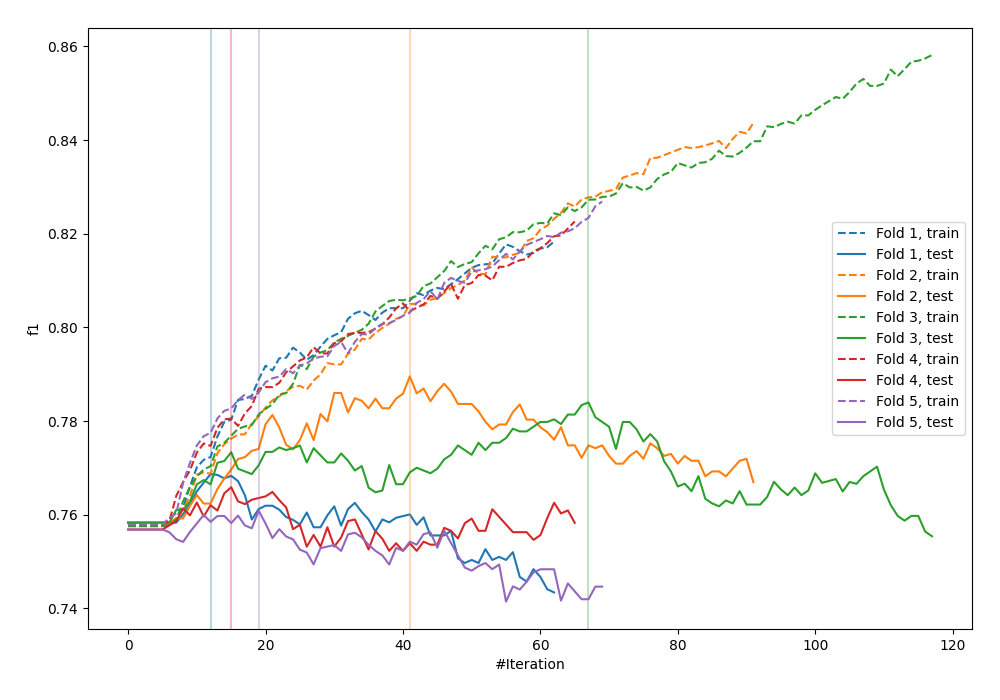
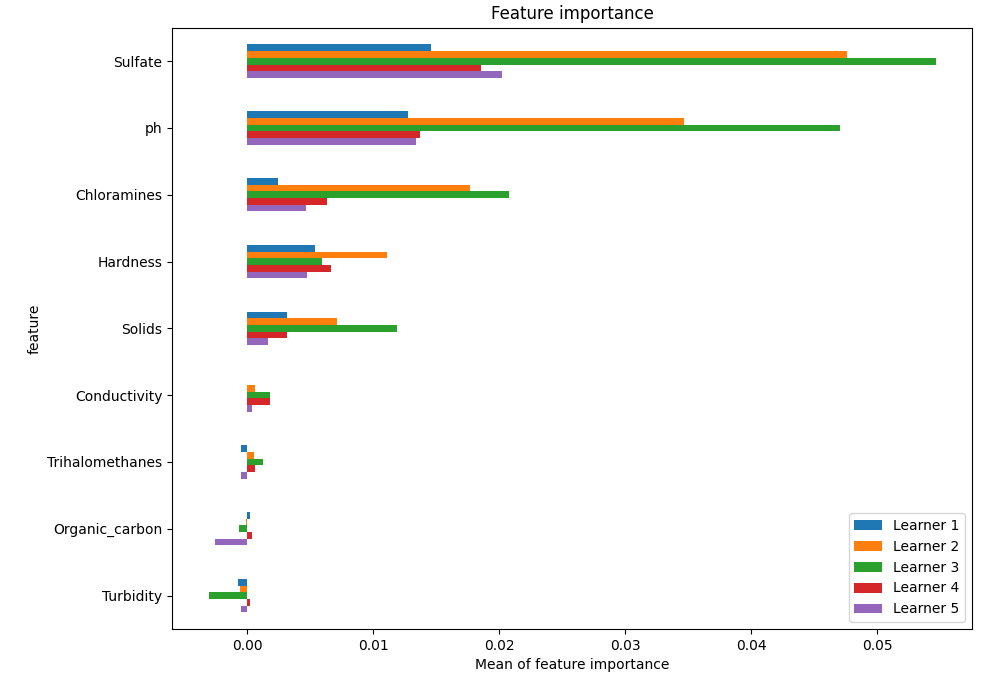
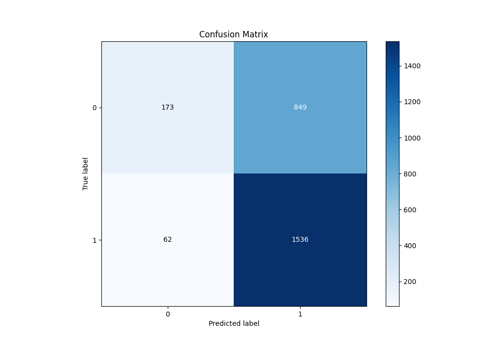
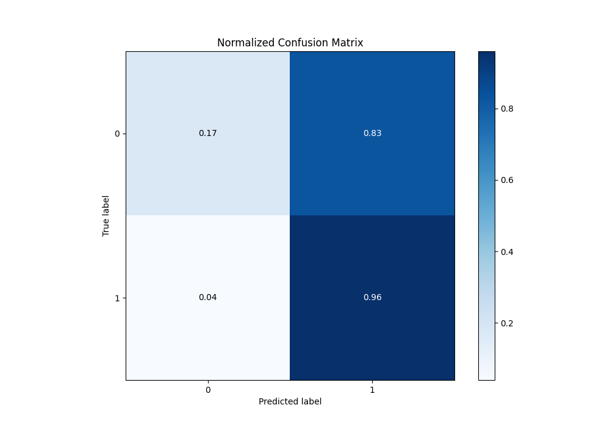
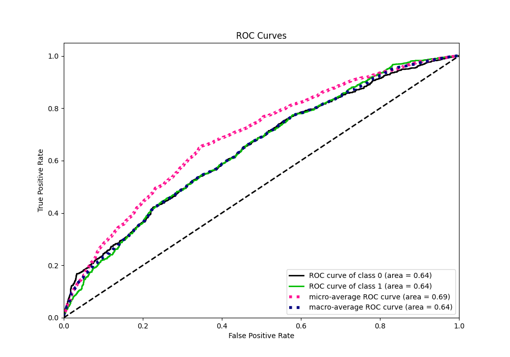
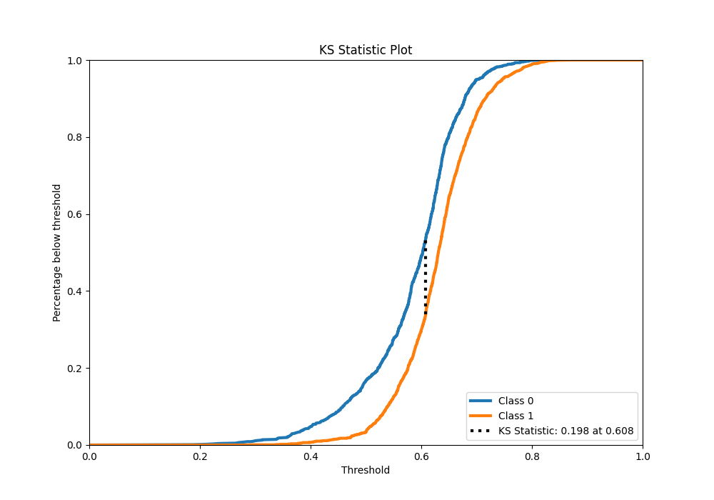
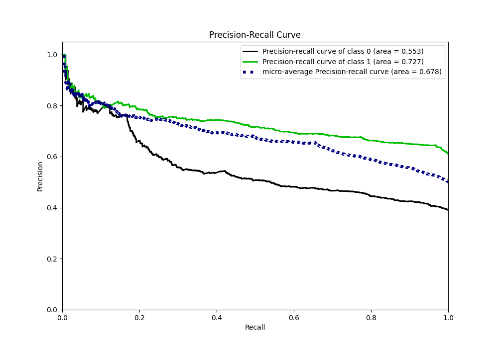
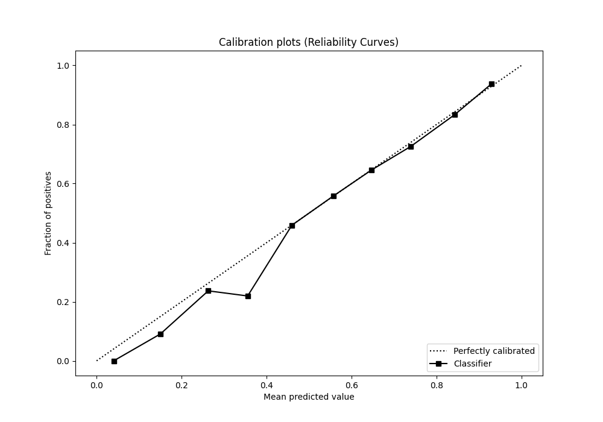
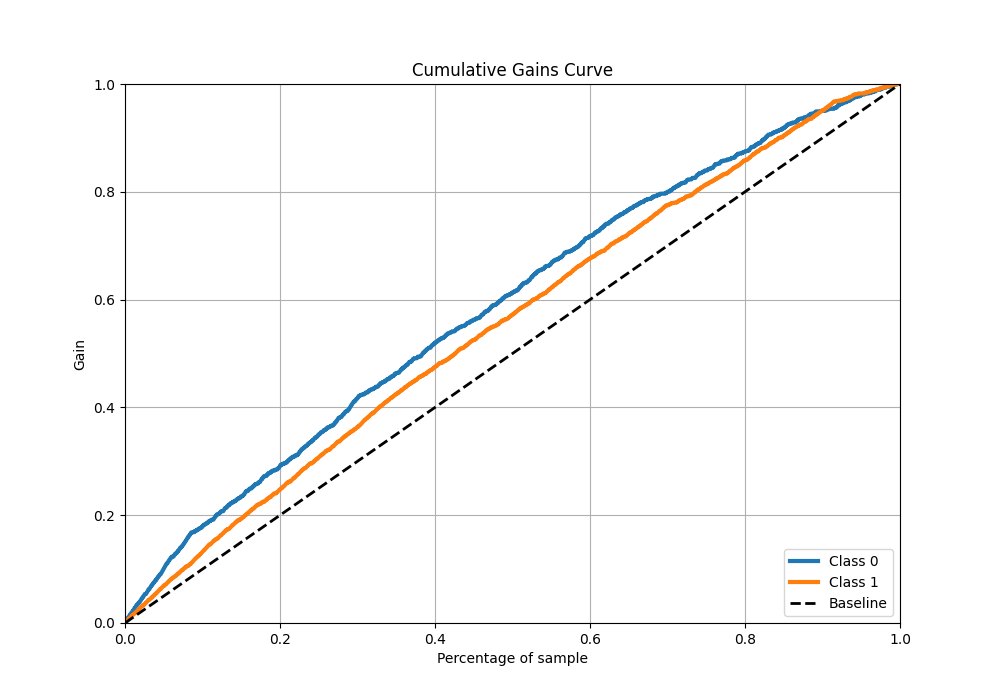
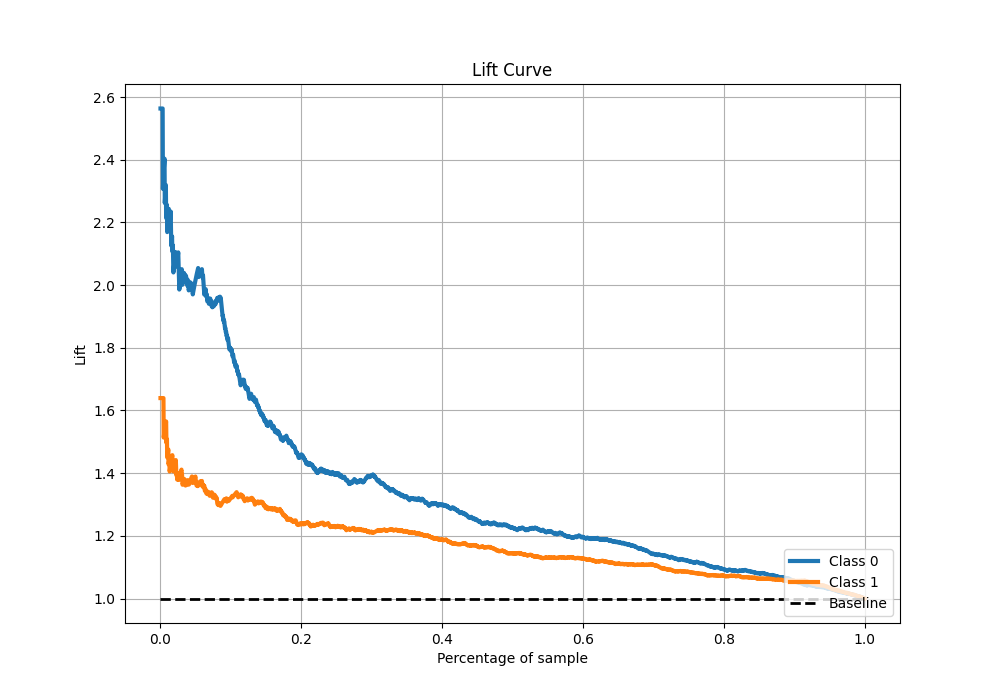

# Summary of 10_LightGBM

[<< Go back](../README.md)

## LightGBM
- **n_jobs**: -1
- **objective**: binary
- **num_leaves**: 15
- **learning_rate**: 0.05
- **feature_fraction**: 0.8
- **bagging_fraction**: 0.5
- **min_data_in_leaf**: 50
- **metric**: custom
- **custom_eval_metric_name**: f1
- **explain_level**: 1

## Validation
 - **validation_type**: kfold
 - **k_folds**: 5
 - **shuffle**: True
 - **stratify**: True
 - **random_seed**: 1234

## Optimized metric
f1

## Training time

9.8 seconds

## Metric details
|           |    score |   threshold |
|:----------|---------:|------------:|
| logloss   | 0.637613 |  nan        |
| auc       | 0.643644 |  nan        |
| f1        | 0.772262 |    0.494807 |
| accuracy  | 0.65229  |    0.501498 |
| precision | 0.888889 |    0.780608 |
| recall    | 1        |    0.168181 |
| mcc       | 0.223755 |    0.494807 |

## Metric details with threshold from accuracy metric
|           |    score |   threshold |
|:----------|---------:|------------:|
| logloss   | 0.637613 |  nan        |
| auc       | 0.643644 |  nan        |
| f1        | 0.771278 |    0.501498 |
| accuracy  | 0.65229  |    0.501498 |
| precision | 0.644025 |    0.501498 |
| recall    | 0.961202 |    0.501498 |
| mcc       | 0.222726 |    0.501498 |

## Confusion matrix (at threshold=0.501498)
|              |   Predicted as 0 |   Predicted as 1 |
|:-------------|-----------------:|-----------------:|
| Labeled as 0 |              173 |              849 |
| Labeled as 1 |               62 |             1536 |

## Learning curves

## Permutation-based Importance

## Confusion Matrix

## Normalized Confusion Matrix

## ROC Curve

## Kolmogorov-Smirnov Statistic

## Precision-Recall Curve

## Calibration Curve

## Cumulative Gains Curve

## Lift Curve

[<< Go back](../README.md)
