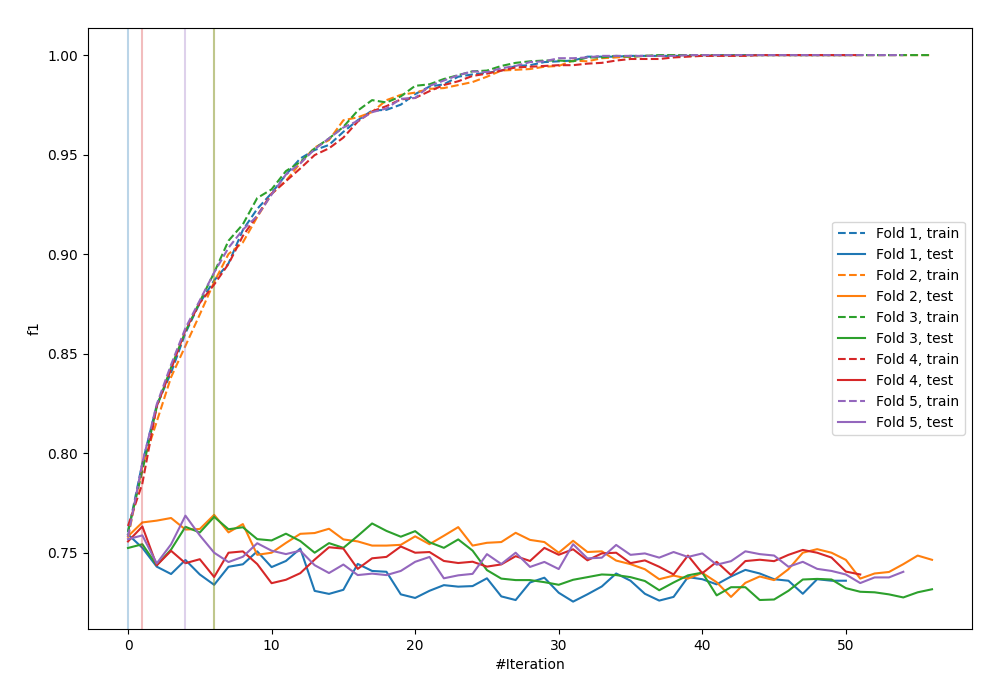
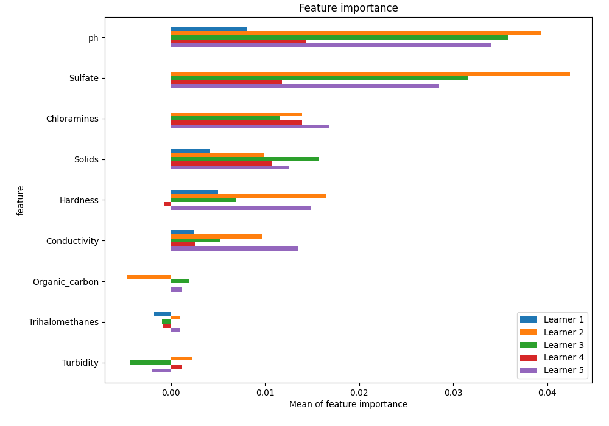
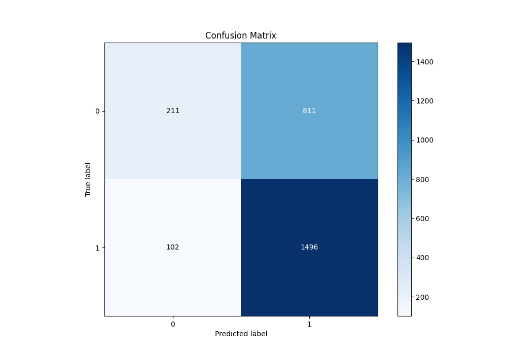
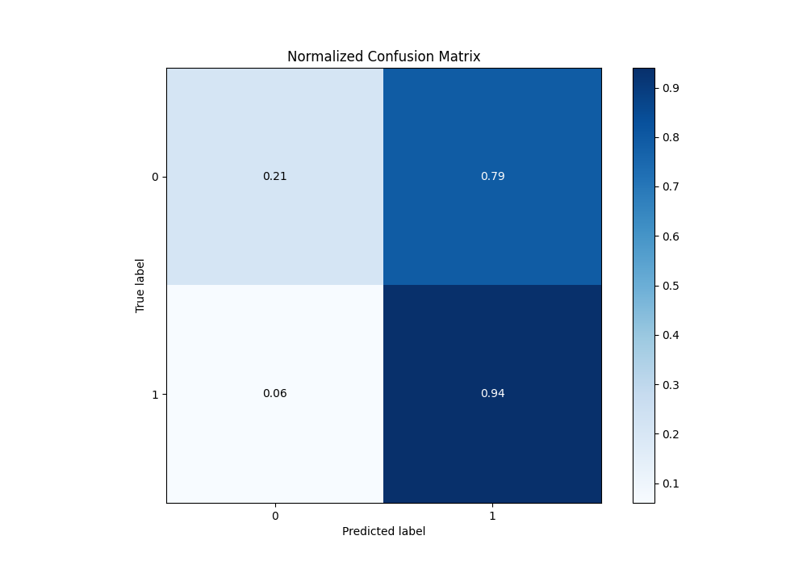
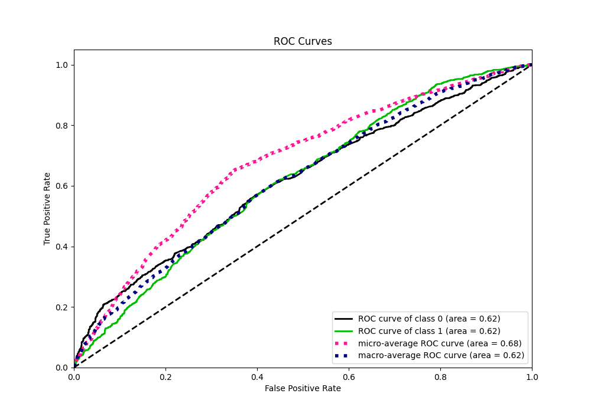
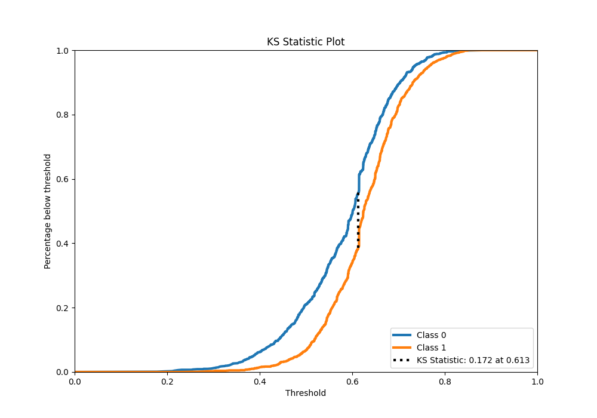
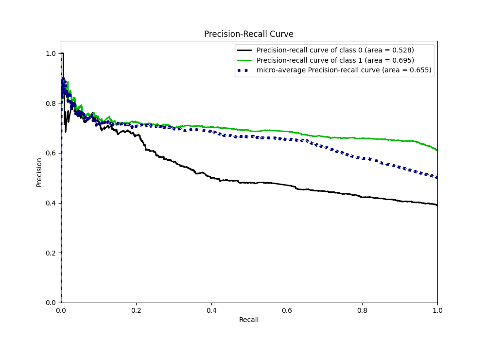
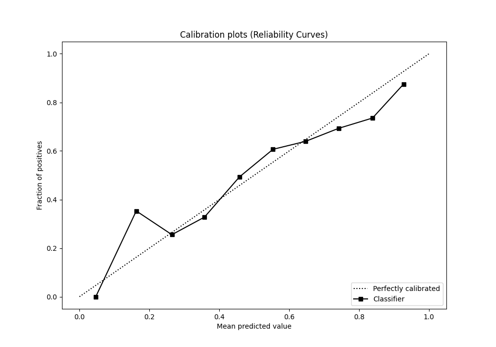
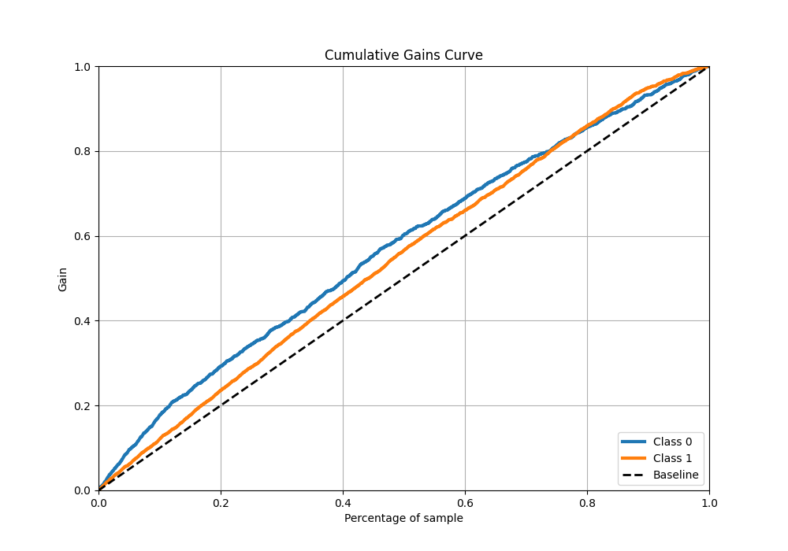
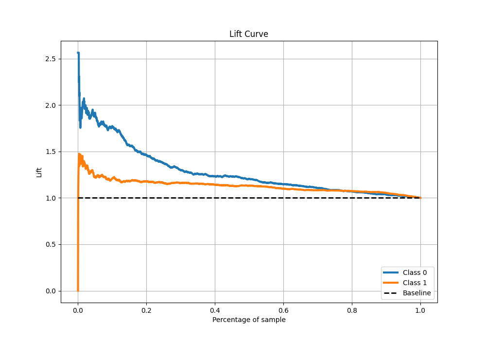

# Summary of 11_LightGBM

[<< Go back](../README.md)

## LightGBM
- **n_jobs**: -1
- **objective**: binary
- **num_leaves**: 63
- **learning_rate**: 0.2
- **feature_fraction**: 0.5
- **bagging_fraction**: 1.0
- **min_data_in_leaf**: 10
- **metric**: custom
- **custom_eval_metric_name**: f1
- **explain_level**: 1

## Validation
 - **validation_type**: kfold
 - **k_folds**: 5
 - **shuffle**: True
 - **stratify**: True
 - **random_seed**: 1234

## Optimized metric
f1

## Training time

8.7 seconds

## Metric details
|           |    score |   threshold |
|:----------|---------:|------------:|
| logloss   | 0.645226 |  nan        |
| auc       | 0.616889 |  nan        |
| f1        | 0.766742 |    0.483468 |
| accuracy  | 0.651527 |    0.497042 |
| precision | 0.844444 |    0.801141 |
| recall    | 1        |    0.159963 |
| mcc       | 0.214498 |    0.497042 |

## Metric details with threshold from accuracy metric
|           |    score |   threshold |
|:----------|---------:|------------:|
| logloss   | 0.645226 |  nan        |
| auc       | 0.616889 |  nan        |
| f1        | 0.766197 |    0.497042 |
| accuracy  | 0.651527 |    0.497042 |
| precision | 0.648461 |    0.497042 |
| recall    | 0.93617  |    0.497042 |
| mcc       | 0.214498 |    0.497042 |

## Confusion matrix (at threshold=0.497042)
|              |   Predicted as 0 |   Predicted as 1 |
|:-------------|-----------------:|-----------------:|
| Labeled as 0 |              211 |              811 |
| Labeled as 1 |              102 |             1496 |

## Learning curves

## Permutation-based Importance

## Confusion Matrix

## Normalized Confusion Matrix

## ROC Curve

## Kolmogorov-Smirnov Statistic

## Precision-Recall Curve

## Calibration Curve

## Cumulative Gains Curve

## Lift Curve

[<< Go back](../README.md)
