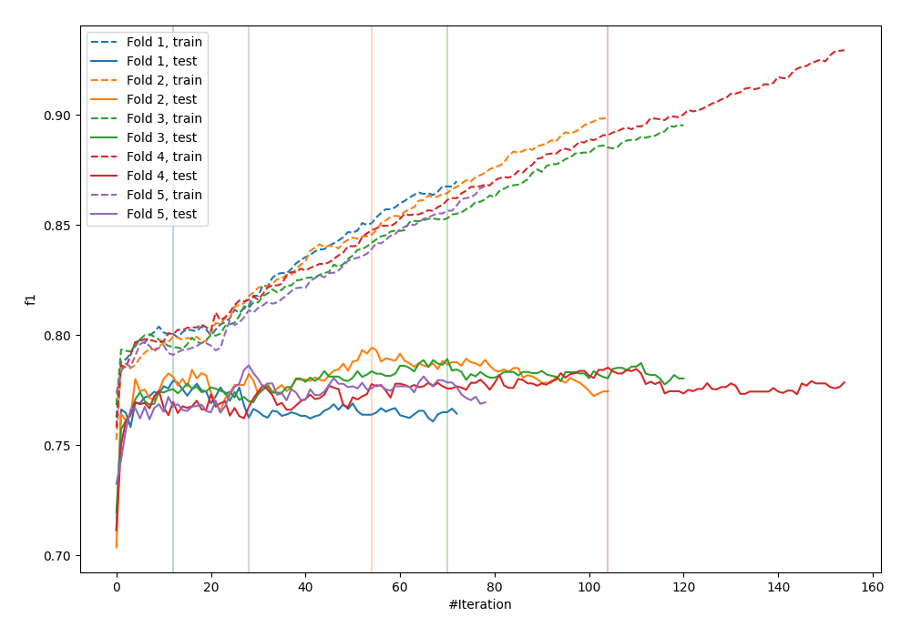
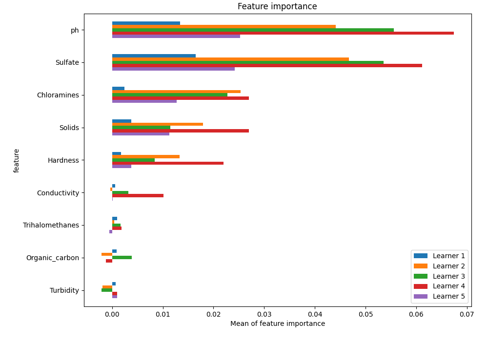
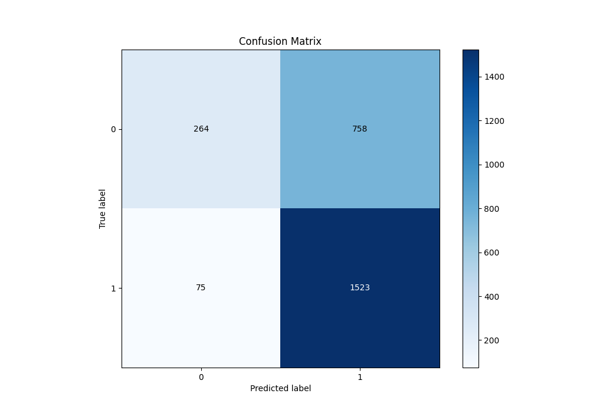
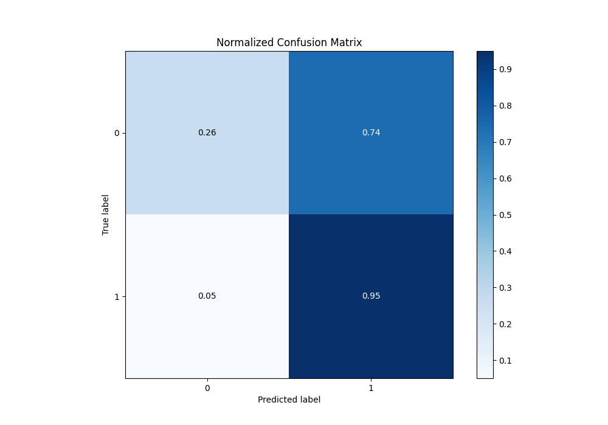
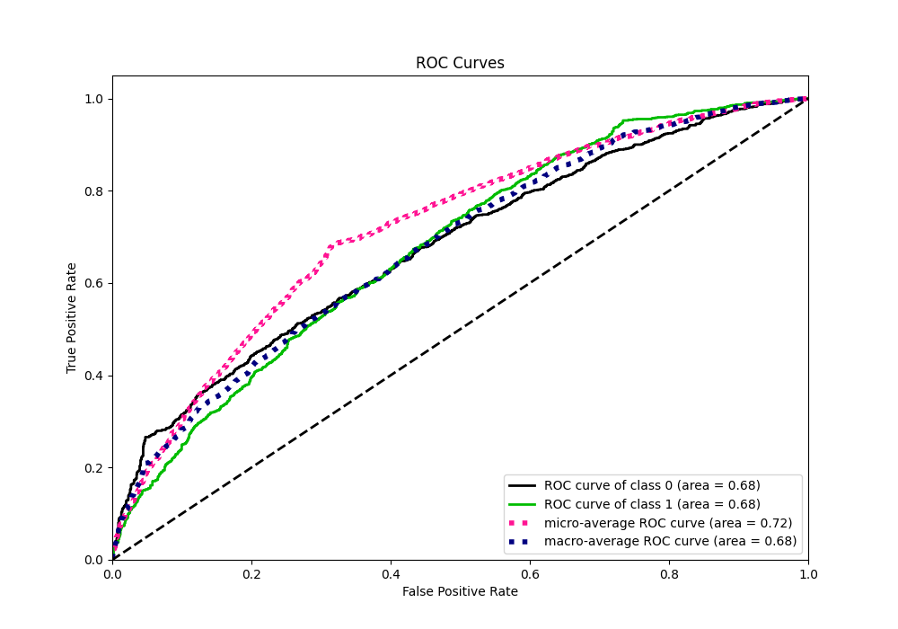
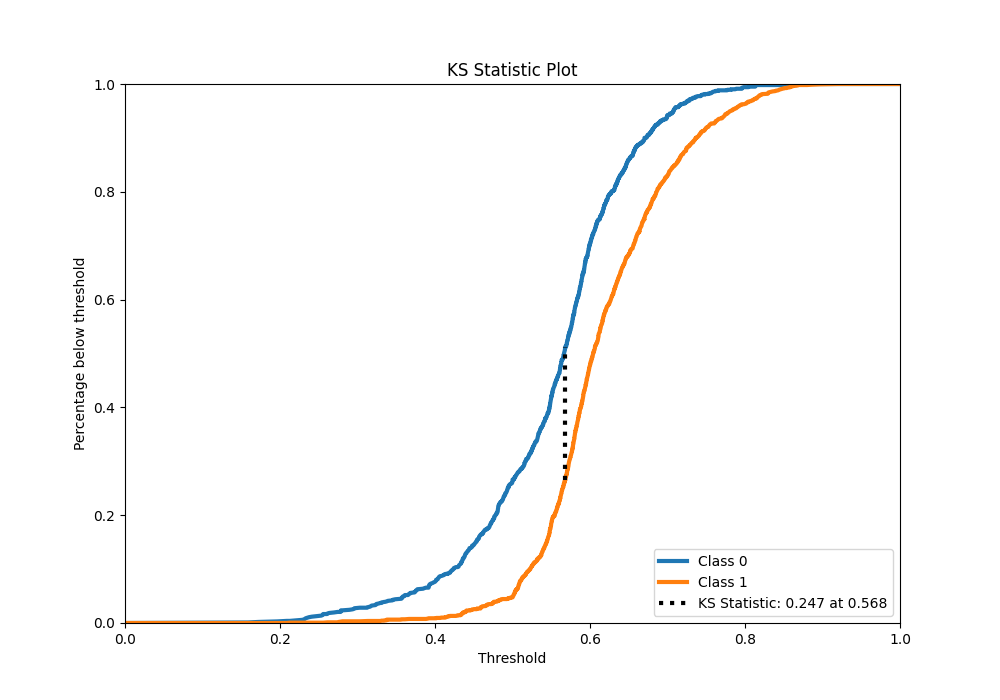
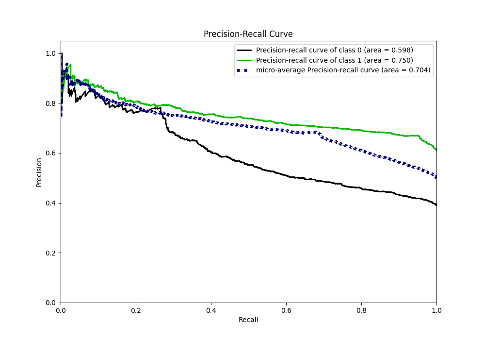
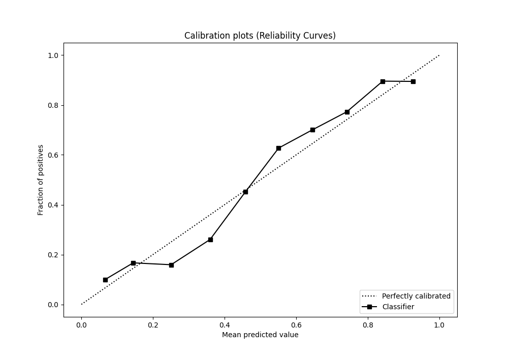
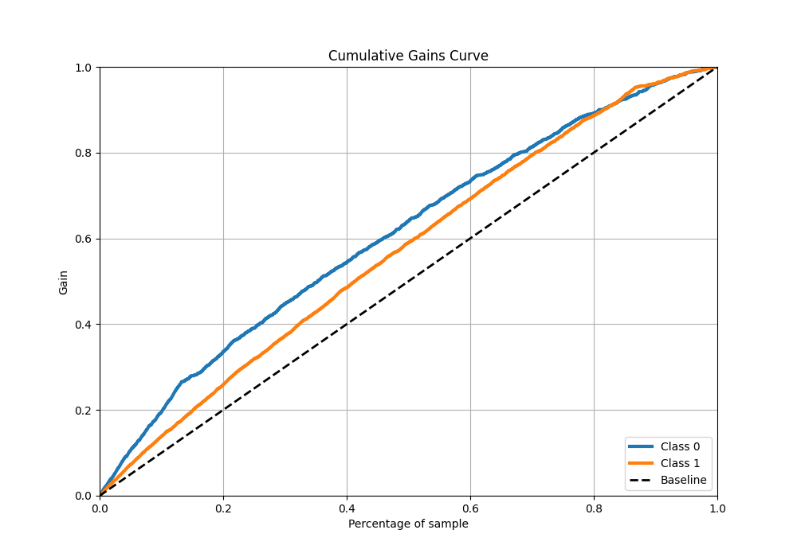
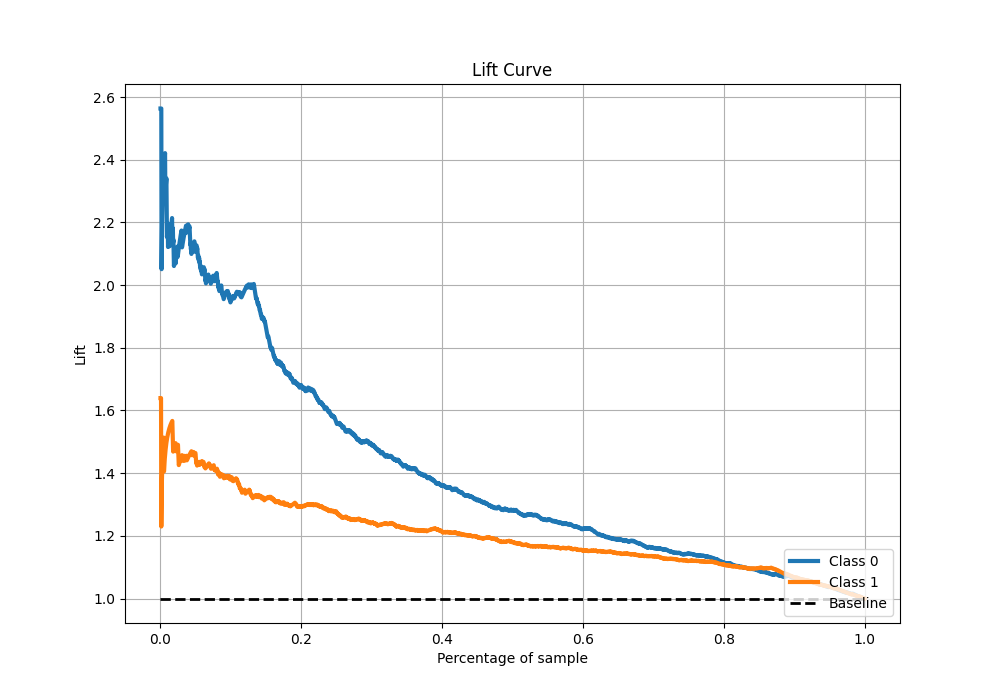

# Summary of 14_CatBoost

[<< Go back](../README.md)

## CatBoost
- **n_jobs**: -1
- **learning_rate**: 0.05
- **depth**: 8
- **rsm**: 0.8
- **loss_function**: Logloss
- **eval_metric**: F1
- **explain_level**: 1

## Validation
 - **validation_type**: kfold
 - **k_folds**: 5
 - **shuffle**: True
 - **stratify**: True
 - **random_seed**: 1234

## Optimized metric
f1

## Training time

8.6 seconds

## Metric details
|           |    score |   threshold |
|:----------|---------:|------------:|
| logloss   | 0.624314 |  nan        |
| auc       | 0.677615 |  nan        |
| f1        | 0.785254 |    0.497892 |
| accuracy  | 0.682061 |    0.497892 |
| precision | 0.955556 |    0.815029 |
| recall    | 1        |    0.142937 |
| mcc       | 0.307201 |    0.497892 |

## Metric details with threshold from accuracy metric
|           |    score |   threshold |
|:----------|---------:|------------:|
| logloss   | 0.624314 |  nan        |
| auc       | 0.677615 |  nan        |
| f1        | 0.785254 |    0.497892 |
| accuracy  | 0.682061 |    0.497892 |
| precision | 0.66769  |    0.497892 |
| recall    | 0.953066 |    0.497892 |
| mcc       | 0.307201 |    0.497892 |

## Confusion matrix (at threshold=0.497892)
|              |   Predicted as 0 |   Predicted as 1 |
|:-------------|-----------------:|-----------------:|
| Labeled as 0 |              264 |              758 |
| Labeled as 1 |               75 |             1523 |

## Learning curves

## Permutation-based Importance

## Confusion Matrix

## Normalized Confusion Matrix

## ROC Curve

## Kolmogorov-Smirnov Statistic

## Precision-Recall Curve

## Calibration Curve

## Cumulative Gains Curve

## Lift Curve

[<< Go back](../README.md)
