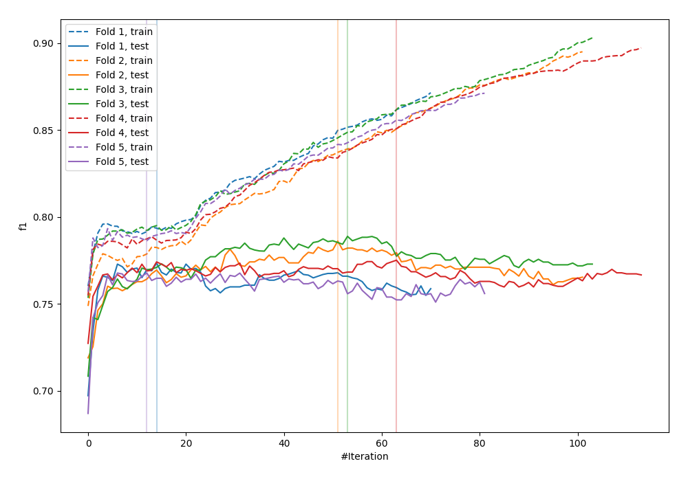
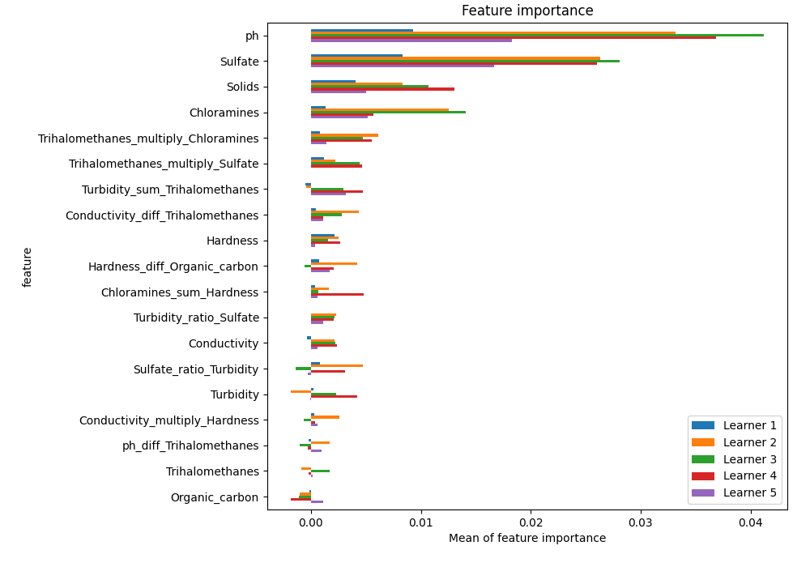
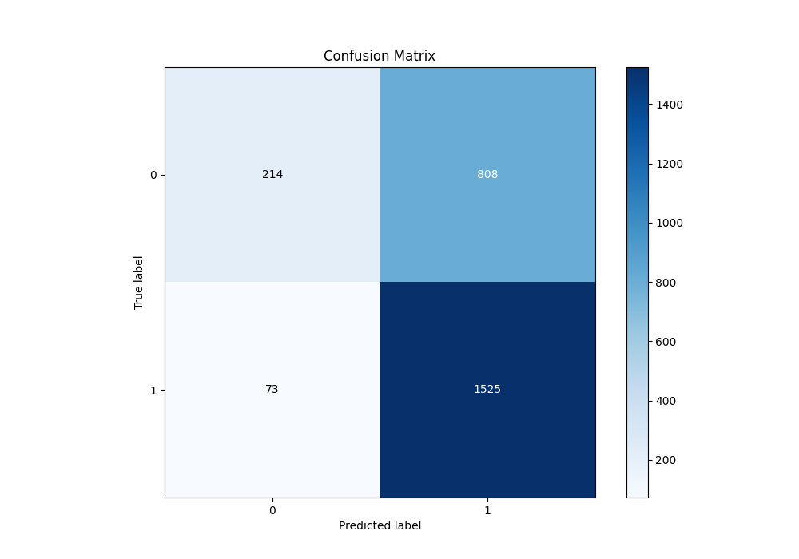
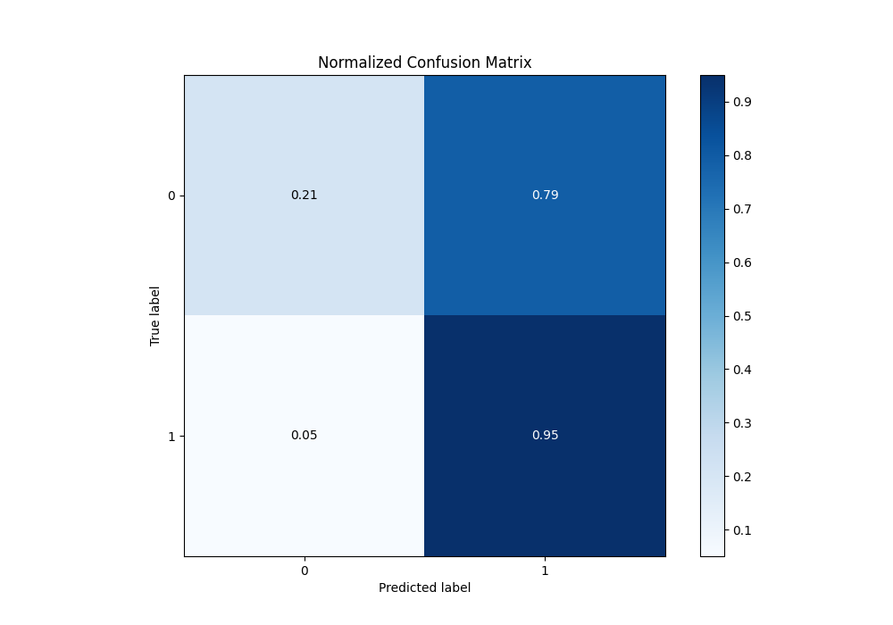
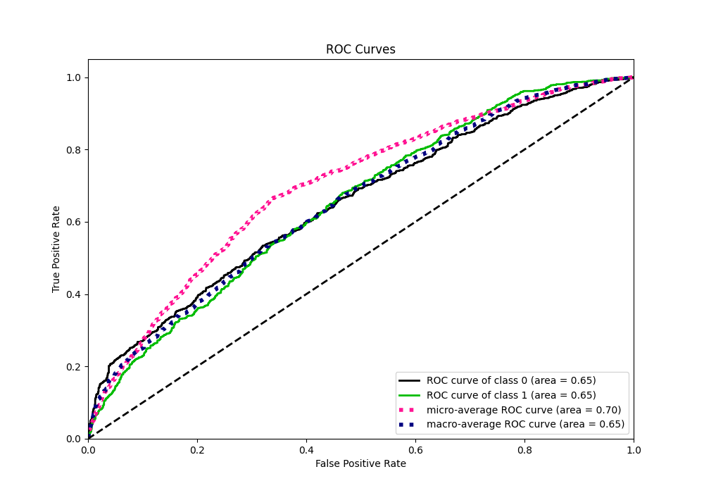
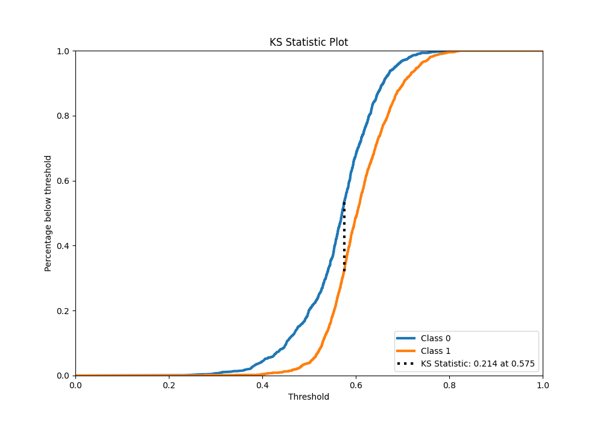
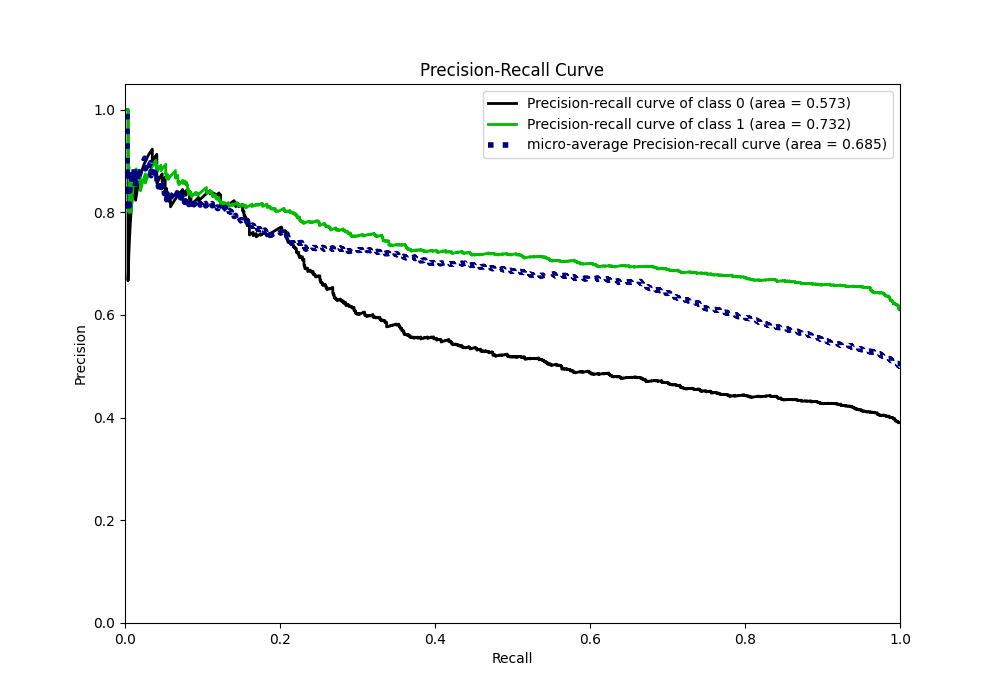
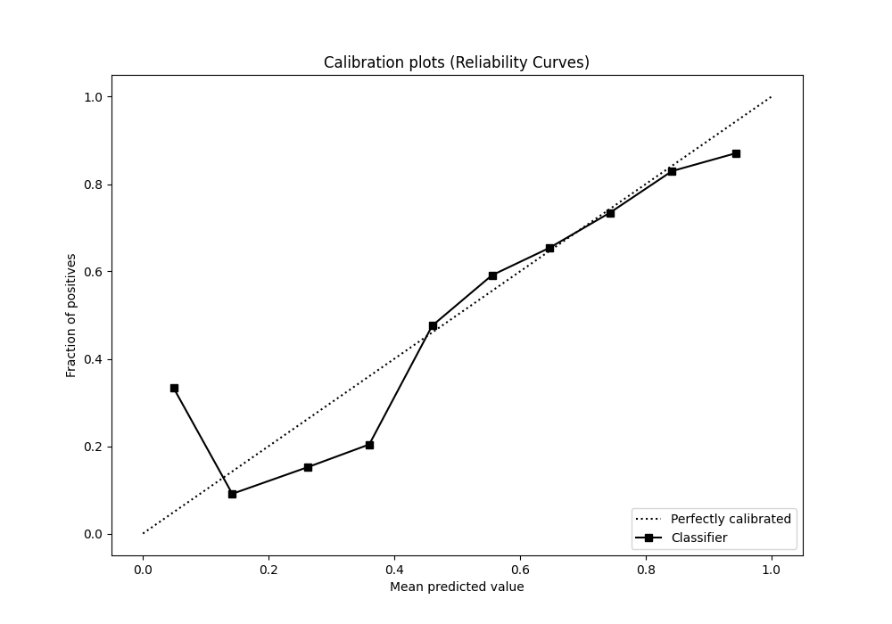
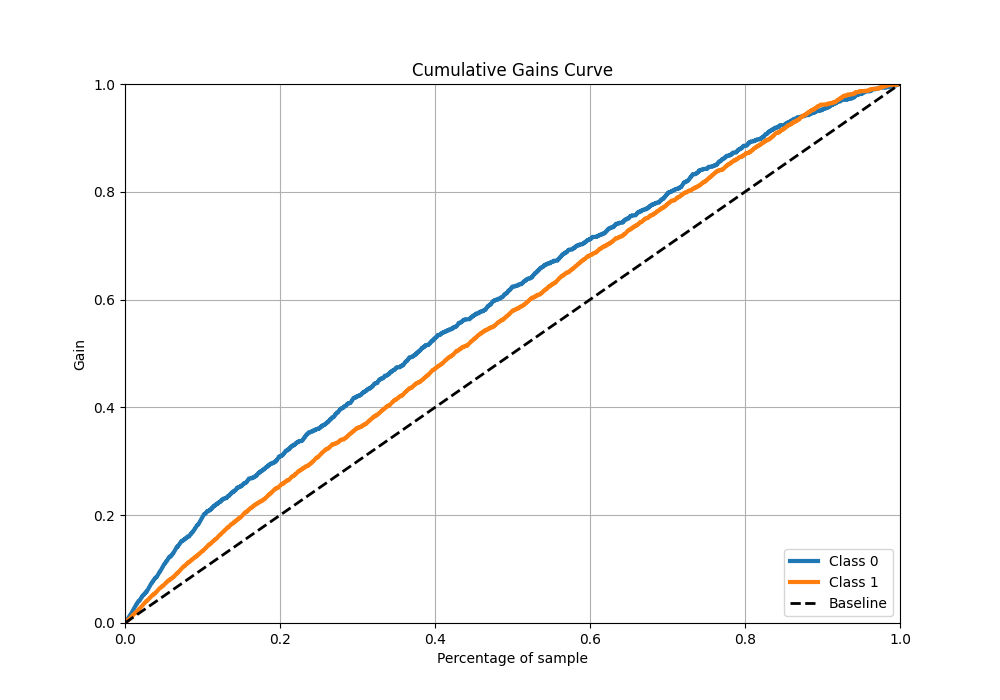
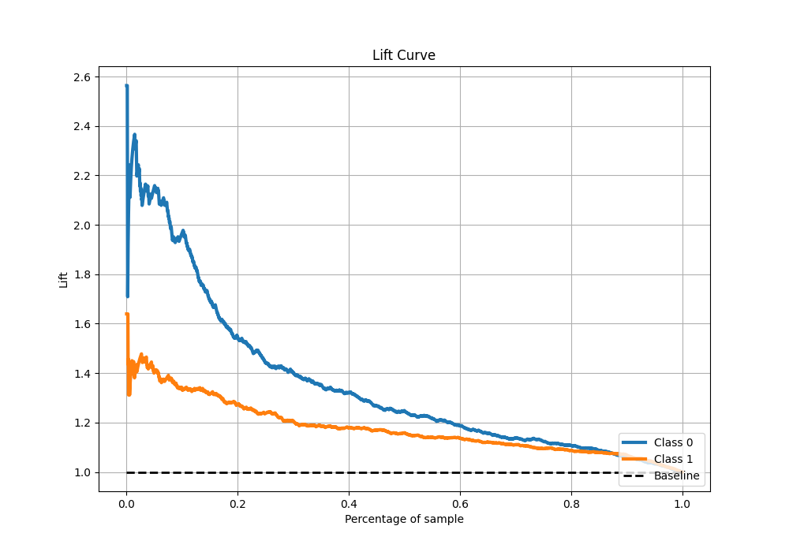

# Summary of 14_CatBoost_GoldenFeatures

[<< Go back](../README.md)

## CatBoost
- **n_jobs**: -1
- **learning_rate**: 0.05
- **depth**: 8
- **rsm**: 0.8
- **loss_function**: Logloss
- **eval_metric**: F1
- **explain_level**: 1

## Validation
 - **validation_type**: kfold
 - **k_folds**: 5
 - **shuffle**: True
 - **stratify**: True
 - **random_seed**: 1234

## Optimized metric
f1

## Training time

12.8 seconds

## Metric details
|           |    score |   threshold |
|:----------|---------:|------------:|
| logloss   | 0.636653 |  nan        |
| auc       | 0.652425 |  nan        |
| f1        | 0.776851 |    0.498821 |
| accuracy  | 0.66374  |    0.504705 |
| precision | 0.901408 |    0.740405 |
| recall    | 1        |    0.208982 |
| mcc       | 0.256549 |    0.498821 |

## Metric details with threshold from accuracy metric
|           |    score |   threshold |
|:----------|---------:|------------:|
| logloss   | 0.636653 |  nan        |
| auc       | 0.652425 |  nan        |
| f1        | 0.775884 |    0.504705 |
| accuracy  | 0.66374  |    0.504705 |
| precision | 0.653665 |    0.504705 |
| recall    | 0.954318 |    0.504705 |
| mcc       | 0.255678 |    0.504705 |

## Confusion matrix (at threshold=0.504705)
|              |   Predicted as 0 |   Predicted as 1 |
|:-------------|-----------------:|-----------------:|
| Labeled as 0 |              214 |              808 |
| Labeled as 1 |               73 |             1525 |

## Learning curves

## Permutation-based Importance

## Confusion Matrix

## Normalized Confusion Matrix

## ROC Curve

## Kolmogorov-Smirnov Statistic

## Precision-Recall Curve

## Calibration Curve

## Cumulative Gains Curve

## Lift Curve

[<< Go back](../README.md)
