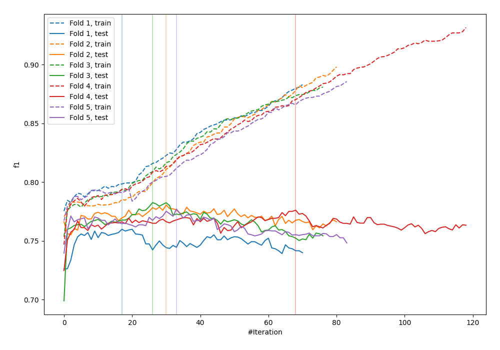
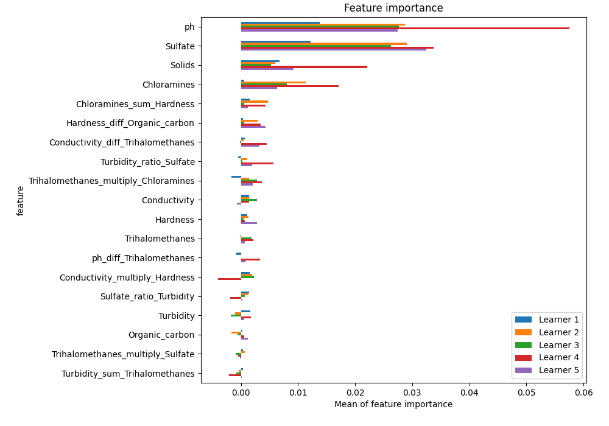
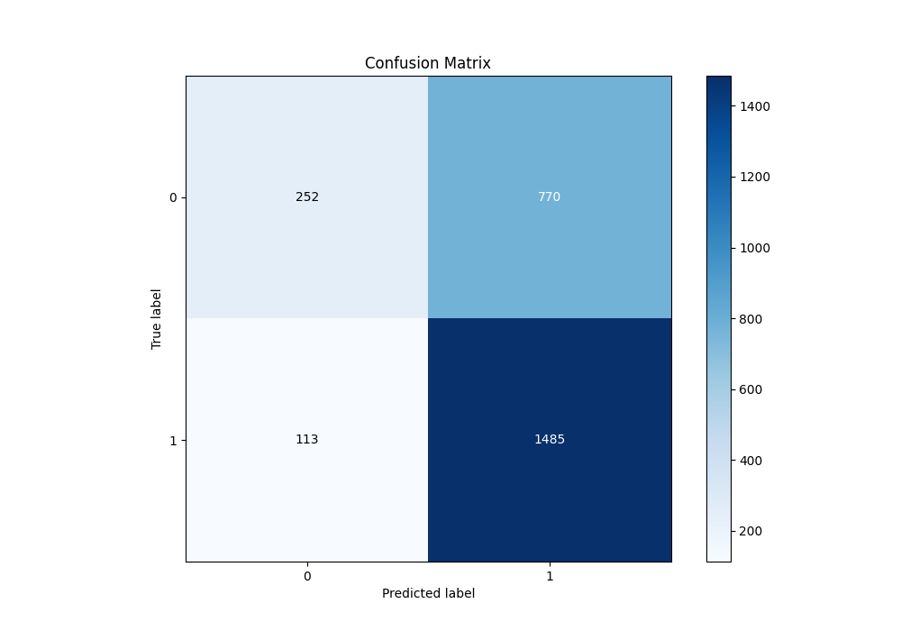
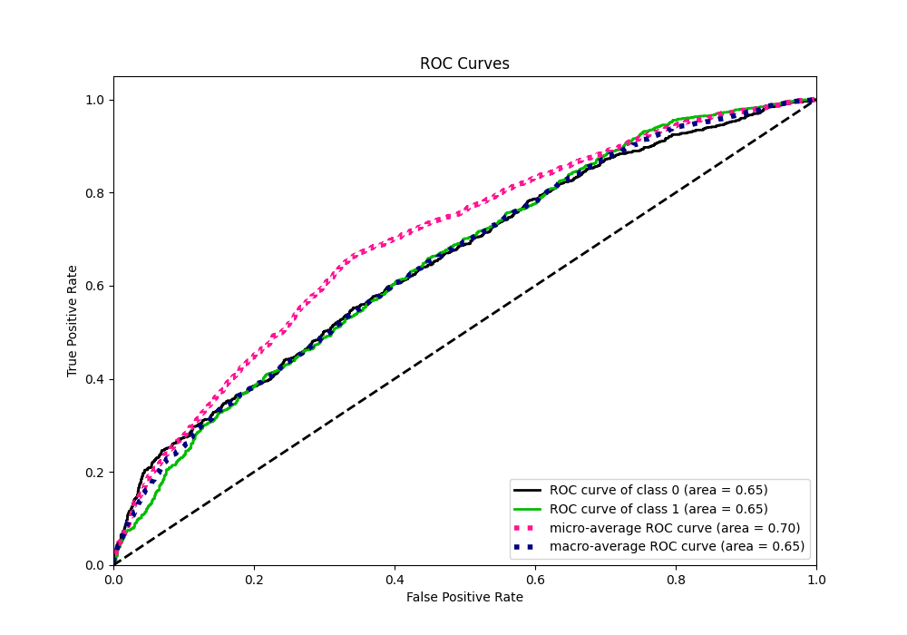
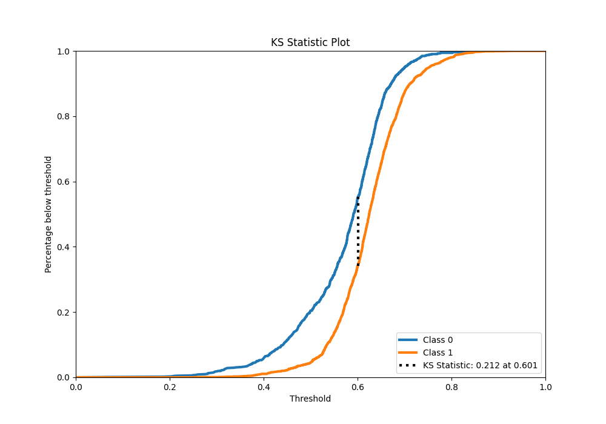
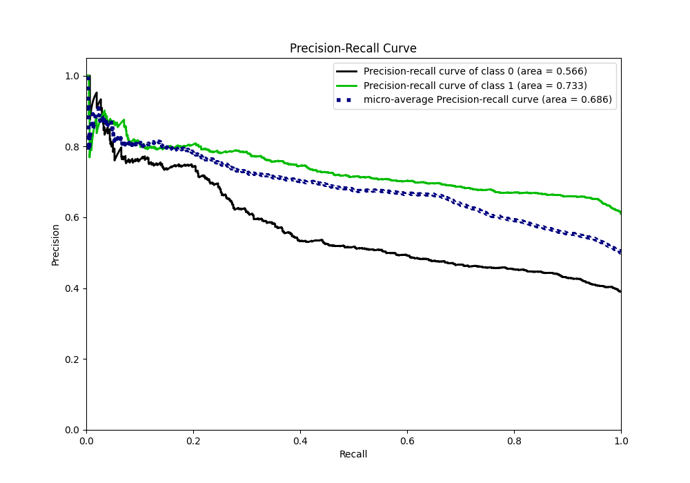
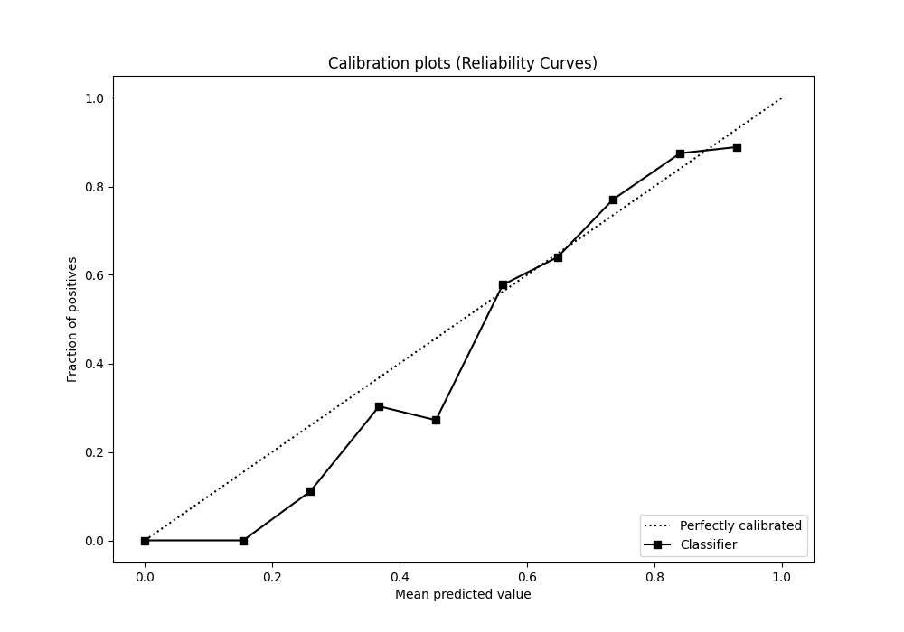
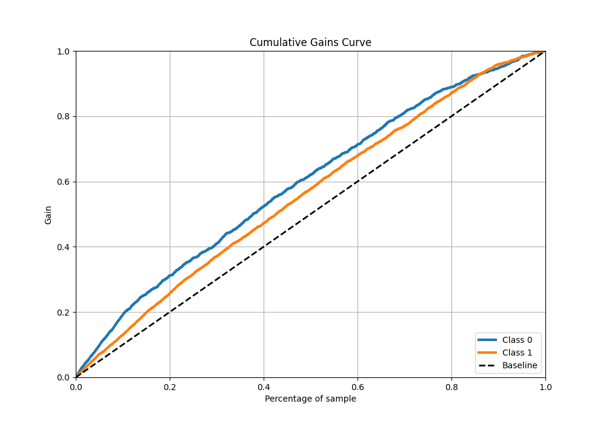
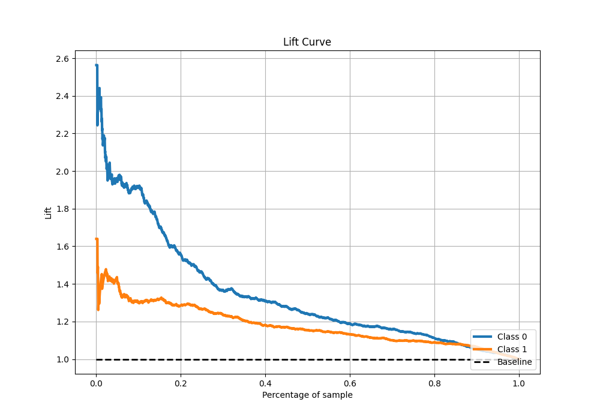

# Summary of 16_CatBoost_GoldenFeatures

[<< Go back](../README.md)

## CatBoost
- **n_jobs**: -1
- **learning_rate**: 0.1
- **depth**: 7
- **rsm**: 1.0
- **loss_function**: Logloss
- **eval_metric**: F1
- **explain_level**: 1

## Validation
 - **validation_type**: kfold
 - **k_folds**: 5
 - **shuffle**: True
 - **stratify**: True
 - **random_seed**: 1234

## Optimized metric
f1

## Training time

8.6 seconds

## Metric details
|           |    score |   threshold |
|:----------|---------:|------------:|
| logloss   | 0.633045 | nan         |
| auc       | 0.653756 | nan         |
| f1        | 0.774324 |   0.492442  |
| accuracy  | 0.662977 |   0.524798  |
| precision | 0.873239 |   0.770366  |
| recall    | 1        |   0.0625091 |
| mcc       | 0.248275 |   0.508438  |

## Metric details with threshold from accuracy metric
|           |    score |   threshold |
|:----------|---------:|------------:|
| logloss   | 0.633045 |  nan        |
| auc       | 0.653756 |  nan        |
| f1        | 0.770828 |    0.524798 |
| accuracy  | 0.662977 |    0.524798 |
| precision | 0.658537 |    0.524798 |
| recall    | 0.929287 |    0.524798 |
| mcc       | 0.247723 |    0.524798 |

## Confusion matrix (at threshold=0.524798)
|              |   Predicted as 0 |   Predicted as 1 |
|:-------------|-----------------:|-----------------:|
| Labeled as 0 |              252 |              770 |
| Labeled as 1 |              113 |             1485 |

## Learning curves

## Permutation-based Importance

## Confusion Matrix

## Normalized Confusion Matrix

## ROC Curve

## Kolmogorov-Smirnov Statistic

## Precision-Recall Curve

## Calibration Curve

## Cumulative Gains Curve

## Lift Curve

[<< Go back](../README.md)
