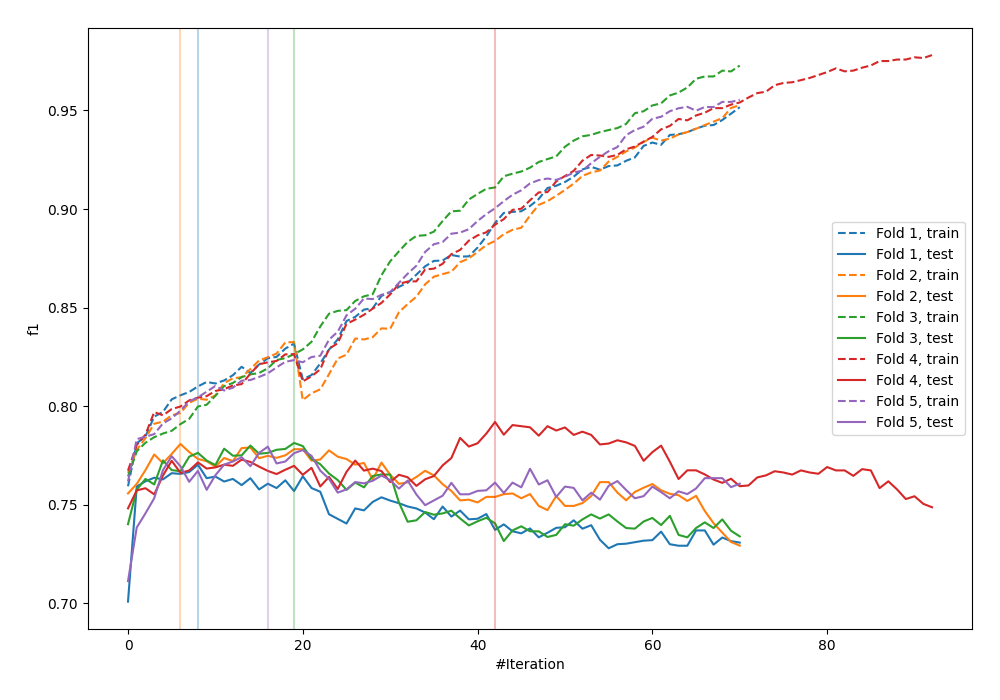
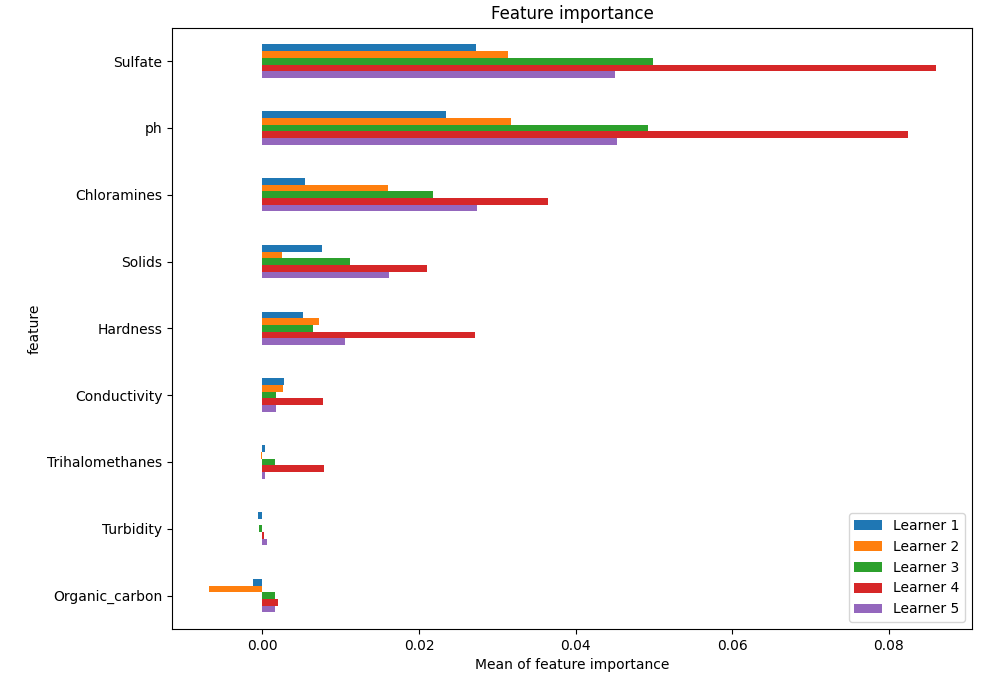
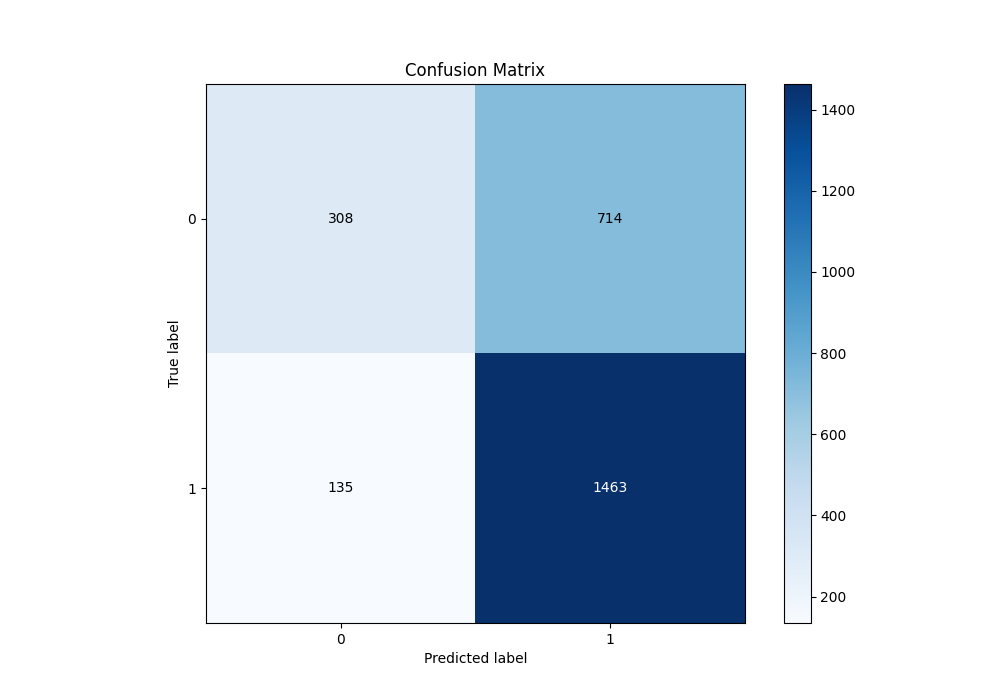
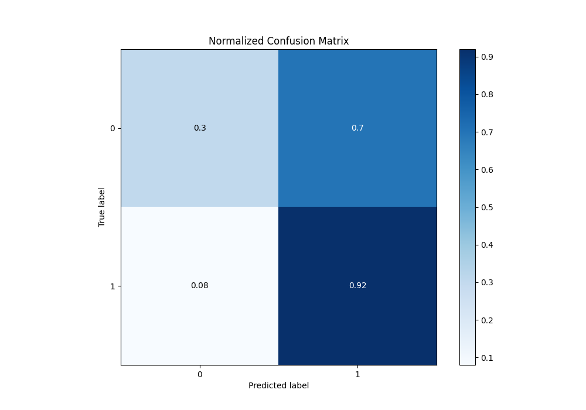
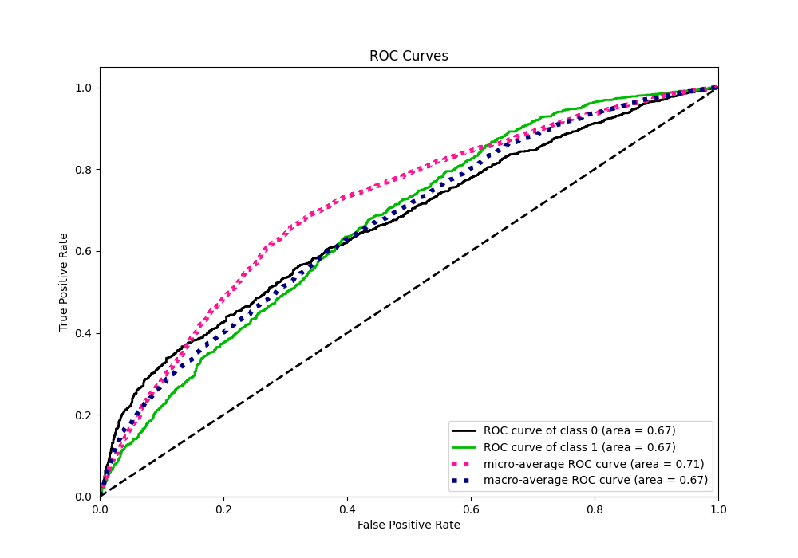
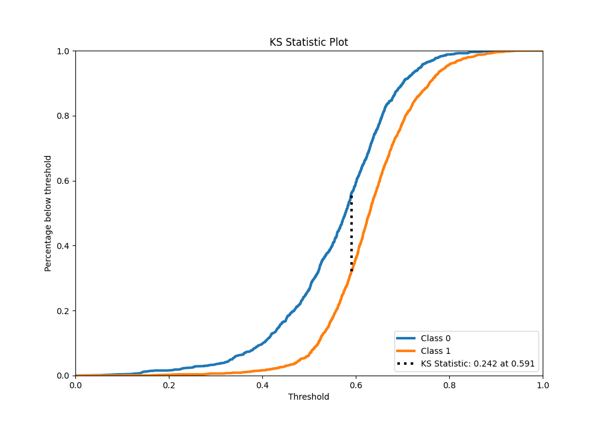
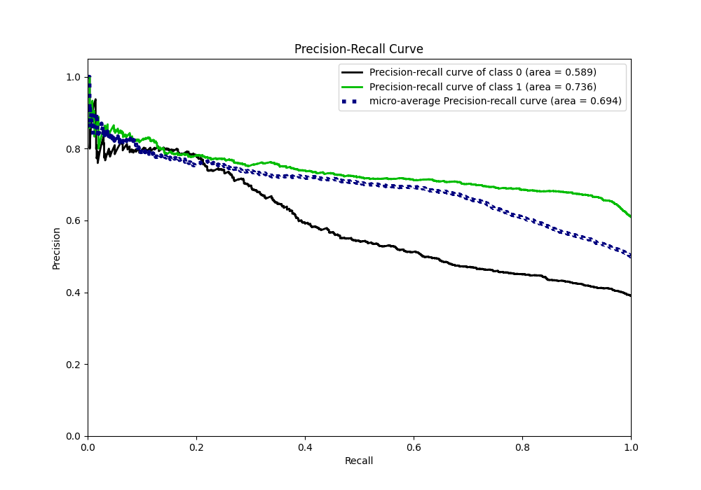
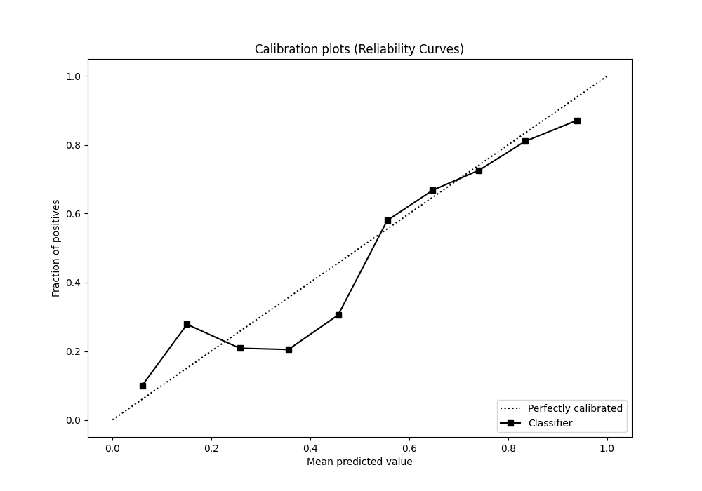
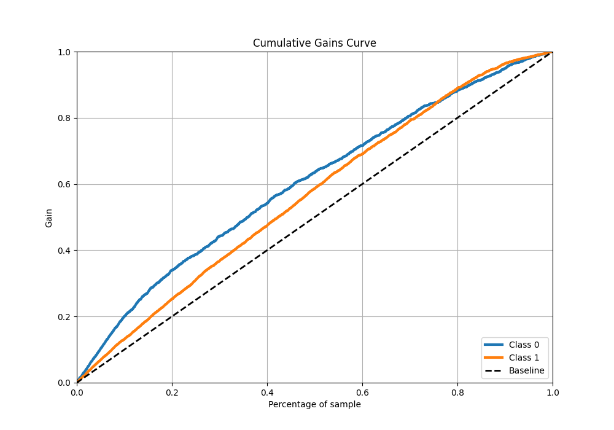
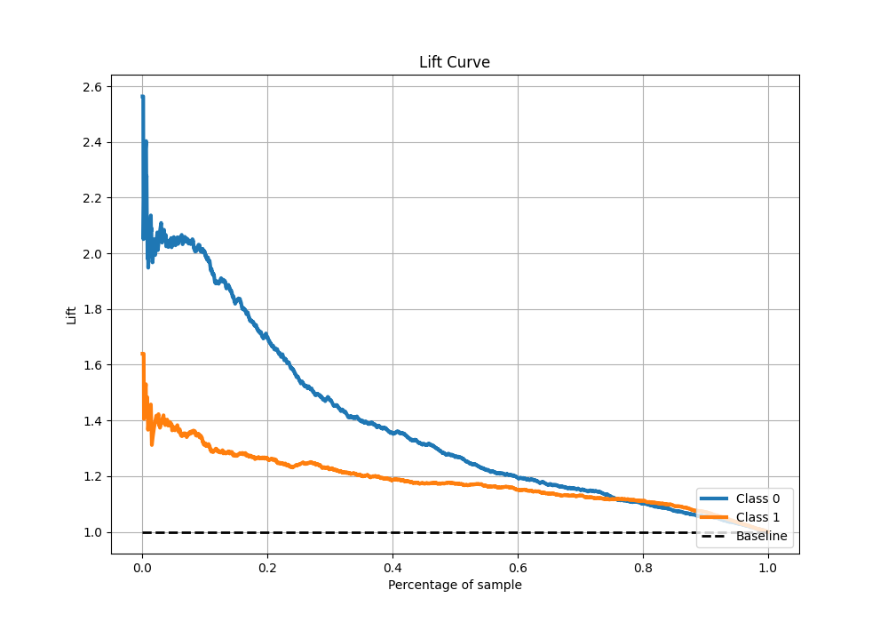

# Summary of 17_CatBoost

[<< Go back](../README.md)

## CatBoost
- **n_jobs**: -1
- **learning_rate**: 0.2
- **depth**: 8
- **rsm**: 1.0
- **loss_function**: Logloss
- **eval_metric**: F1
- **explain_level**: 1

## Validation
 - **validation_type**: kfold
 - **k_folds**: 5
 - **shuffle**: True
 - **stratify**: True
 - **random_seed**: 1234

## Optimized metric
f1

## Training time

12.9 seconds

## Metric details
|           |    score |   threshold |
|:----------|---------:|------------:|
| logloss   | 0.624818 |  nan        |
| auc       | 0.667344 |  nan        |
| f1        | 0.779067 |    0.491785 |
| accuracy  | 0.675954 |    0.511696 |
| precision | 0.845528 |    0.779126 |
| recall    | 1        |    0.046933 |
| mcc       | 0.282241 |    0.511696 |

## Metric details with threshold from accuracy metric
|           |    score |   threshold |
|:----------|---------:|------------:|
| logloss   | 0.624818 |  nan        |
| auc       | 0.667344 |  nan        |
| f1        | 0.775099 |    0.511696 |
| accuracy  | 0.675954 |    0.511696 |
| precision | 0.672026 |    0.511696 |
| recall    | 0.915519 |    0.511696 |
| mcc       | 0.282241 |    0.511696 |

## Confusion matrix (at threshold=0.511696)
|              |   Predicted as 0 |   Predicted as 1 |
|:-------------|-----------------:|-----------------:|
| Labeled as 0 |              308 |              714 |
| Labeled as 1 |              135 |             1463 |

## Learning curves

## Permutation-based Importance

## Confusion Matrix

## Normalized Confusion Matrix

## ROC Curve

## Kolmogorov-Smirnov Statistic

## Precision-Recall Curve

## Calibration Curve

## Cumulative Gains Curve

## Lift Curve

[<< Go back](../README.md)
