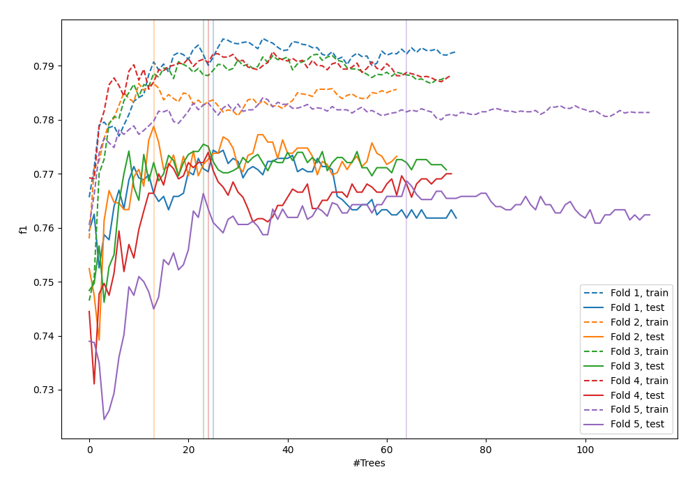
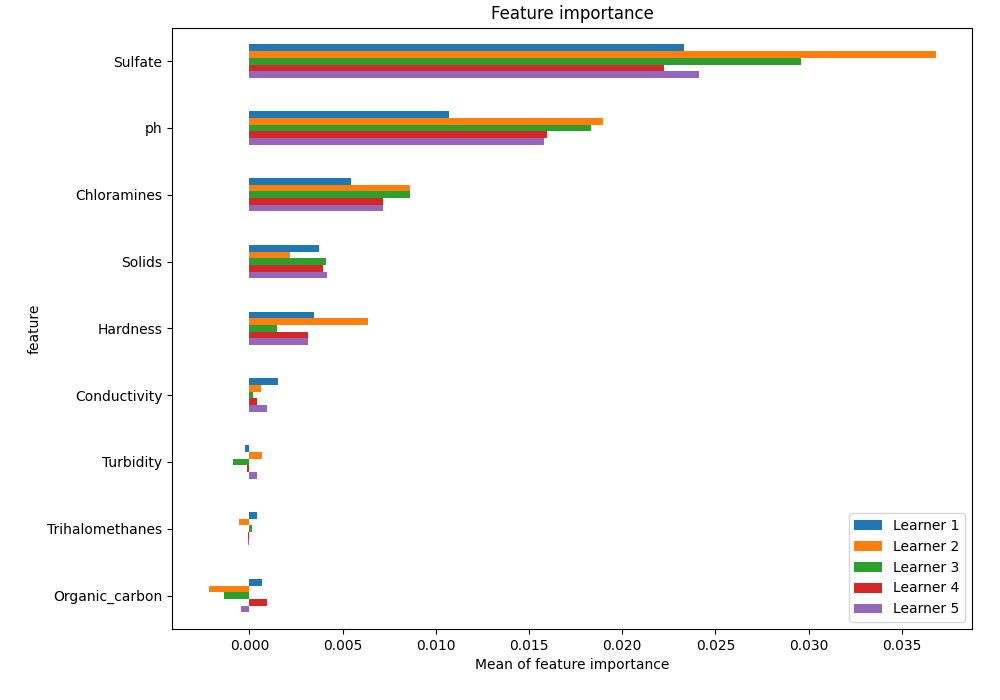
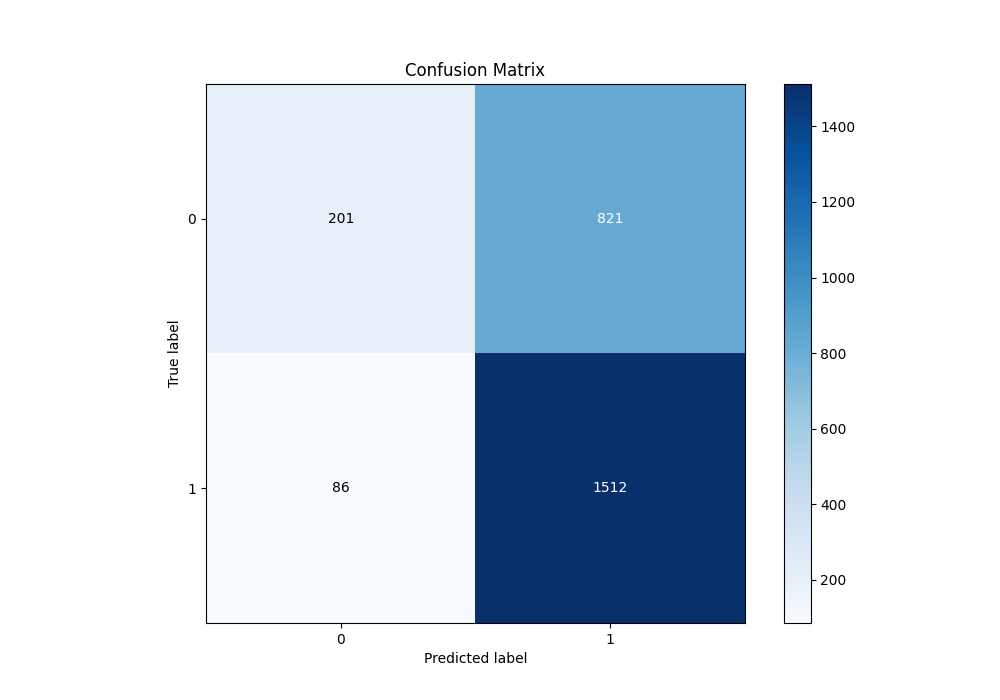
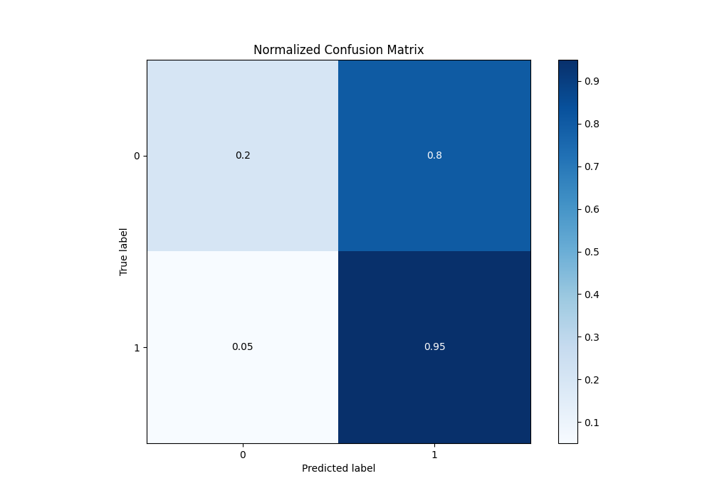
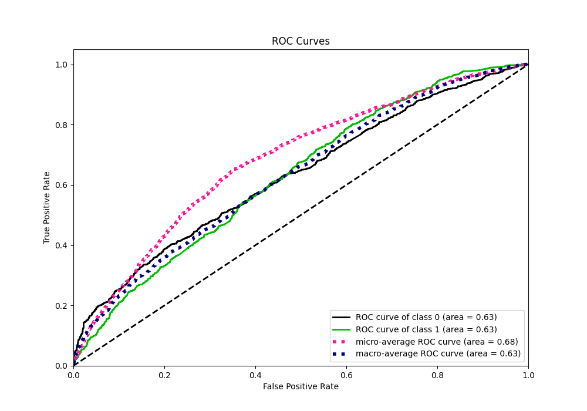
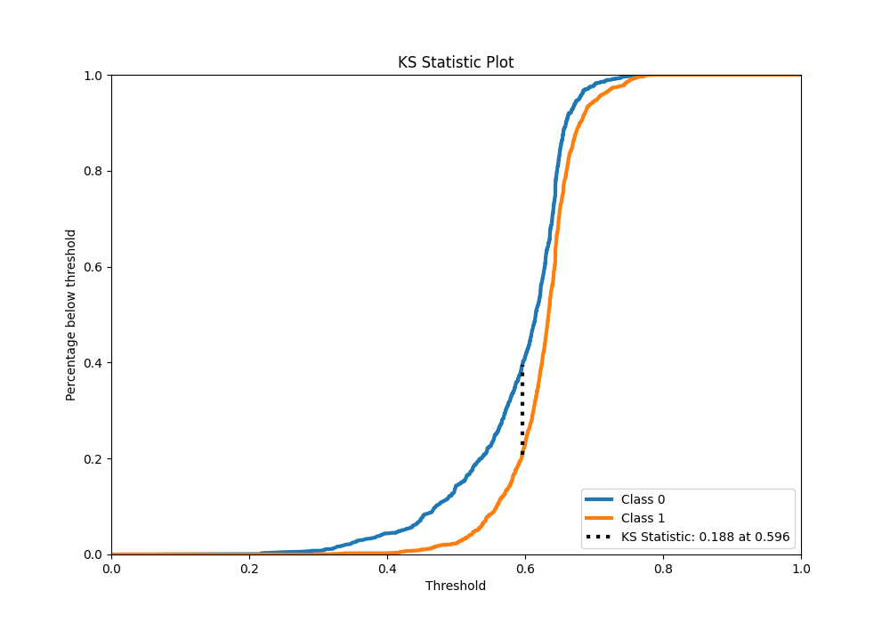
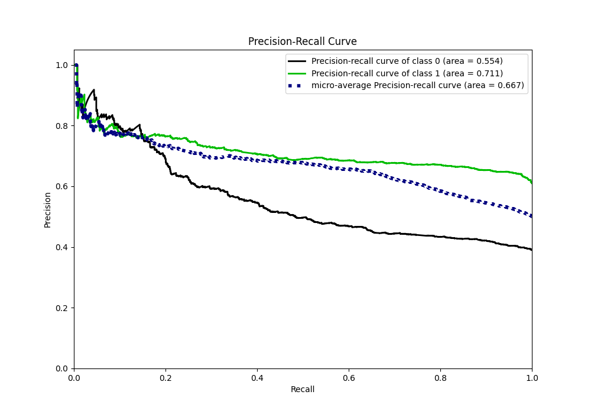
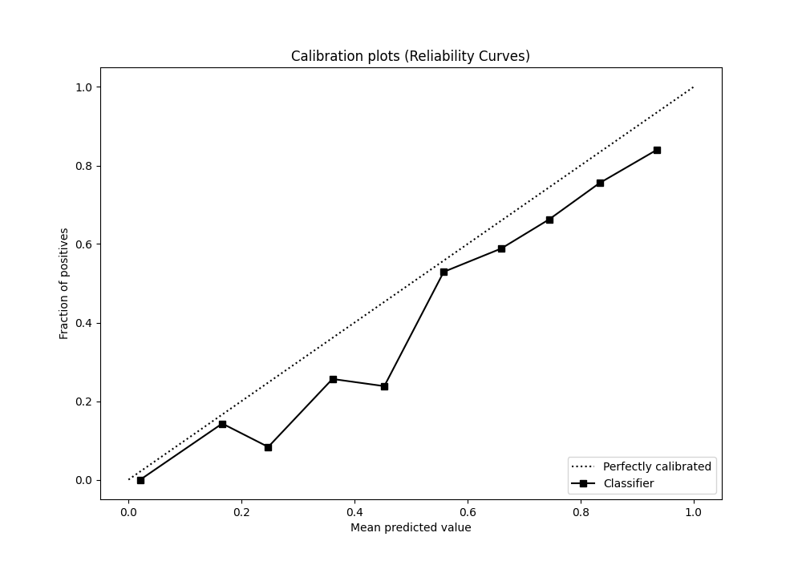
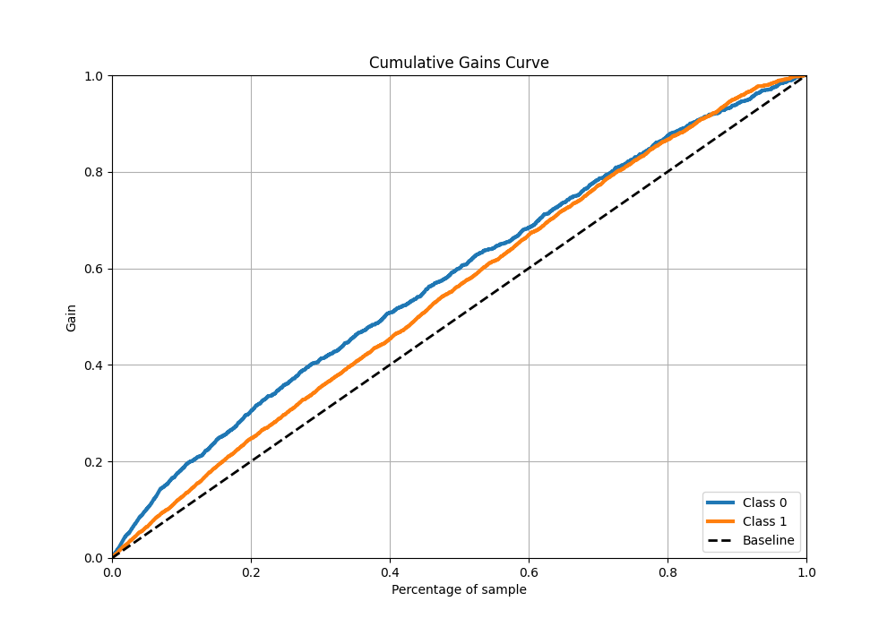
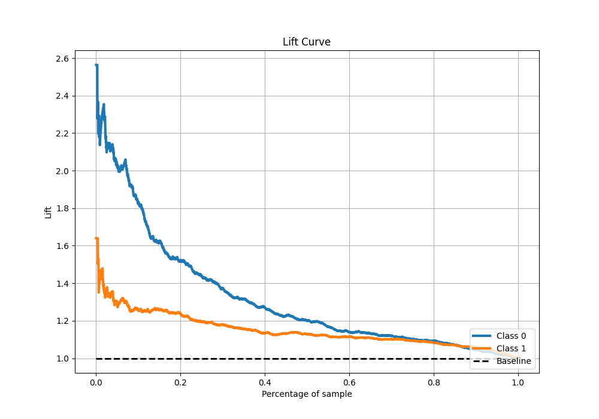

# Summary of 18_RandomForest

[<< Go back](../README.md)

## Random Forest
- **n_jobs**: -1
- **criterion**: gini
- **max_features**: 0.5
- **min_samples_split**: 20
- **max_depth**: 4
- **eval_metric_name**: f1
- **explain_level**: 1

## Validation
 - **validation_type**: kfold
 - **k_folds**: 5
 - **shuffle**: True
 - **stratify**: True
 - **random_seed**: 1234

## Optimized metric
f1

## Training time

13.1 seconds

## Metric details
|           |    score |   threshold |
|:----------|---------:|------------:|
| logloss   | 0.641895 |  nan        |
| auc       | 0.630834 |  nan        |
| f1        | 0.774226 |    0.500166 |
| accuracy  | 0.653817 |    0.533182 |
| precision | 0.844444 |    0.738585 |
| recall    | 1        |    0.193943 |
| mcc       | 0.232139 |    0.500166 |

## Metric details with threshold from accuracy metric
|           |    score |   threshold |
|:----------|---------:|------------:|
| logloss   | 0.641895 |  nan        |
| auc       | 0.630834 |  nan        |
| f1        | 0.76927  |    0.533182 |
| accuracy  | 0.653817 |    0.533182 |
| precision | 0.648093 |    0.533182 |
| recall    | 0.946183 |    0.533182 |
| mcc       | 0.223107 |    0.533182 |

## Confusion matrix (at threshold=0.533182)
|              |   Predicted as 0 |   Predicted as 1 |
|:-------------|-----------------:|-----------------:|
| Labeled as 0 |              201 |              821 |
| Labeled as 1 |               86 |             1512 |

## Learning curves

## Permutation-based Importance

## Confusion Matrix

## Normalized Confusion Matrix

## ROC Curve

## Kolmogorov-Smirnov Statistic

## Precision-Recall Curve

## Calibration Curve

## Cumulative Gains Curve

## Lift Curve

[<< Go back](../README.md)
