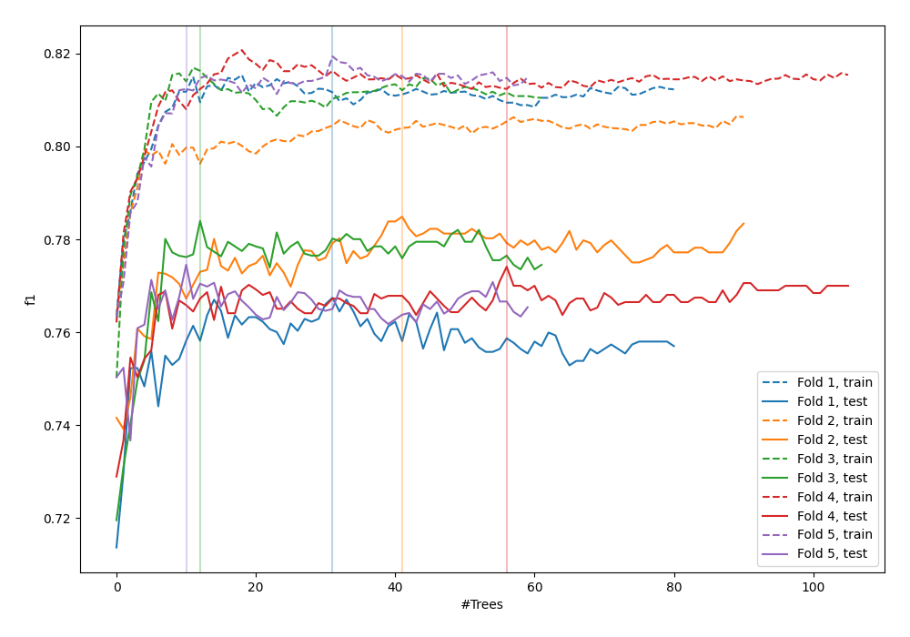
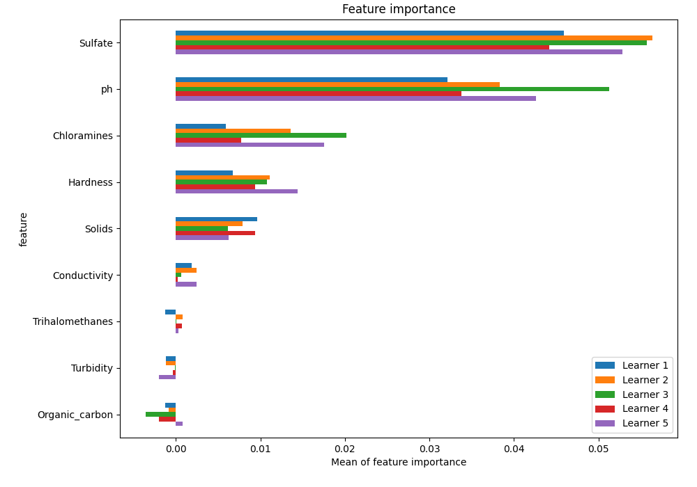
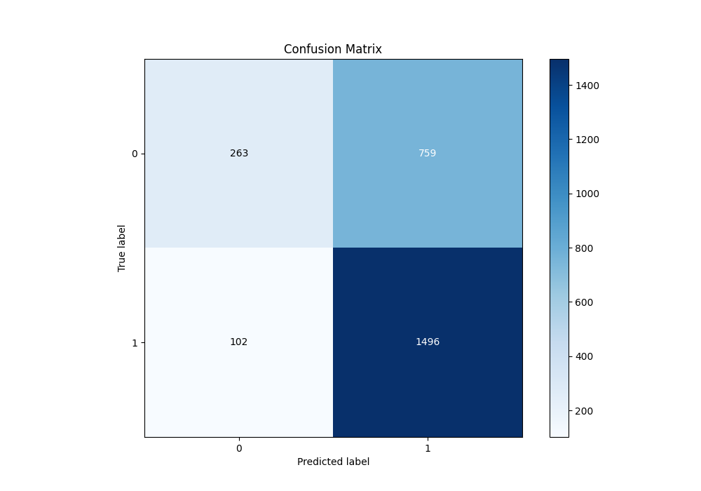
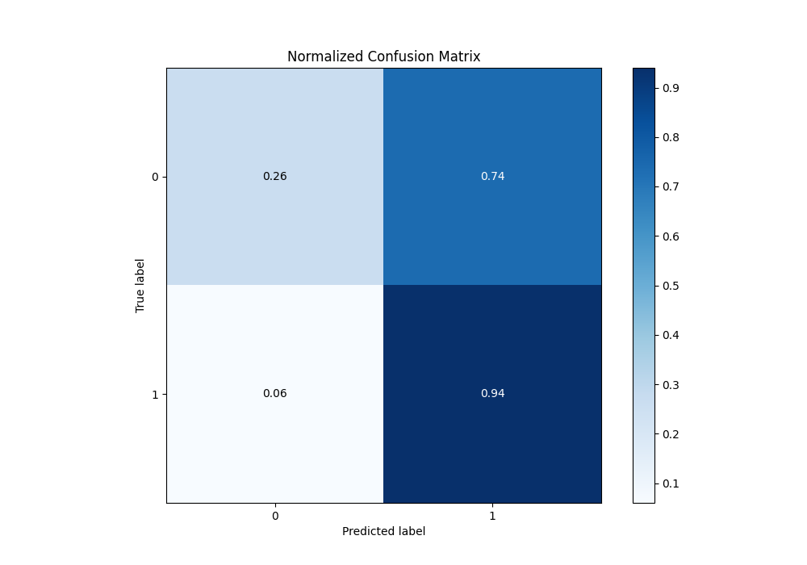
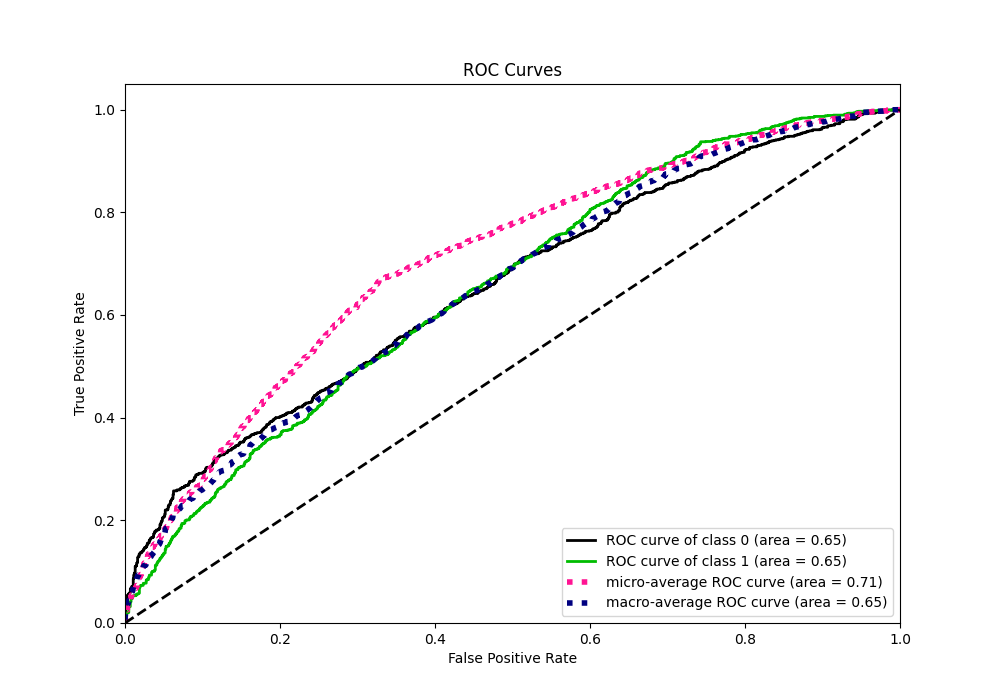
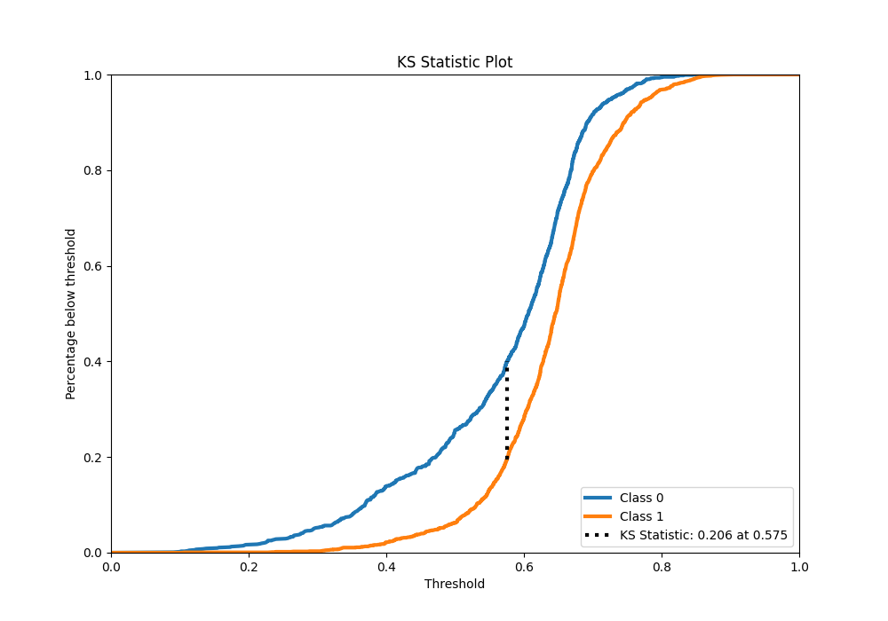
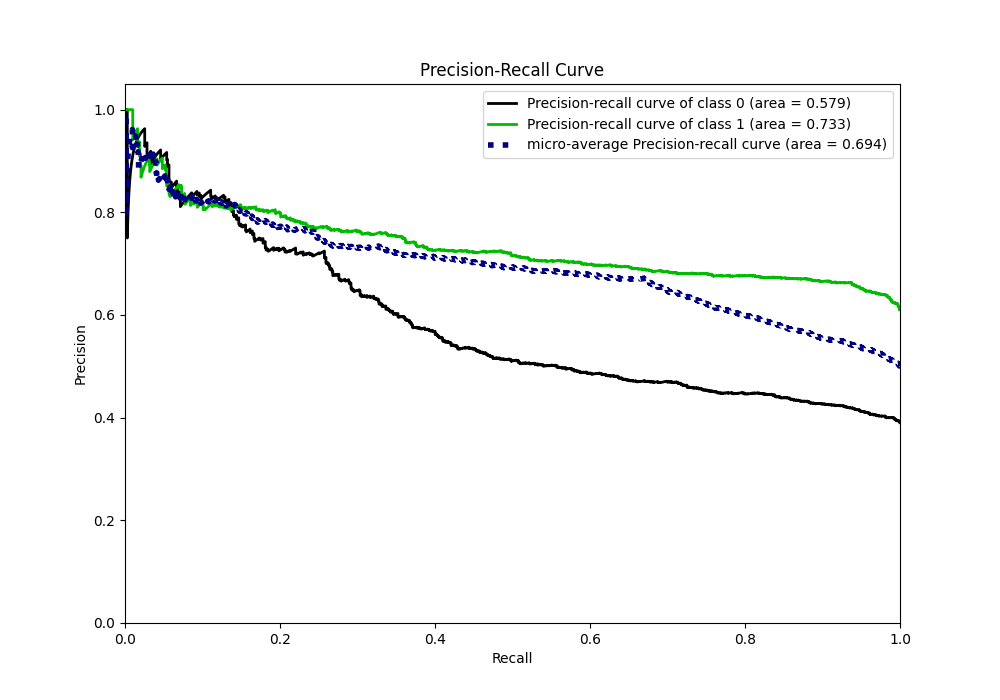
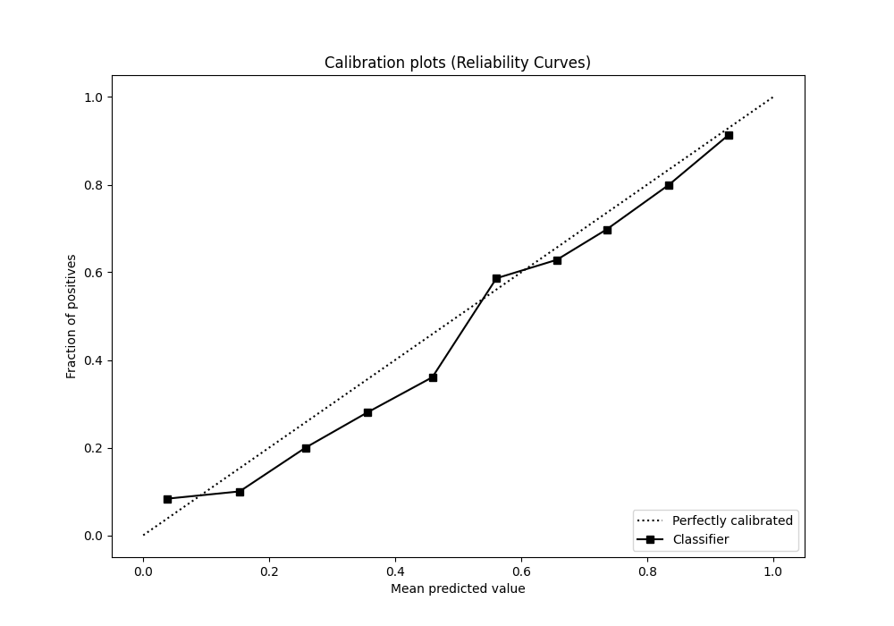
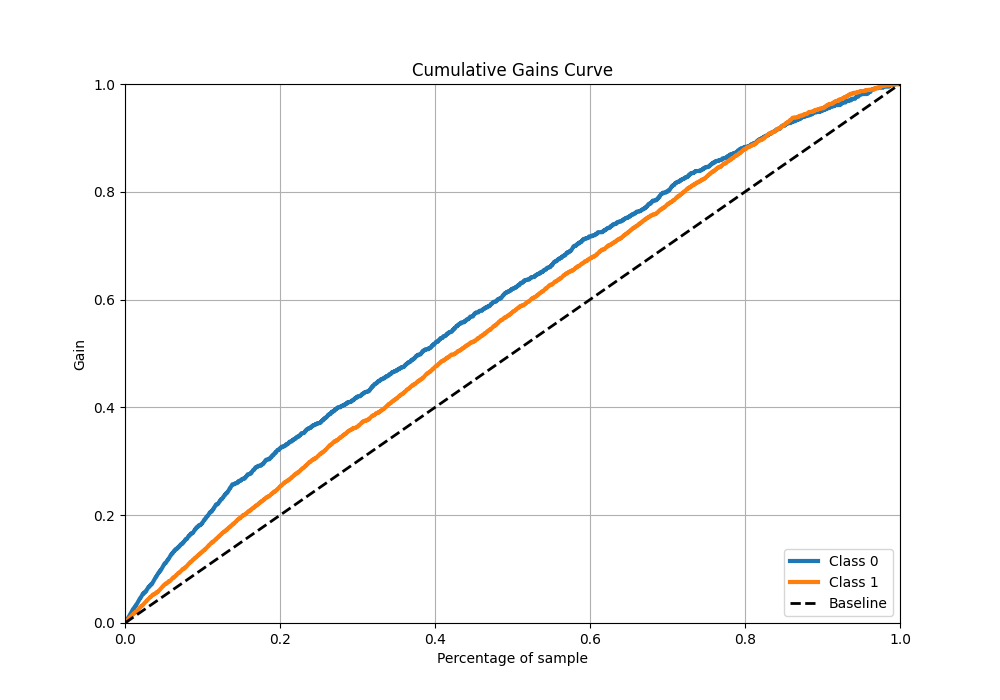
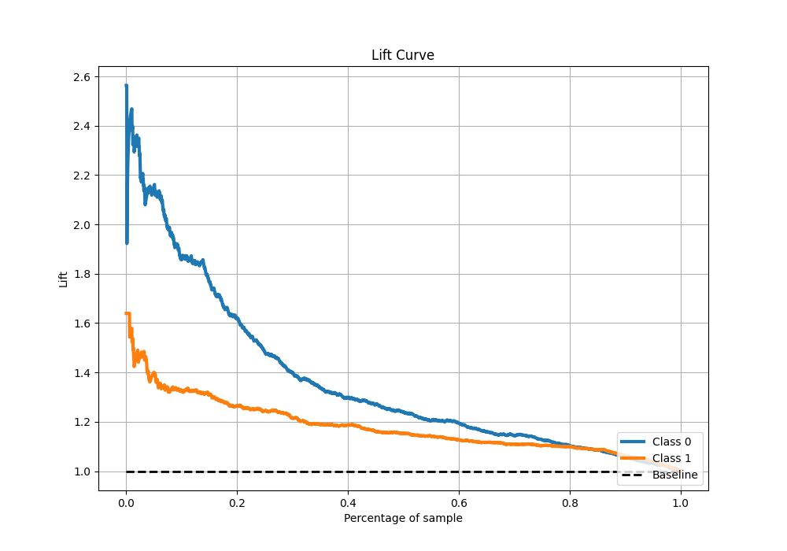

# Summary of 19_RandomForest

[<< Go back](../README.md)

## Random Forest
- **n_jobs**: -1
- **criterion**: gini
- **max_features**: 0.7
- **min_samples_split**: 30
- **max_depth**: 7
- **eval_metric_name**: f1
- **explain_level**: 1

## Validation
 - **validation_type**: kfold
 - **k_folds**: 5
 - **shuffle**: True
 - **stratify**: True
 - **random_seed**: 1234

## Optimized metric
f1

## Training time

13.7 seconds

## Metric details
|           |    score |   threshold |
|:----------|---------:|------------:|
| logloss   | 0.625308 | nan         |
| auc       | 0.654283 | nan         |
| f1        | 0.776538 |   0.502204  |
| accuracy  | 0.671374 |   0.502204  |
| precision | 0.901408 |   0.790799  |
| recall    | 1        |   0.0815171 |
| mcc       | 0.27258  |   0.502204  |

## Metric details with threshold from accuracy metric
|           |    score |   threshold |
|:----------|---------:|------------:|
| logloss   | 0.625308 |  nan        |
| auc       | 0.654283 |  nan        |
| f1        | 0.776538 |    0.502204 |
| accuracy  | 0.671374 |    0.502204 |
| precision | 0.663415 |    0.502204 |
| recall    | 0.93617  |    0.502204 |
| mcc       | 0.27258  |    0.502204 |

## Confusion matrix (at threshold=0.502204)
|              |   Predicted as 0 |   Predicted as 1 |
|:-------------|-----------------:|-----------------:|
| Labeled as 0 |              263 |              759 |
| Labeled as 1 |              102 |             1496 |

## Learning curves

## Permutation-based Importance

## Confusion Matrix

## Normalized Confusion Matrix

## ROC Curve

## Kolmogorov-Smirnov Statistic

## Precision-Recall Curve

## Calibration Curve

## Cumulative Gains Curve

## Lift Curve

[<< Go back](../README.md)
