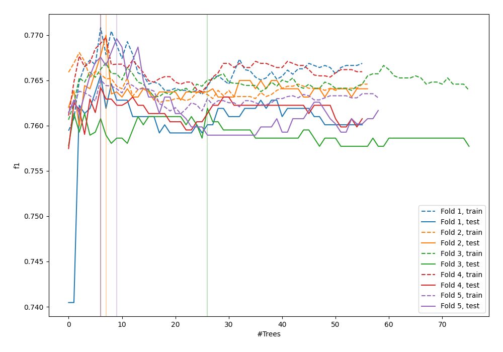
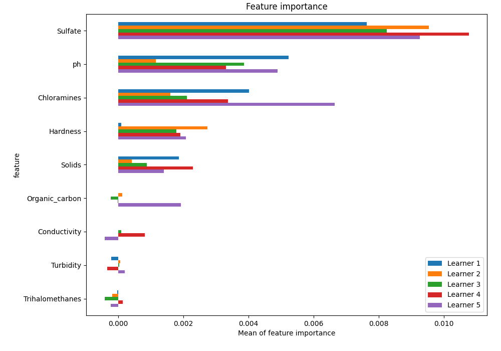
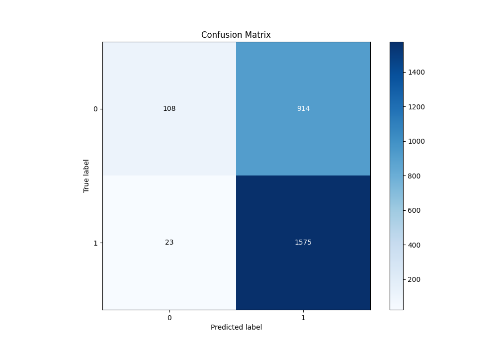
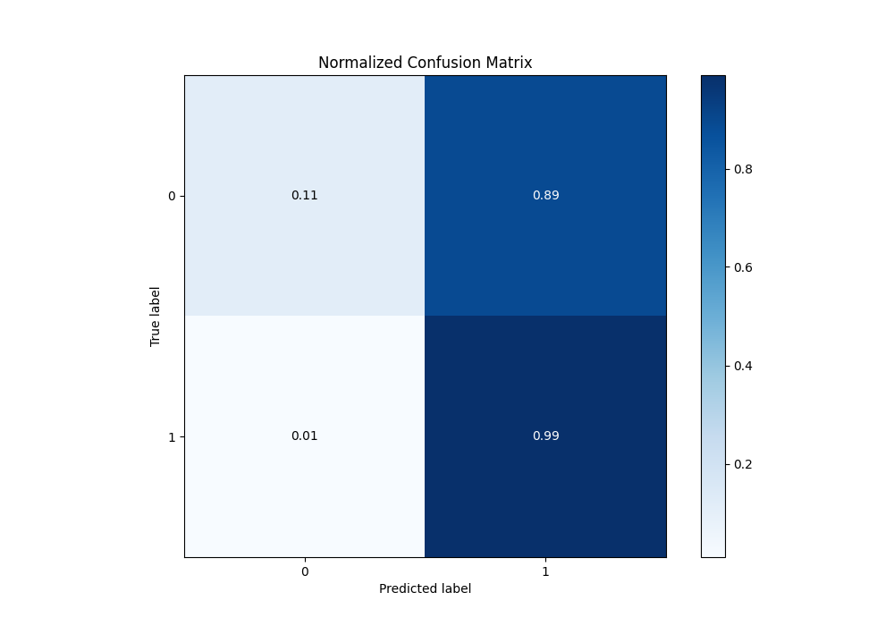
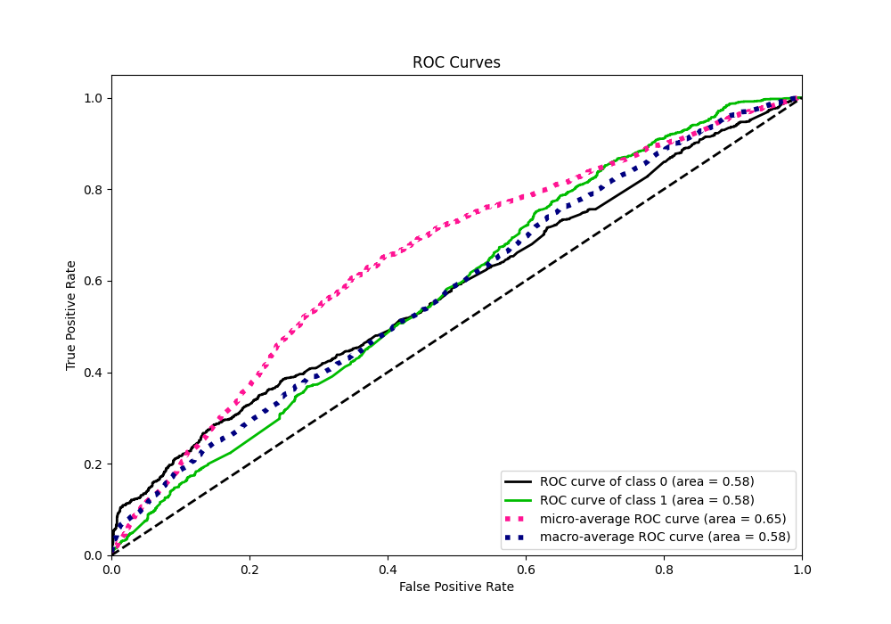
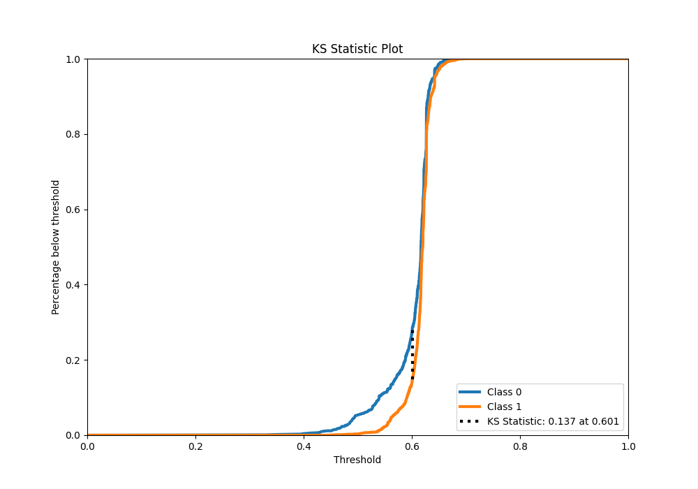
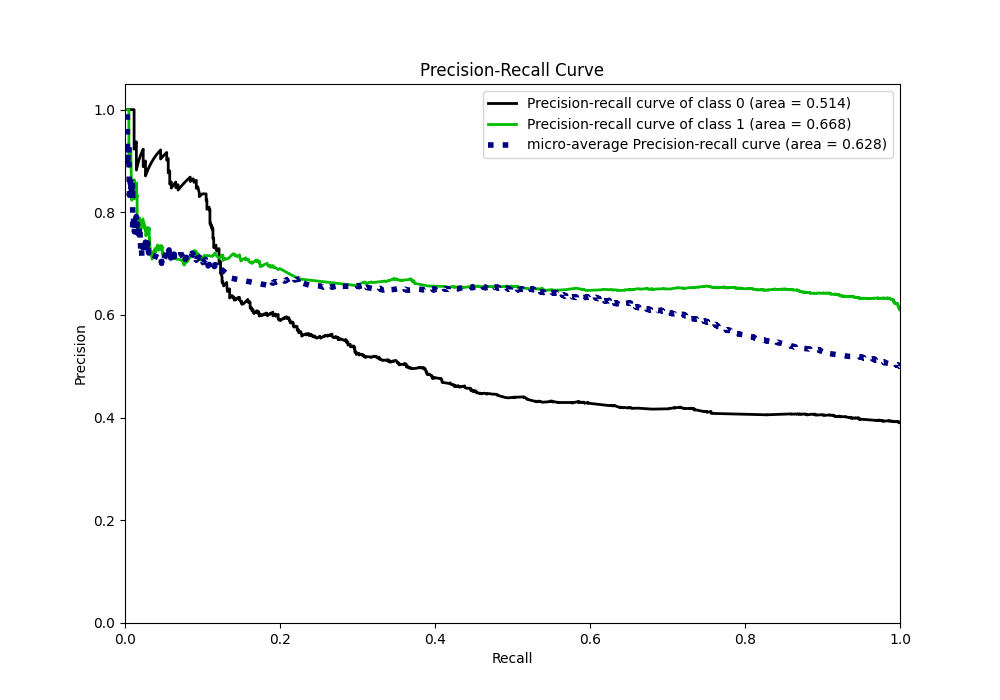
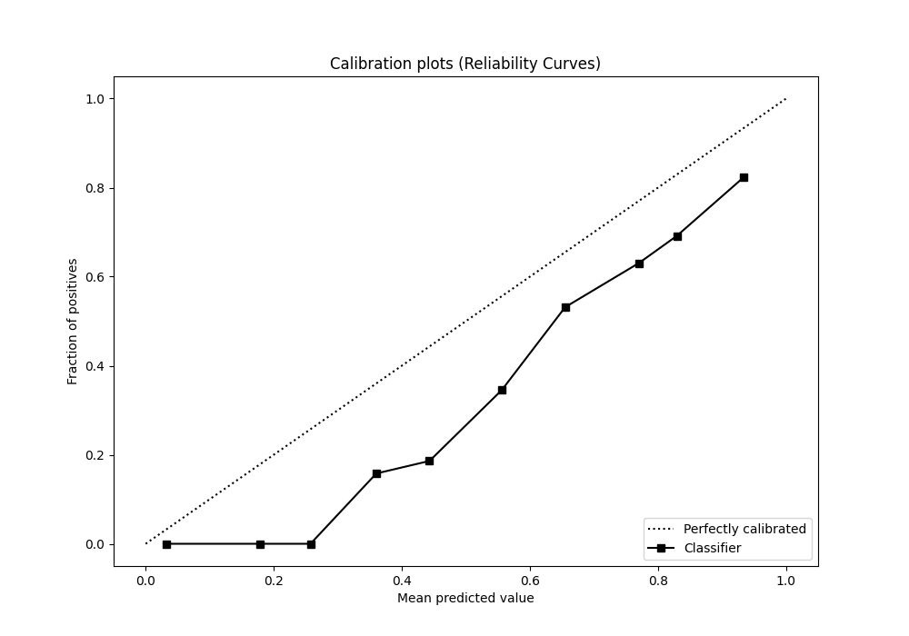
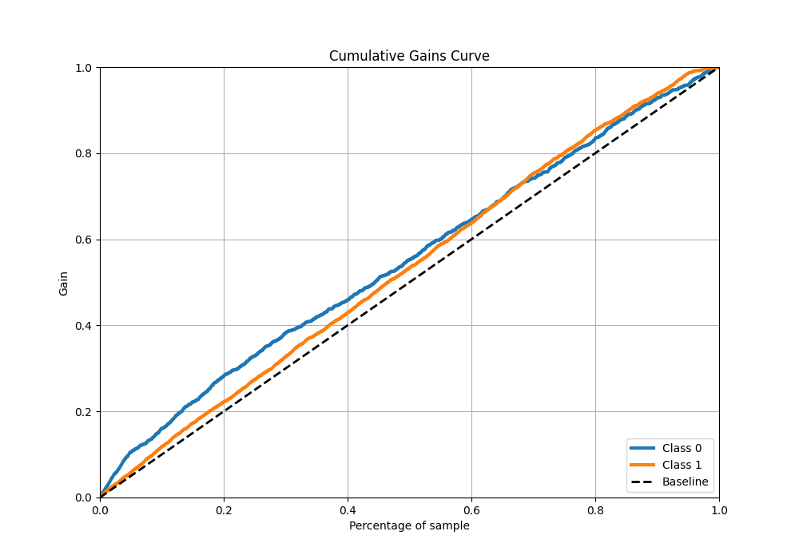
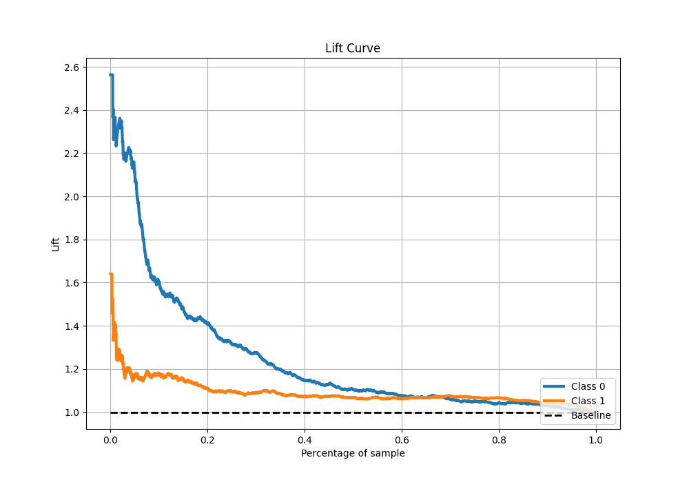

# Summary of 22_ExtraTrees

[<< Go back](../README.md)

## Extra Trees Classifier (Extra Trees)
- **n_jobs**: -1
- **criterion**: gini
- **max_features**: 0.5
- **min_samples_split**: 20
- **max_depth**: 4
- **eval_metric_name**: f1
- **explain_level**: 1

## Validation
 - **validation_type**: kfold
 - **k_folds**: 5
 - **shuffle**: True
 - **stratify**: True
 - **random_seed**: 1234

## Optimized metric
f1

## Training time

10.5 seconds

## Metric details
|           |    score |   threshold |
|:----------|---------:|------------:|
| logloss   | 0.657222 |  nan        |
| auc       | 0.581525 |  nan        |
| f1        | 0.770736 |    0.54292  |
| accuracy  | 0.642366 |    0.54292  |
| precision | 0.777778 |    0.65308  |
| recall    | 1        |    0.297009 |
| mcc       | 0.204292 |    0.54292  |

## Metric details with threshold from accuracy metric
|           |    score |   threshold |
|:----------|---------:|------------:|
| logloss   | 0.657222 |   nan       |
| auc       | 0.581525 |   nan       |
| f1        | 0.770736 |     0.54292 |
| accuracy  | 0.642366 |     0.54292 |
| precision | 0.632784 |     0.54292 |
| recall    | 0.985607 |     0.54292 |
| mcc       | 0.204292 |     0.54292 |

## Confusion matrix (at threshold=0.54292)
|              |   Predicted as 0 |   Predicted as 1 |
|:-------------|-----------------:|-----------------:|
| Labeled as 0 |              108 |              914 |
| Labeled as 1 |               23 |             1575 |

## Learning curves

## Permutation-based Importance

## Confusion Matrix

## Normalized Confusion Matrix

## ROC Curve

## Kolmogorov-Smirnov Statistic

## Precision-Recall Curve

## Calibration Curve

## Cumulative Gains Curve

## Lift Curve

[<< Go back](../README.md)
