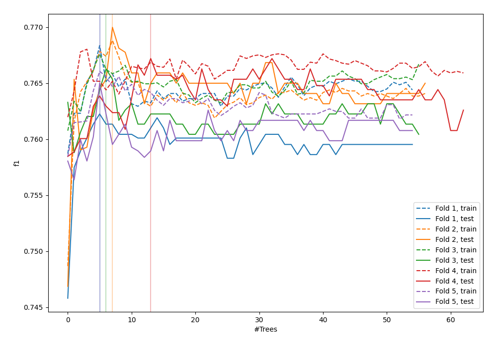
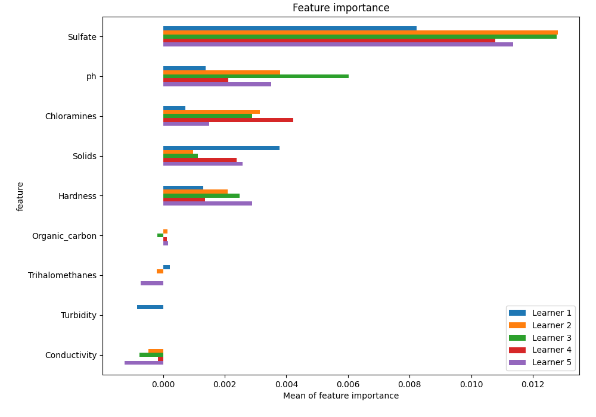
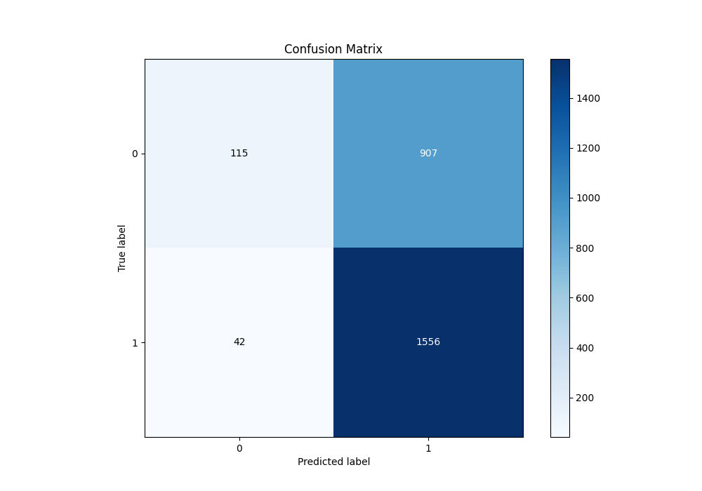
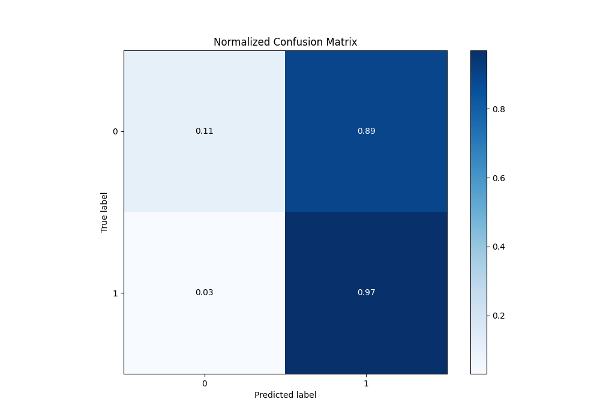
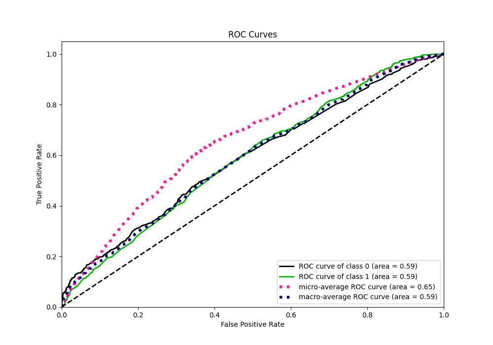
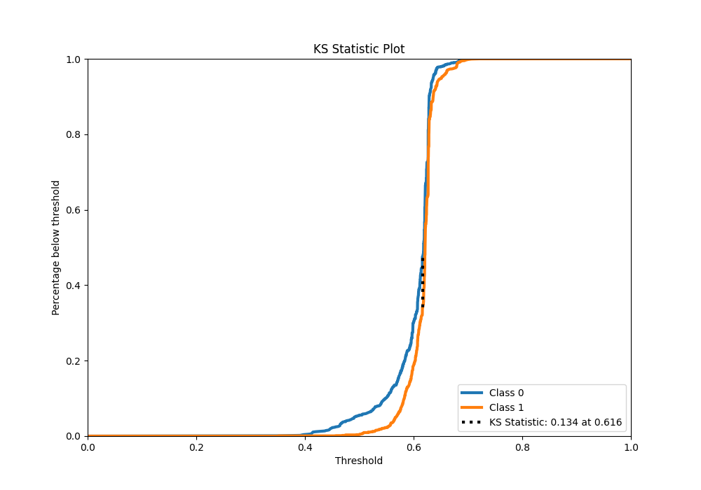
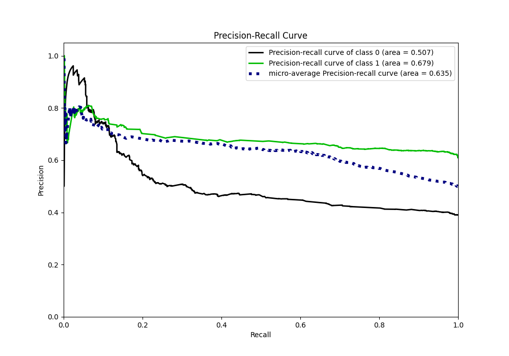
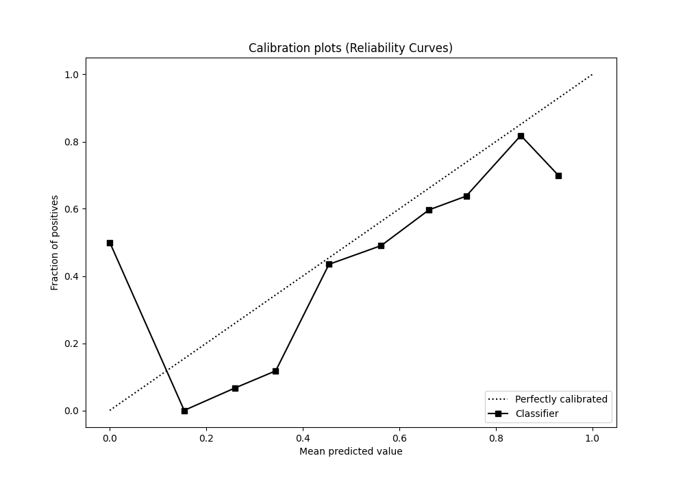
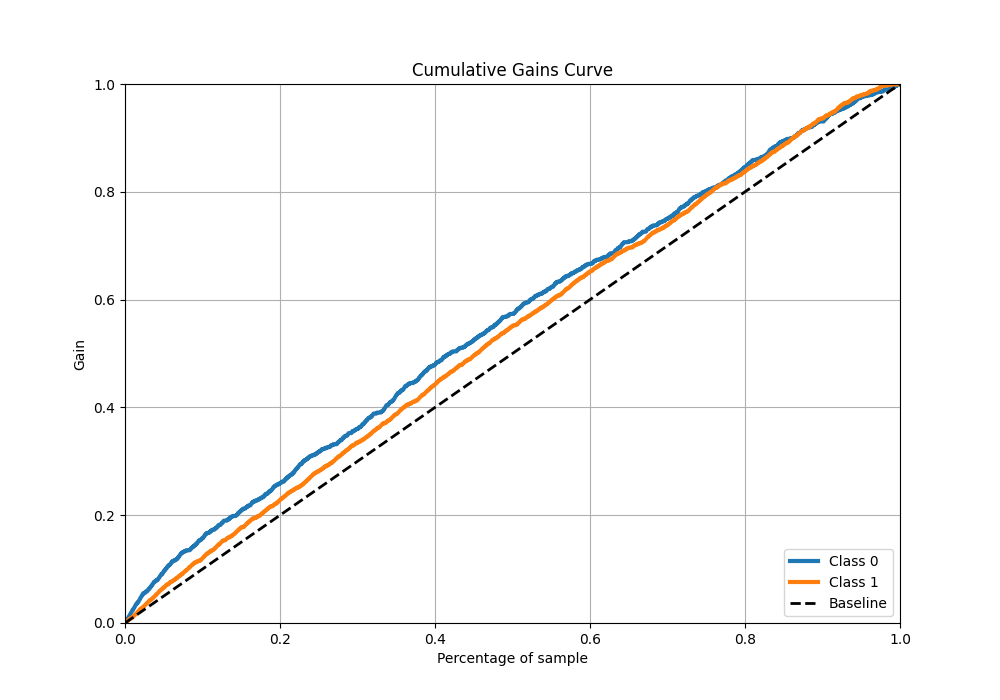
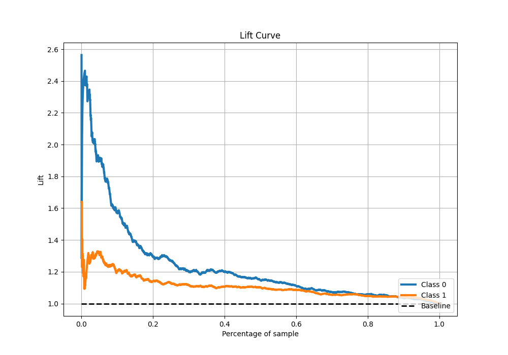

# Summary of 24_ExtraTrees

[<< Go back](../README.md)

## Extra Trees Classifier (Extra Trees)
- **n_jobs**: -1
- **criterion**: gini
- **max_features**: 0.8
- **min_samples_split**: 40
- **max_depth**: 3
- **eval_metric_name**: f1
- **explain_level**: 1

## Validation
 - **validation_type**: kfold
 - **k_folds**: 5
 - **shuffle**: True
 - **stratify**: True
 - **random_seed**: 1234

## Optimized metric
f1

## Training time

11.0 seconds

## Metric details
|           |    score |   threshold |
|:----------|---------:|------------:|
| logloss   | 0.657052 |  nan        |
| auc       | 0.590427 |  nan        |
| f1        | 0.766314 |    0.554942 |
| accuracy  | 0.637786 |    0.554942 |
| precision | 0.808333 |    0.6439   |
| recall    | 1        |    0.316035 |
| mcc       | 0.177235 |    0.554942 |

## Metric details with threshold from accuracy metric
|           |    score |   threshold |
|:----------|---------:|------------:|
| logloss   | 0.657052 |  nan        |
| auc       | 0.590427 |  nan        |
| f1        | 0.766314 |    0.554942 |
| accuracy  | 0.637786 |    0.554942 |
| precision | 0.63175  |    0.554942 |
| recall    | 0.973717 |    0.554942 |
| mcc       | 0.177235 |    0.554942 |

## Confusion matrix (at threshold=0.554942)
|              |   Predicted as 0 |   Predicted as 1 |
|:-------------|-----------------:|-----------------:|
| Labeled as 0 |              115 |              907 |
| Labeled as 1 |               42 |             1556 |

## Learning curves

## Permutation-based Importance

## Confusion Matrix

## Normalized Confusion Matrix

## ROC Curve

## Kolmogorov-Smirnov Statistic

## Precision-Recall Curve

## Calibration Curve

## Cumulative Gains Curve

## Lift Curve

[<< Go back](../README.md)
