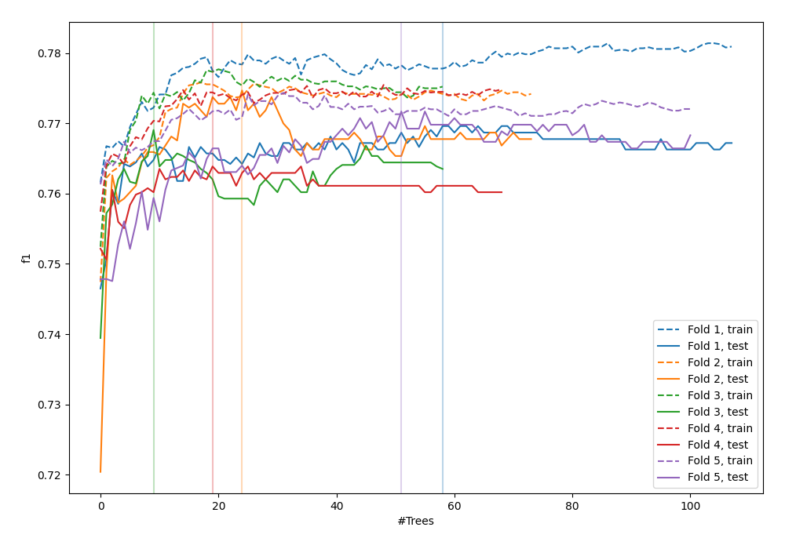
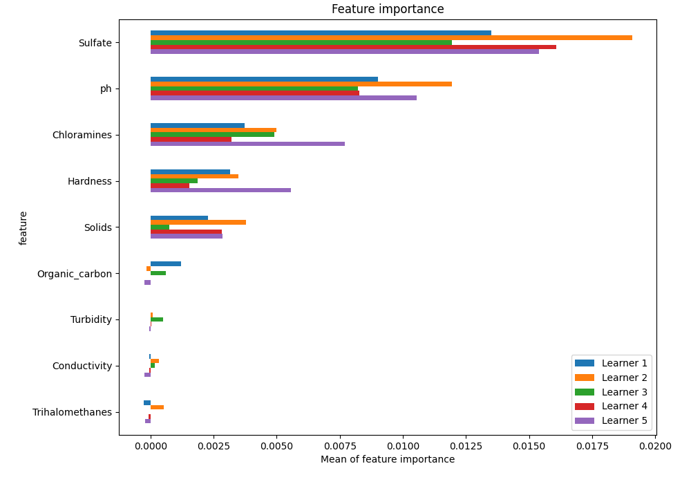
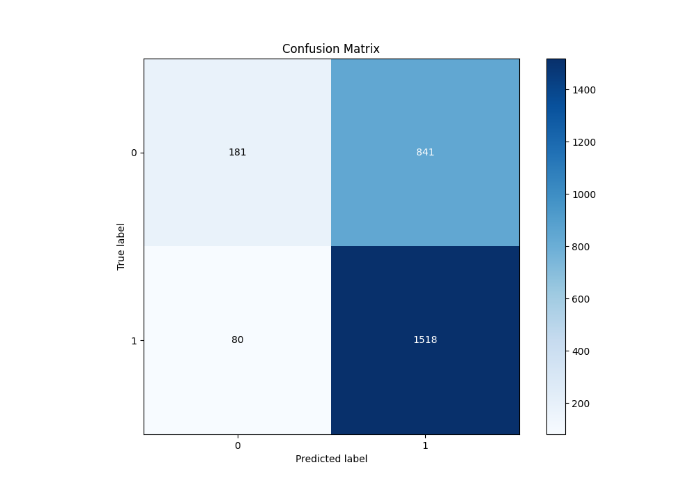
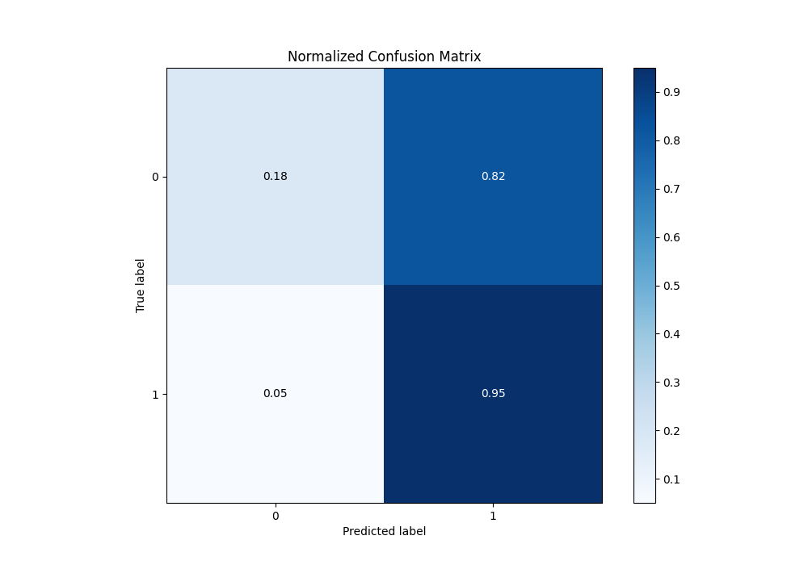
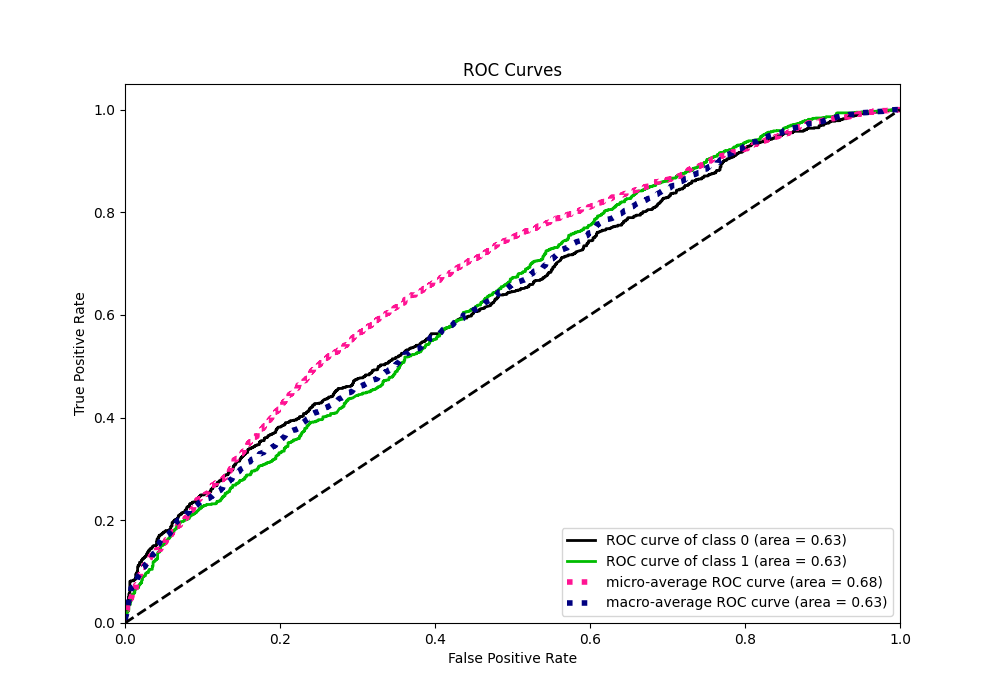
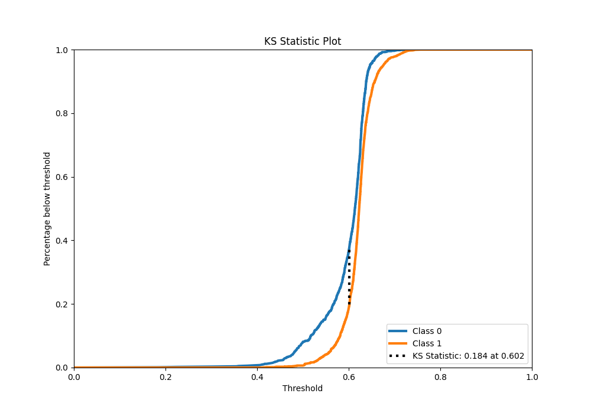
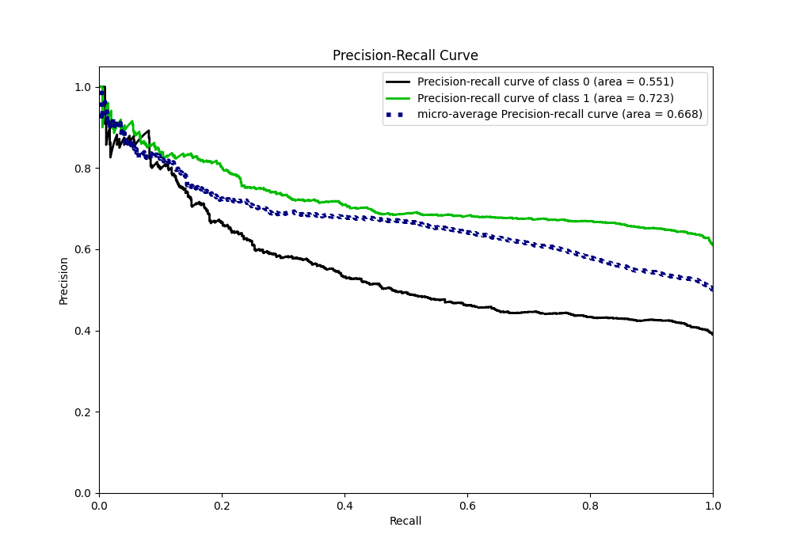
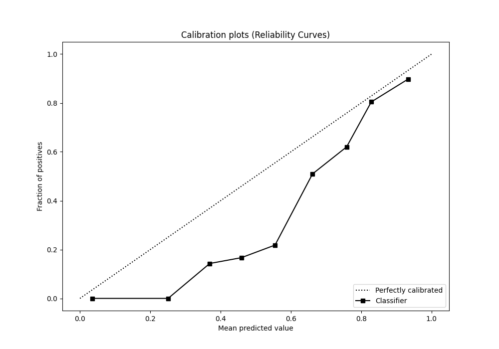
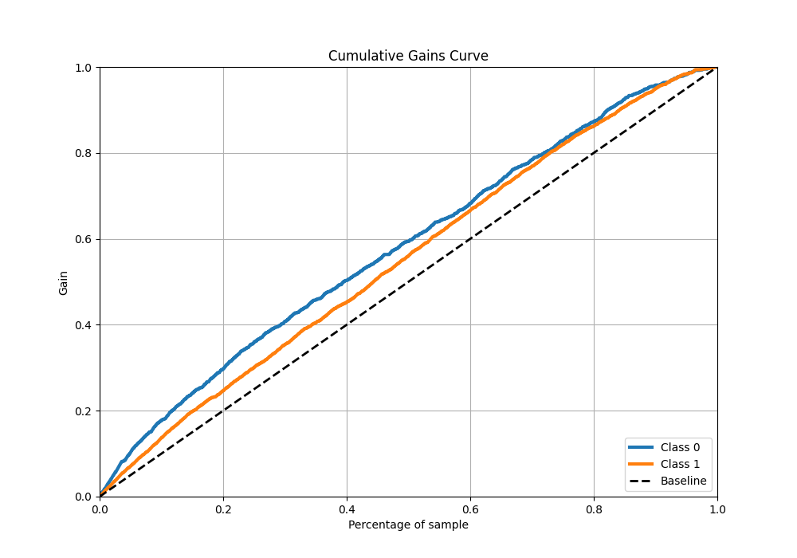
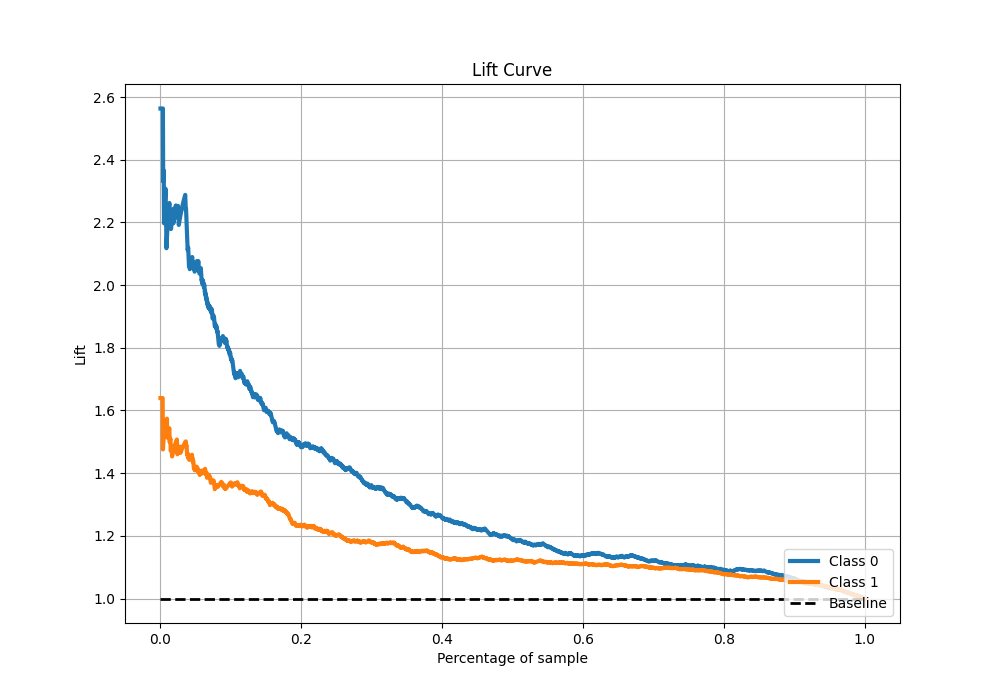

# Summary of 25_ExtraTrees

[<< Go back](../README.md)

## Extra Trees Classifier (Extra Trees)
- **n_jobs**: -1
- **criterion**: entropy
- **max_features**: 0.6
- **min_samples_split**: 50
- **max_depth**: 6
- **eval_metric_name**: f1
- **explain_level**: 1

## Validation
 - **validation_type**: kfold
 - **k_folds**: 5
 - **shuffle**: True
 - **stratify**: True
 - **random_seed**: 1234

## Optimized metric
f1

## Training time

13.5 seconds

## Metric details
|           |    score |   threshold |
|:----------|---------:|------------:|
| logloss   | 0.648399 |  nan        |
| auc       | 0.632197 |  nan        |
| f1        | 0.770254 |    0.530168 |
| accuracy  | 0.648473 |    0.558998 |
| precision | 0.907216 |    0.672954 |
| recall    | 1        |    0.165859 |
| mcc       | 0.207472 |    0.595651 |

## Metric details with threshold from accuracy metric
|           |    score |   threshold |
|:----------|---------:|------------:|
| logloss   | 0.648399 |  nan        |
| auc       | 0.632197 |  nan        |
| f1        | 0.767248 |    0.558998 |
| accuracy  | 0.648473 |    0.558998 |
| precision | 0.643493 |    0.558998 |
| recall    | 0.949937 |    0.558998 |
| mcc       | 0.206906 |    0.558998 |

## Confusion matrix (at threshold=0.558998)
|              |   Predicted as 0 |   Predicted as 1 |
|:-------------|-----------------:|-----------------:|
| Labeled as 0 |              181 |              841 |
| Labeled as 1 |               80 |             1518 |

## Learning curves

## Permutation-based Importance

## Confusion Matrix

## Normalized Confusion Matrix

## ROC Curve

## Kolmogorov-Smirnov Statistic

## Precision-Recall Curve

## Calibration Curve

## Cumulative Gains Curve

## Lift Curve

[<< Go back](../README.md)
