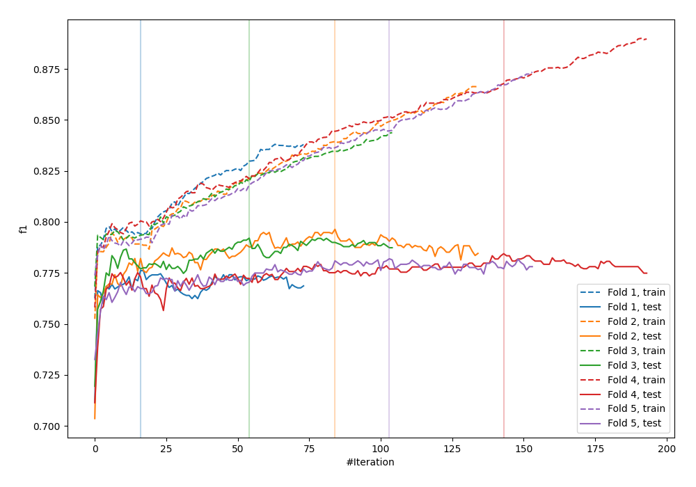
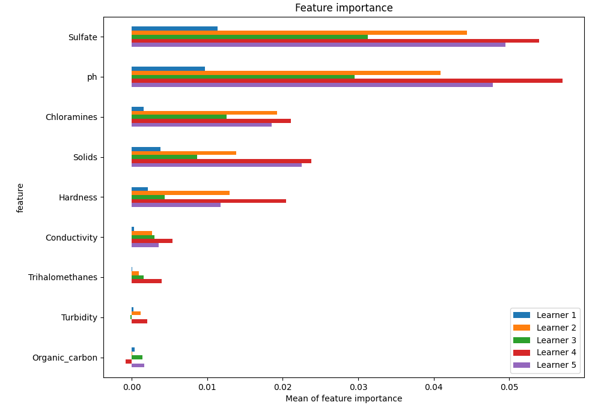
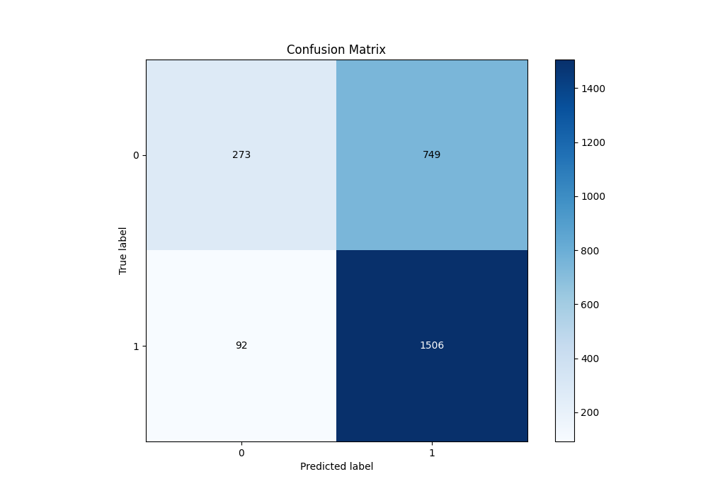
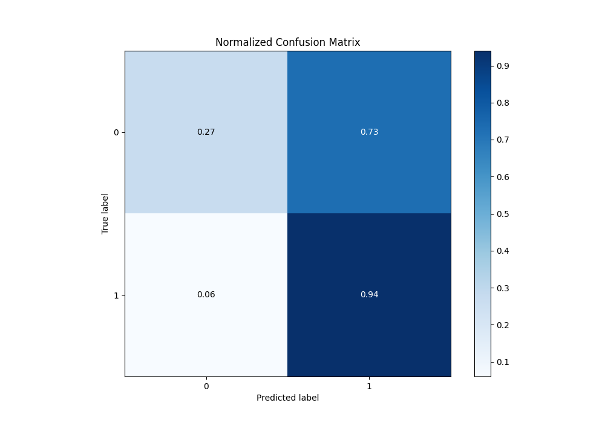
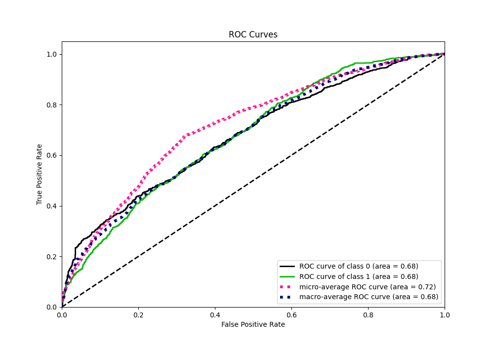
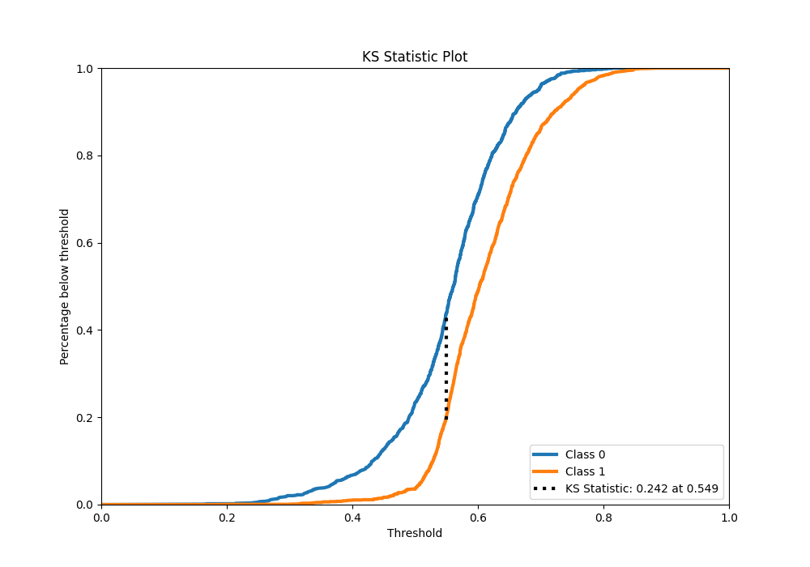
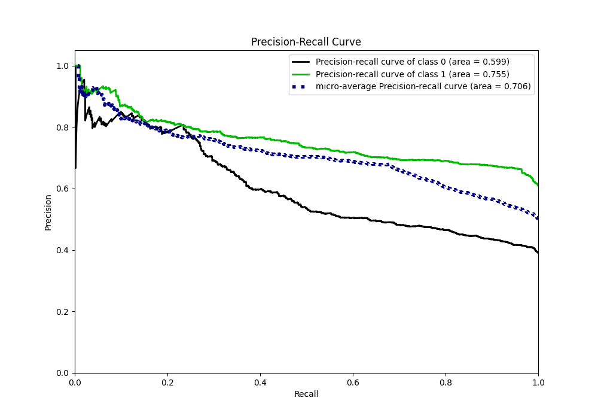
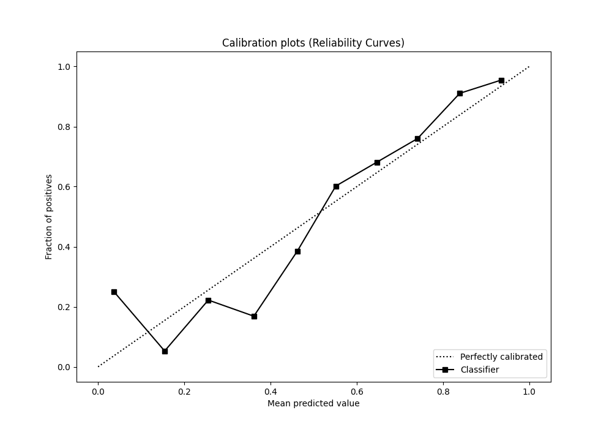
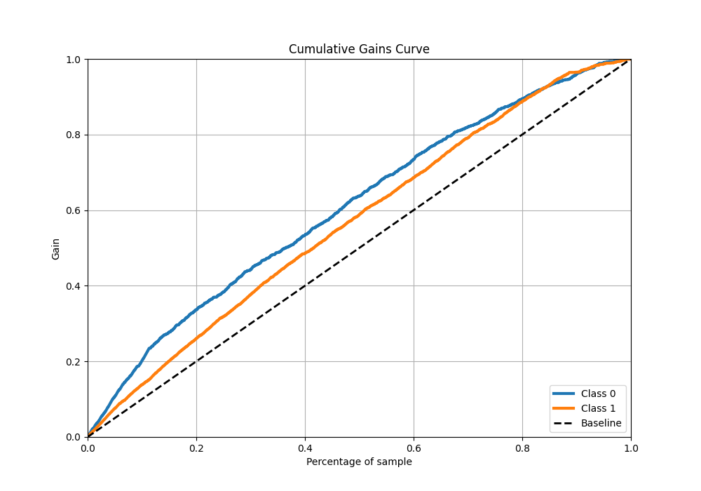
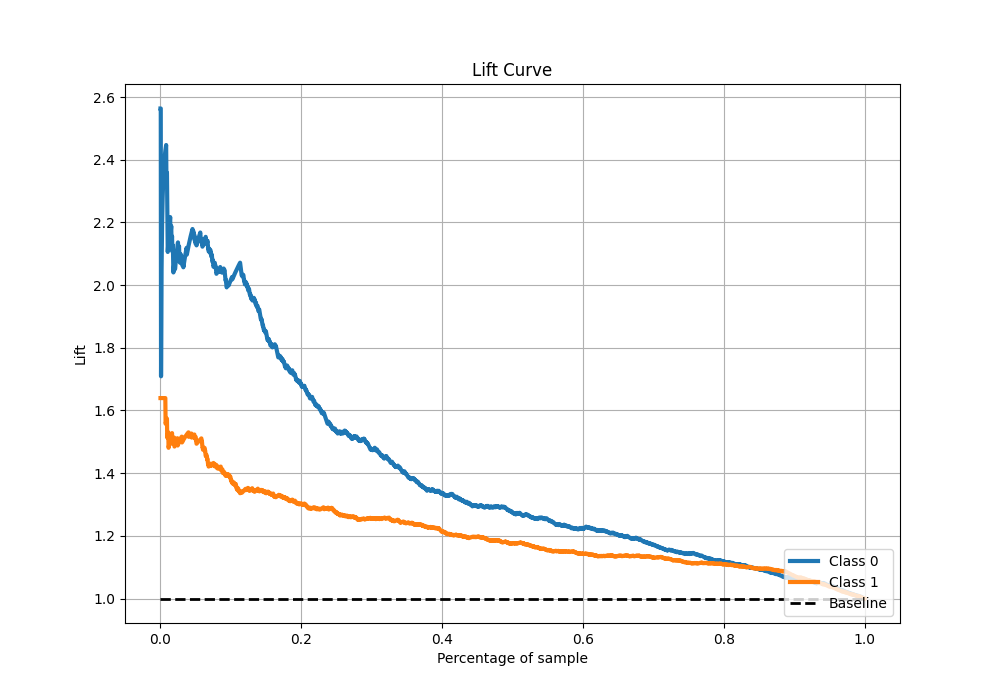

# Summary of 26_CatBoost

[<< Go back](../README.md)

## CatBoost
- **n_jobs**: -1
- **learning_rate**: 0.025
- **depth**: 8
- **rsm**: 0.8
- **loss_function**: Logloss
- **eval_metric**: F1
- **explain_level**: 1

## Validation
 - **validation_type**: kfold
 - **k_folds**: 5
 - **shuffle**: True
 - **stratify**: True
 - **random_seed**: 1234

## Optimized metric
f1

## Training time

13.7 seconds

## Metric details
|           |    score |   threshold |
|:----------|---------:|------------:|
| logloss   | 0.626634 |  nan        |
| auc       | 0.677205 |  nan        |
| f1        | 0.784123 |    0.503461 |
| accuracy  | 0.679008 |    0.51231  |
| precision | 0.927835 |    0.754479 |
| recall    | 1        |    0.146678 |
| mcc       | 0.29894  |    0.503461 |

## Metric details with threshold from accuracy metric
|           |    score |   threshold |
|:----------|---------:|------------:|
| logloss   | 0.626634 |   nan       |
| auc       | 0.677205 |   nan       |
| f1        | 0.781729 |     0.51231 |
| accuracy  | 0.679008 |     0.51231 |
| precision | 0.667849 |     0.51231 |
| recall    | 0.942428 |     0.51231 |
| mcc       | 0.295178 |     0.51231 |

## Confusion matrix (at threshold=0.51231)
|              |   Predicted as 0 |   Predicted as 1 |
|:-------------|-----------------:|-----------------:|
| Labeled as 0 |              273 |              749 |
| Labeled as 1 |               92 |             1506 |

## Learning curves

## Permutation-based Importance

## Confusion Matrix

## Normalized Confusion Matrix

## ROC Curve

## Kolmogorov-Smirnov Statistic

## Precision-Recall Curve

## Calibration Curve

## Cumulative Gains Curve

## Lift Curve

[<< Go back](../README.md)
