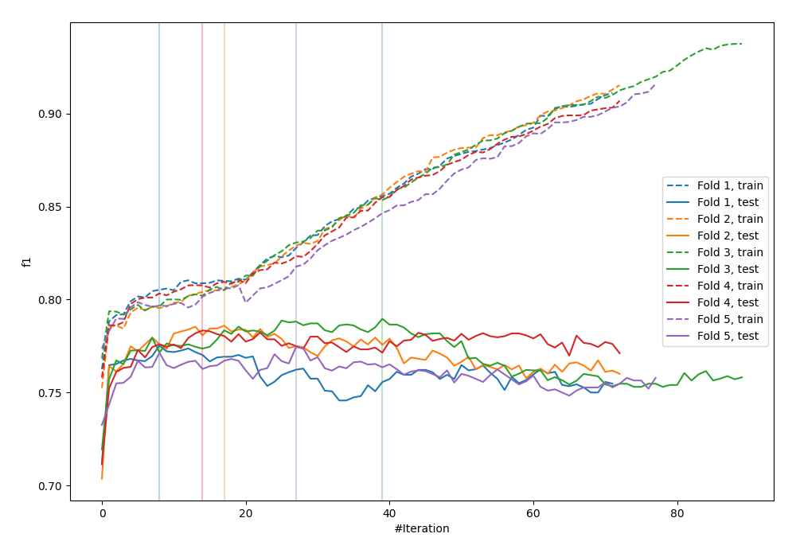
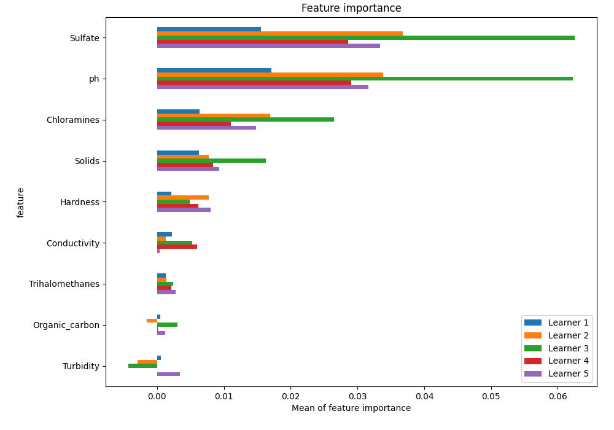
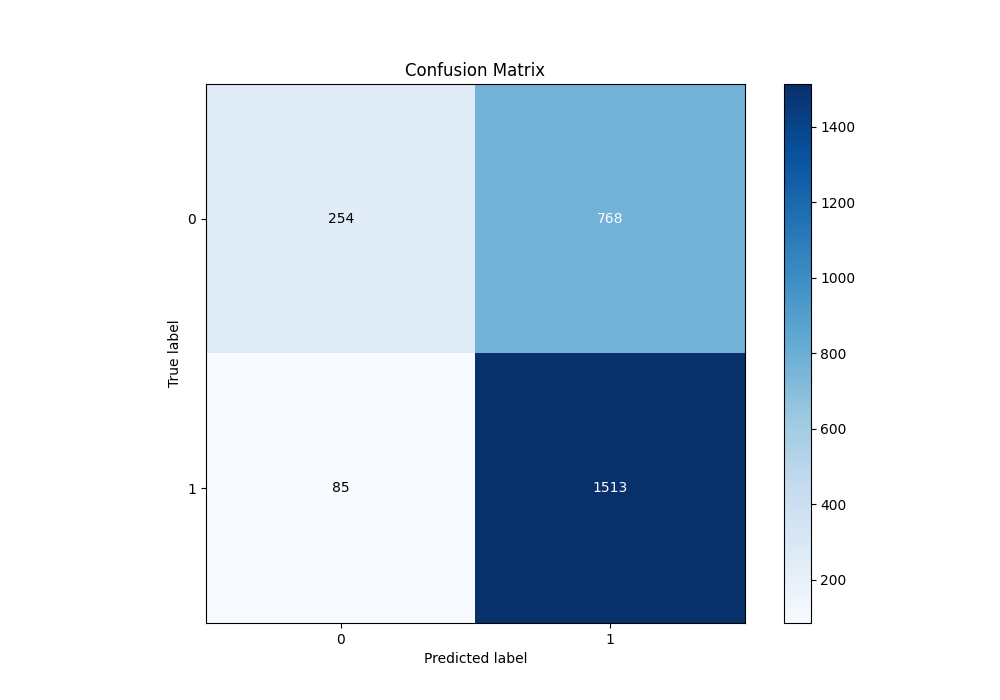
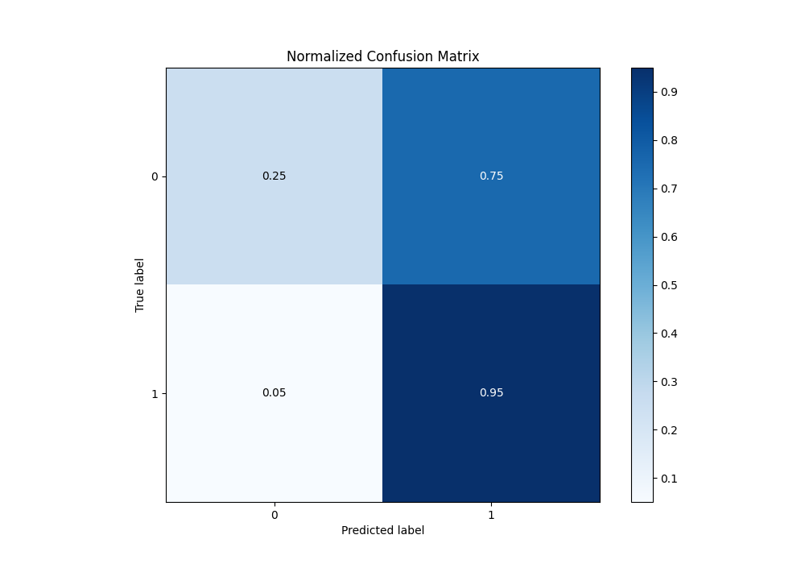
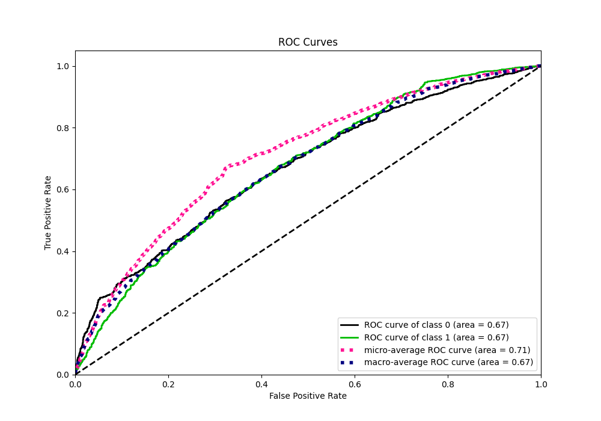
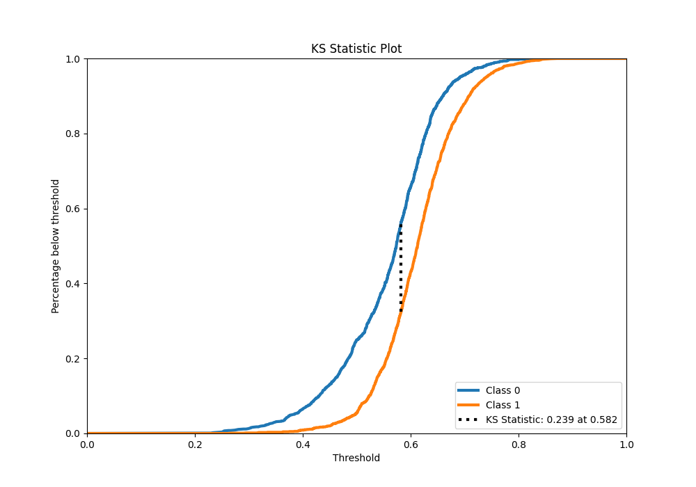
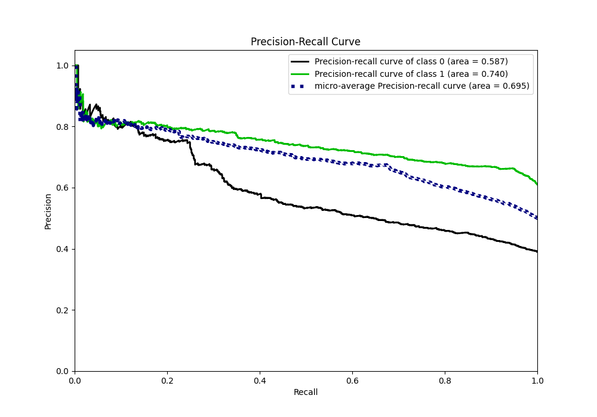
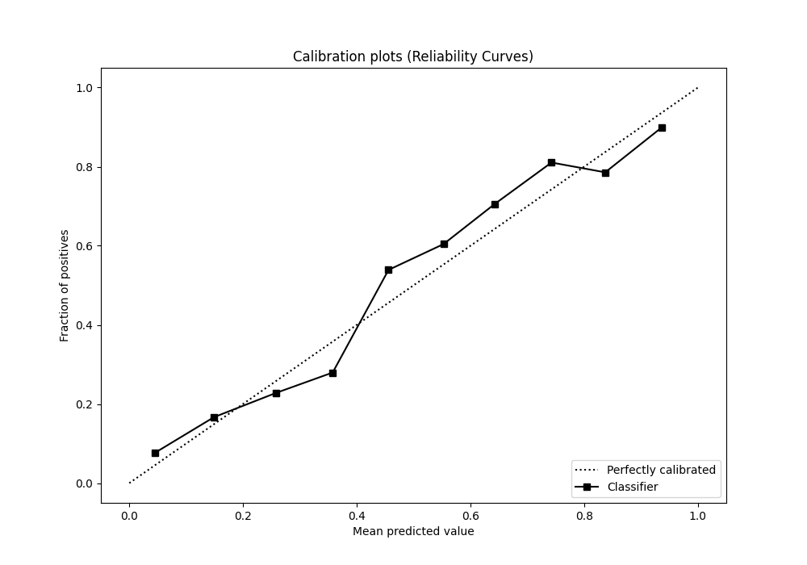
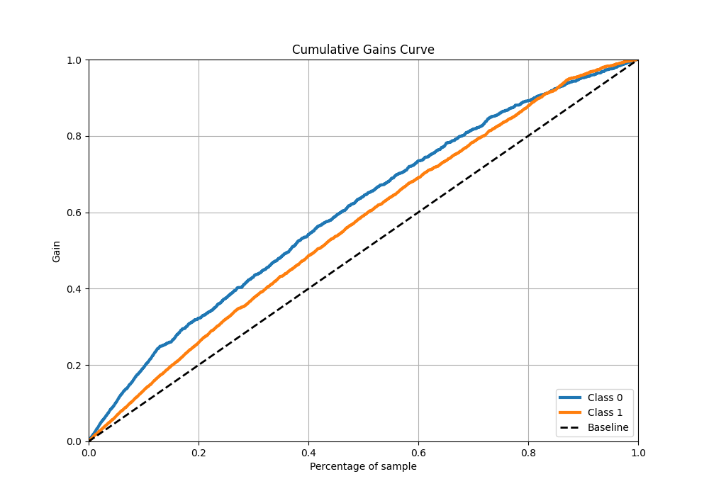
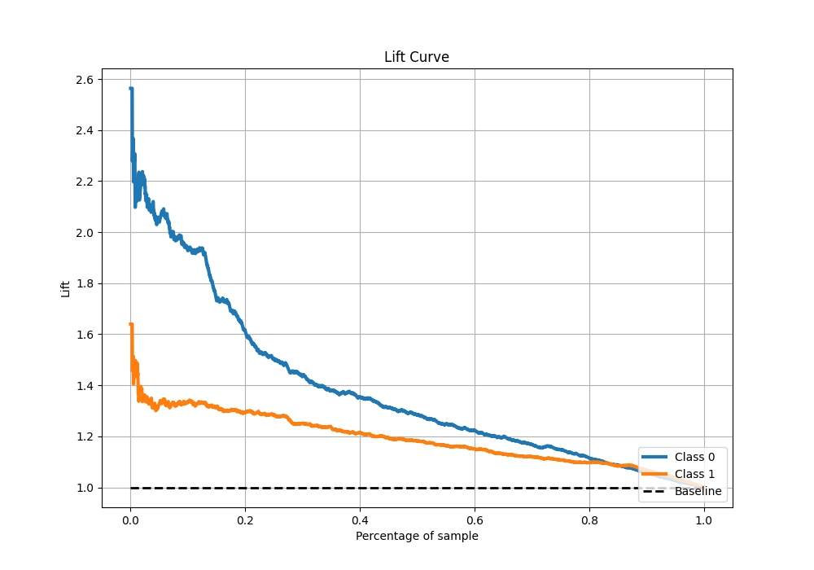

# Summary of 27_CatBoost

[<< Go back](../README.md)

## CatBoost
- **n_jobs**: -1
- **learning_rate**: 0.1
- **depth**: 8
- **rsm**: 0.8
- **loss_function**: Logloss
- **eval_metric**: F1
- **explain_level**: 1

## Validation
 - **validation_type**: kfold
 - **k_folds**: 5
 - **shuffle**: True
 - **stratify**: True
 - **random_seed**: 1234

## Optimized metric
f1

## Training time

9.4 seconds

## Metric details
|           |    score |   threshold |
|:----------|---------:|------------:|
| logloss   | 0.630604 |  nan        |
| auc       | 0.670167 |  nan        |
| f1        | 0.780098 |    0.499271 |
| accuracy  | 0.674427 |    0.499271 |
| precision | 0.844444 |    0.771777 |
| recall    | 1        |    0.206761 |
| mcc       | 0.283886 |    0.499271 |

## Metric details with threshold from accuracy metric
|           |    score |   threshold |
|:----------|---------:|------------:|
| logloss   | 0.630604 |  nan        |
| auc       | 0.670167 |  nan        |
| f1        | 0.780098 |    0.499271 |
| accuracy  | 0.674427 |    0.499271 |
| precision | 0.663306 |    0.499271 |
| recall    | 0.946809 |    0.499271 |
| mcc       | 0.283886 |    0.499271 |

## Confusion matrix (at threshold=0.499271)
|              |   Predicted as 0 |   Predicted as 1 |
|:-------------|-----------------:|-----------------:|
| Labeled as 0 |              254 |              768 |
| Labeled as 1 |               85 |             1513 |

## Learning curves

## Permutation-based Importance

## Confusion Matrix

## Normalized Confusion Matrix

## ROC Curve

## Kolmogorov-Smirnov Statistic

## Precision-Recall Curve

## Calibration Curve

## Cumulative Gains Curve

## Lift Curve

[<< Go back](../README.md)
