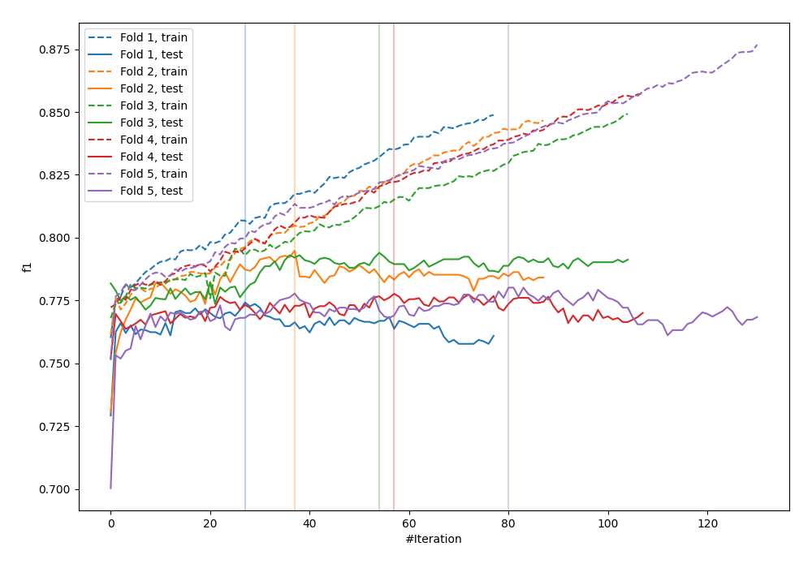
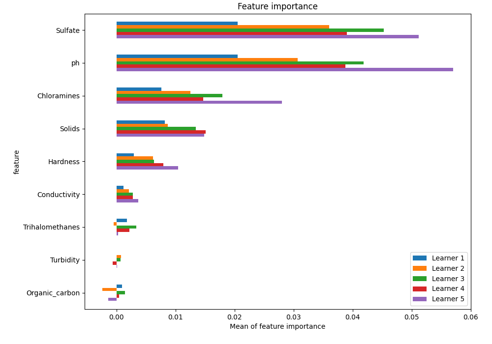
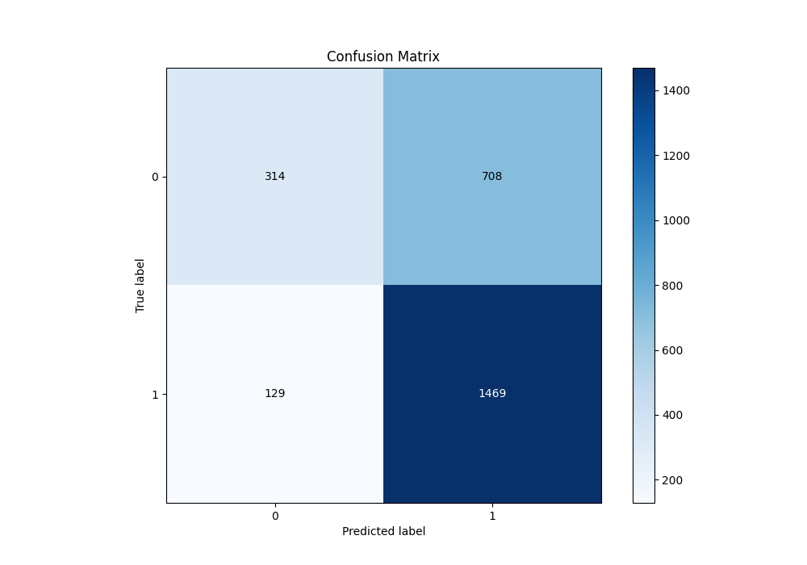
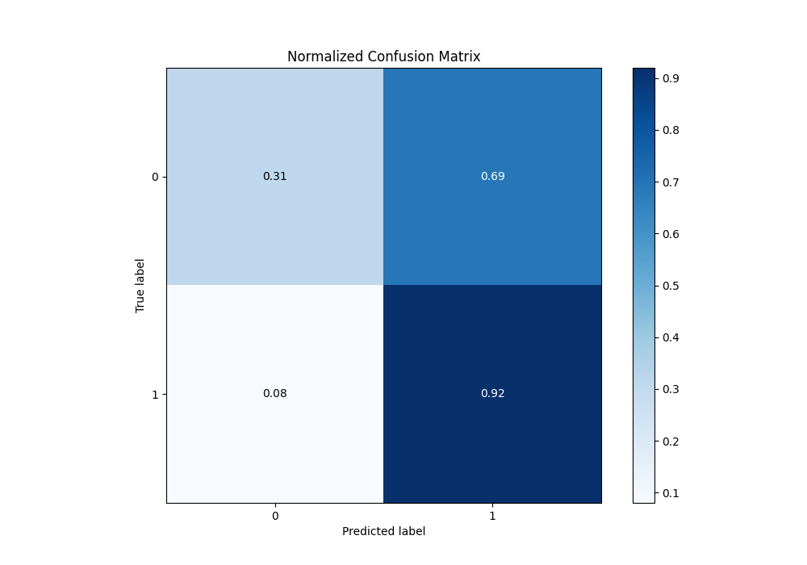
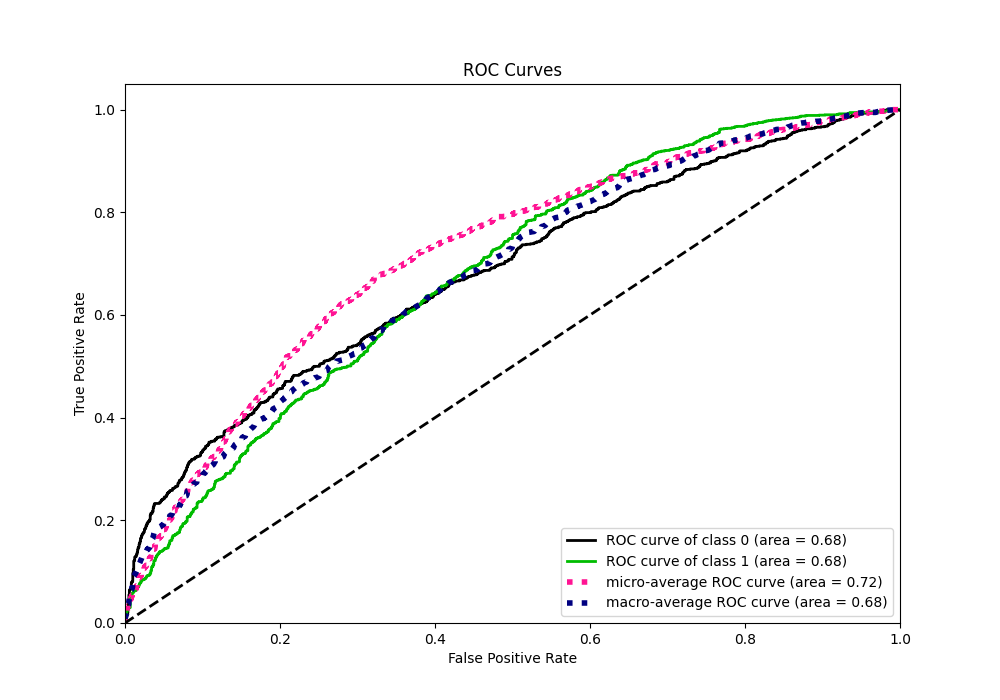
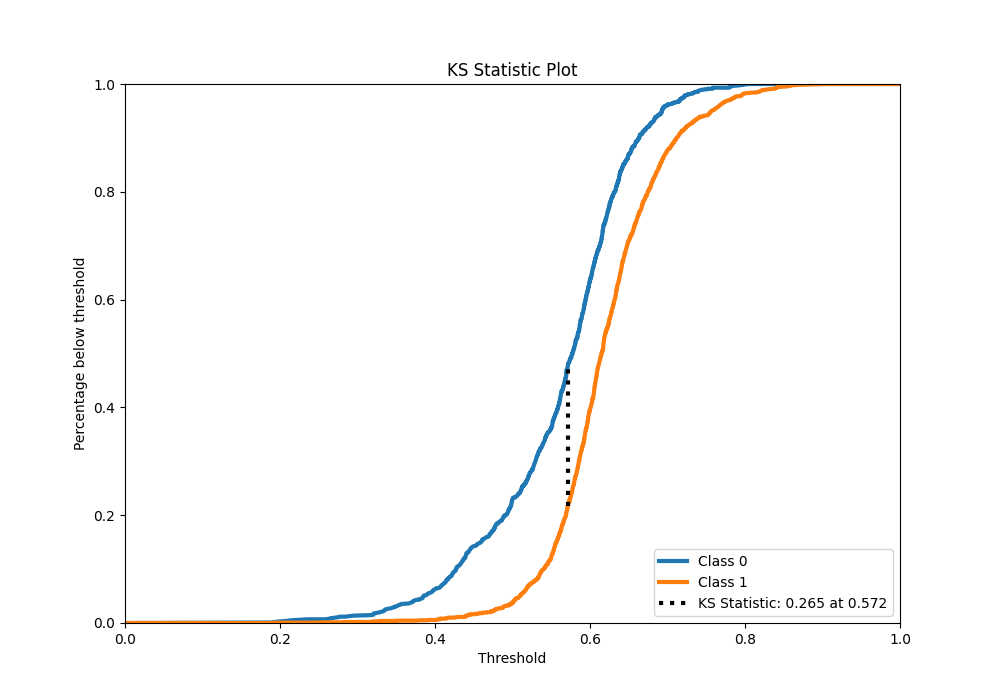
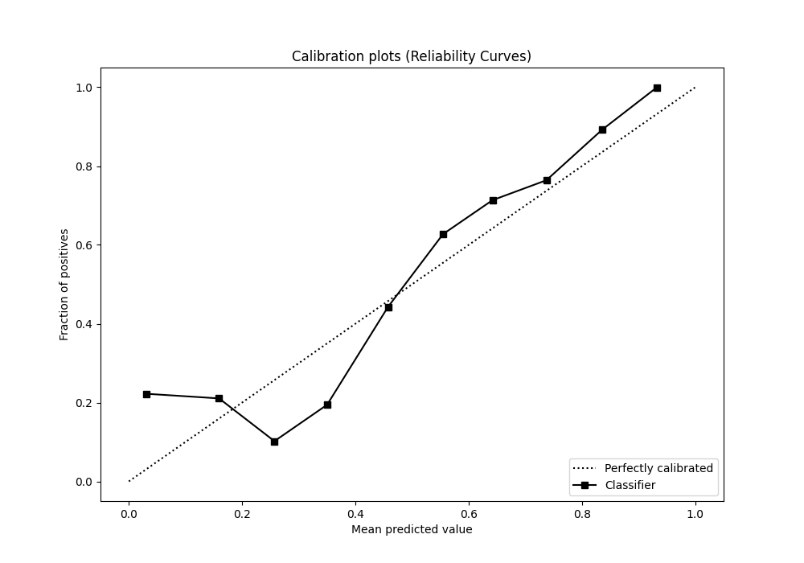
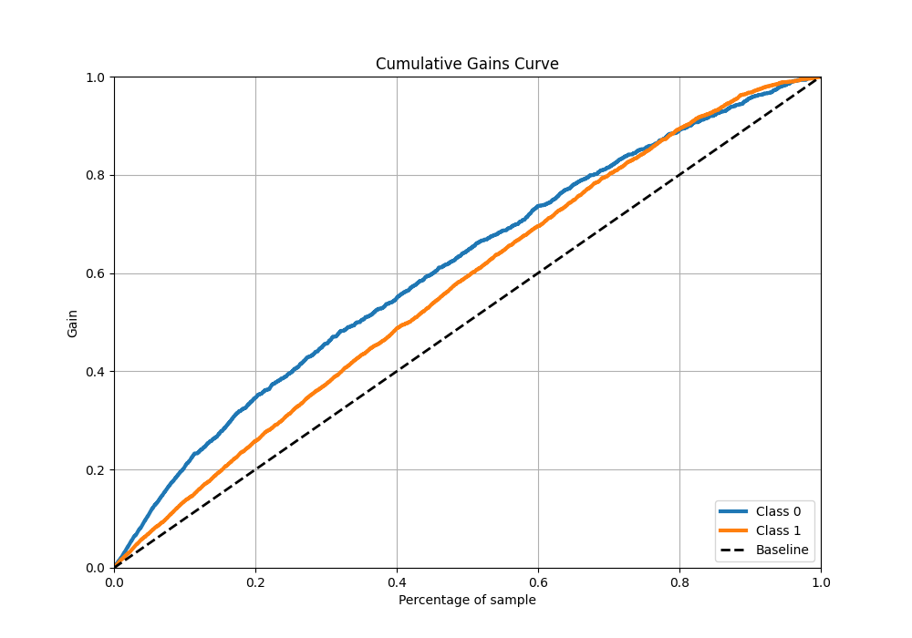
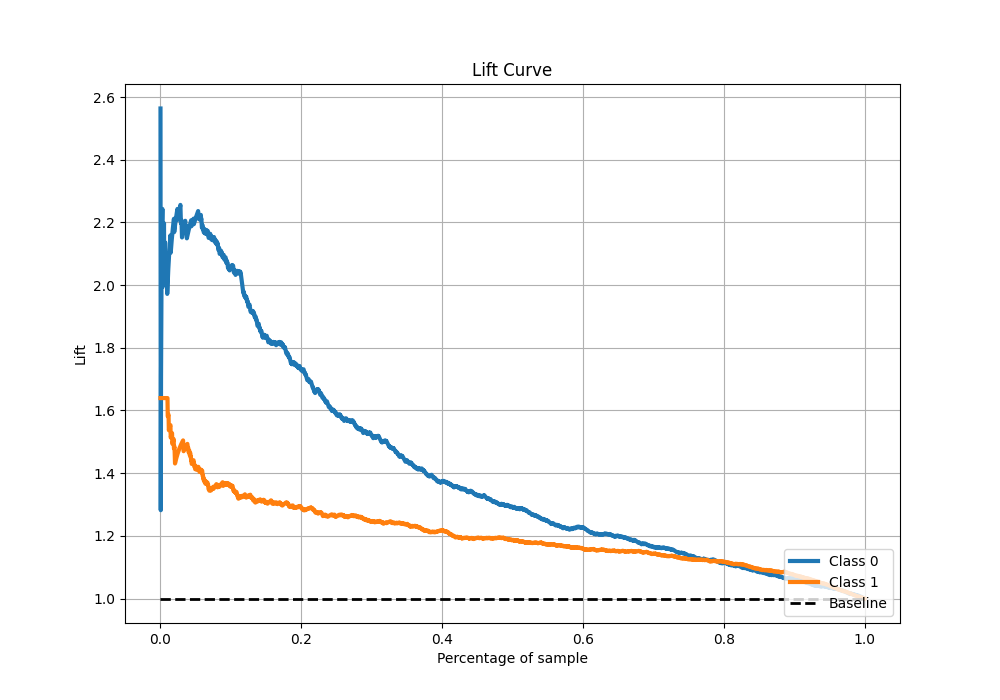

# Summary of 28_CatBoost

[<< Go back](../README.md)

## CatBoost
- **n_jobs**: -1
- **learning_rate**: 0.05
- **depth**: 7
- **rsm**: 1.0
- **loss_function**: Logloss
- **eval_metric**: F1
- **explain_level**: 1

## Validation
 - **validation_type**: kfold
 - **k_folds**: 5
 - **shuffle**: True
 - **stratify**: True
 - **random_seed**: 1234

## Optimized metric
f1

## Training time

8.7 seconds

## Metric details
|           |    score |   threshold |
|:----------|---------:|------------:|
| logloss   | 0.625294 |  nan        |
| auc       | 0.681711 |  nan        |
| f1        | 0.783516 |    0.498875 |
| accuracy  | 0.680534 |    0.531011 |
| precision | 0.911111 |    0.785492 |
| recall    | 1        |    0.17136  |
| mcc       | 0.294767 |    0.531011 |

## Metric details with threshold from accuracy metric
|           |    score |   threshold |
|:----------|---------:|------------:|
| logloss   | 0.625294 |  nan        |
| auc       | 0.681711 |  nan        |
| f1        | 0.778278 |    0.531011 |
| accuracy  | 0.680534 |    0.531011 |
| precision | 0.674782 |    0.531011 |
| recall    | 0.919274 |    0.531011 |
| mcc       | 0.294767 |    0.531011 |

## Confusion matrix (at threshold=0.531011)
|              |   Predicted as 0 |   Predicted as 1 |
|:-------------|-----------------:|-----------------:|
| Labeled as 0 |              314 |              708 |
| Labeled as 1 |              129 |             1469 |

## Learning curves

## Permutation-based Importance

## Confusion Matrix

## Normalized Confusion Matrix

## ROC Curve

## Kolmogorov-Smirnov Statistic

## Precision-Recall Curve

## Calibration Curve

## Cumulative Gains Curve

## Lift Curve

[<< Go back](../README.md)
