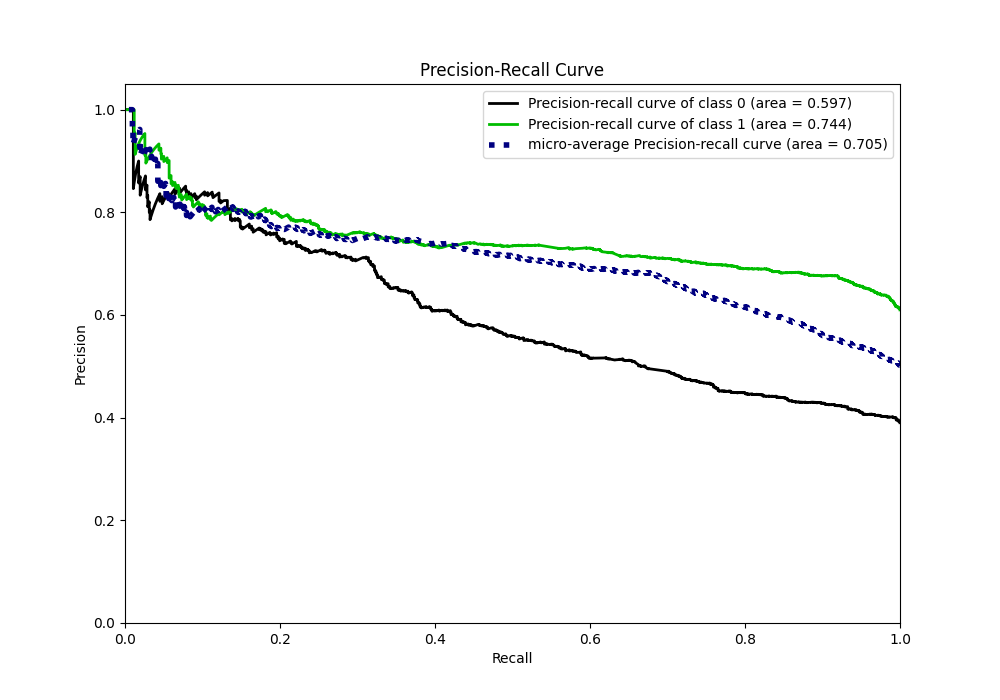

# Summary of 2_Default_Xgboost

[<< Go back](../README.md)

## Extreme Gradient Boosting (Xgboost)
- **n_jobs**: -1
- **objective**: binary:logistic
- **eta**: 0.075
- **max_depth**: 6
- **min_child_weight**: 1
- **subsample**: 1.0
- **colsample_bytree**: 1.0
- **eval_metric**: f1
- **explain_level**: 1

## Validation
 - **validation_type**: kfold
 - **k_folds**: 5
 - **shuffle**: True
 - **stratify**: True
 - **random_seed**: 1234

## Optimized metric
f1

## Training time

11.2 seconds

## Metric details
|           |    score |   threshold |
|:----------|---------:|------------:|
| logloss   | 0.616202 | nan         |
| auc       | 0.675094 | nan         |
| f1        | 0.778808 |   0.497878  |
| accuracy  | 0.681298 |   0.497878  |
| precision | 0.929577 |   0.863499  |
| recall    | 1        |   0.0295359 |
| mcc       | 0.296855 |   0.497878  |

## Metric details with threshold from accuracy metric
|           |    score |   threshold |
|:----------|---------:|------------:|
| logloss   | 0.616202 |  nan        |
| auc       | 0.675094 |  nan        |
| f1        | 0.778808 |    0.497878 |
| accuracy  | 0.681298 |    0.497878 |
| precision | 0.675241 |    0.497878 |
| recall    | 0.9199   |    0.497878 |
| mcc       | 0.296855 |    0.497878 |

## Confusion matrix (at threshold=0.497878)
|              |   Predicted as 0 |   Predicted as 1 |
|:-------------|-----------------:|-----------------:|
| Labeled as 0 |              315 |              707 |
| Labeled as 1 |              128 |             1470 |

## Learning curves

## Permutation-based Importance

## Confusion Matrix

## Normalized Confusion Matrix

## ROC Curve

## Kolmogorov-Smirnov Statistic

## Precision-Recall Curve

## Calibration Curve

## Cumulative Gains Curve

## Lift Curve

[<< Go back](../README.md)
