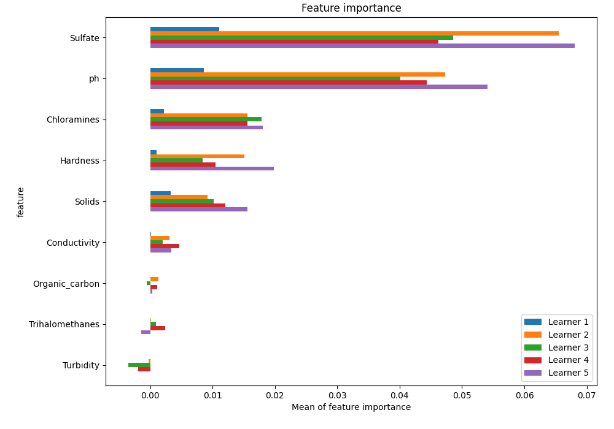

# Summary of 30_Xgboost

[<< Go back](../README.md)

## Extreme Gradient Boosting (Xgboost)
- **n_jobs**: -1
- **objective**: binary:logistic
- **eta**: 0.075
- **max_depth**: 5
- **min_child_weight**: 1
- **subsample**: 1.0
- **colsample_bytree**: 1.0
- **eval_metric**: f1
- **explain_level**: 1

## Validation
 - **validation_type**: kfold
 - **k_folds**: 5
 - **shuffle**: True
 - **stratify**: True
 - **random_seed**: 1234

## Optimized metric
f1

## Training time

11.9 seconds

## Metric details
|           |    score |   threshold |
|:----------|---------:|------------:|
| logloss   | 0.627514 | nan         |
| auc       | 0.659323 | nan         |
| f1        | 0.774392 |   0.502783  |
| accuracy  | 0.66374  |   0.502783  |
| precision | 0.85567  |   0.791151  |
| recall    | 1        |   0.0537232 |
| mcc       | 0.2531   |   0.502783  |

## Metric details with threshold from accuracy metric
|           |    score |   threshold |
|:----------|---------:|------------:|
| logloss   | 0.627514 |  nan        |
| auc       | 0.659323 |  nan        |
| f1        | 0.774392 |    0.502783 |
| accuracy  | 0.66374  |    0.502783 |
| precision | 0.655397 |    0.502783 |
| recall    | 0.946183 |    0.502783 |
| mcc       | 0.2531   |    0.502783 |

## Confusion matrix (at threshold=0.502783)
|              |   Predicted as 0 |   Predicted as 1 |
|:-------------|-----------------:|-----------------:|
| Labeled as 0 |              227 |              795 |
| Labeled as 1 |               86 |             1512 |

## Learning curves

## Permutation-based Importance

## Confusion Matrix

## Normalized Confusion Matrix

## ROC Curve

## Kolmogorov-Smirnov Statistic

## Precision-Recall Curve

## Calibration Curve

## Cumulative Gains Curve

## Lift Curve

[<< Go back](../README.md)
