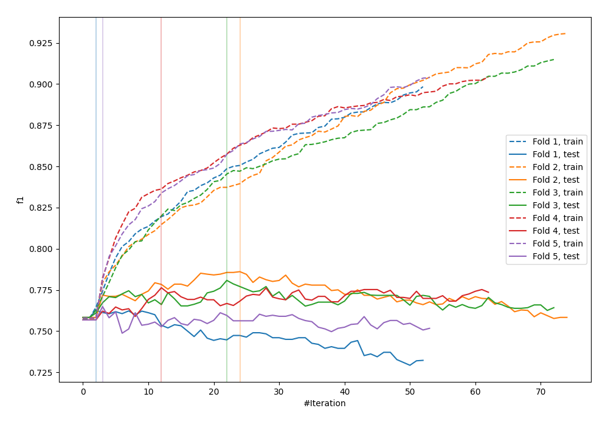
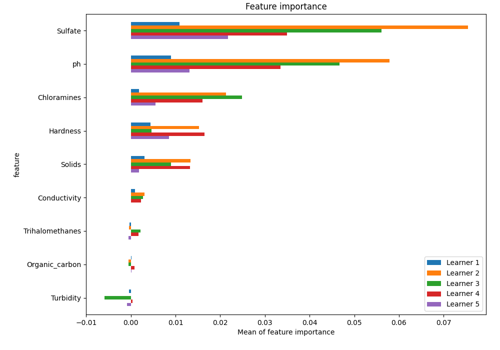
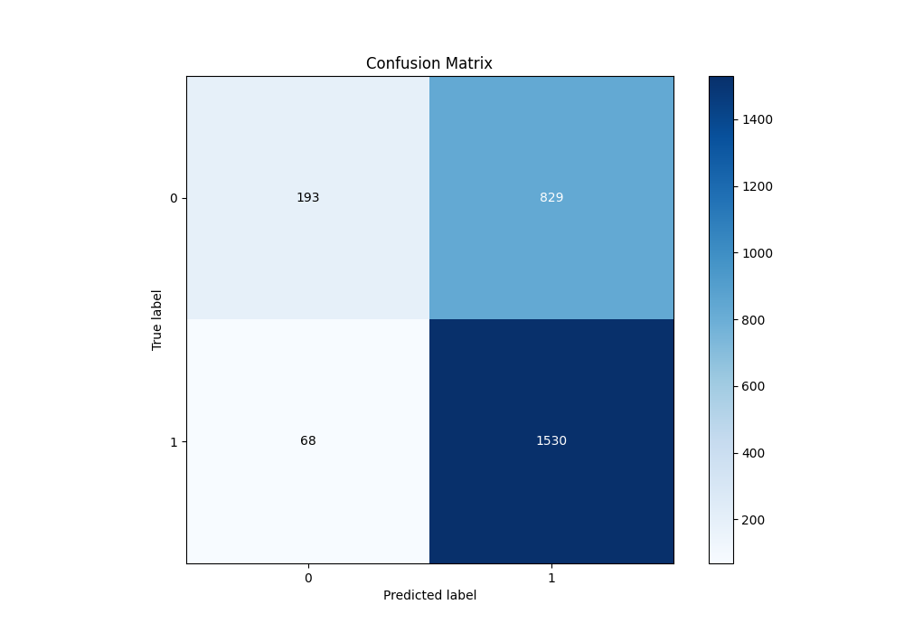
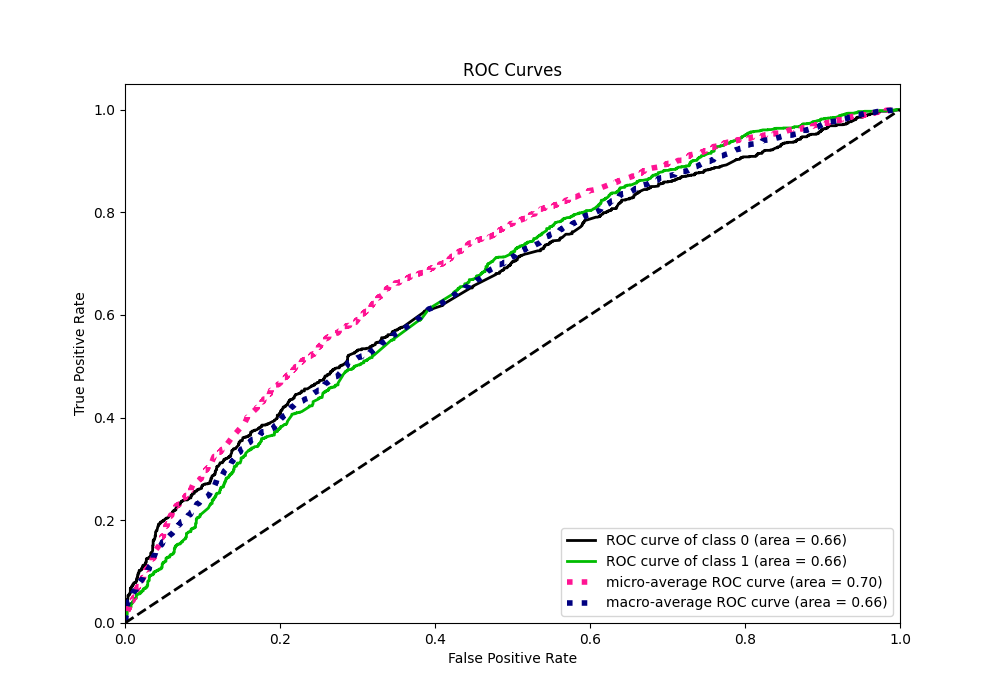
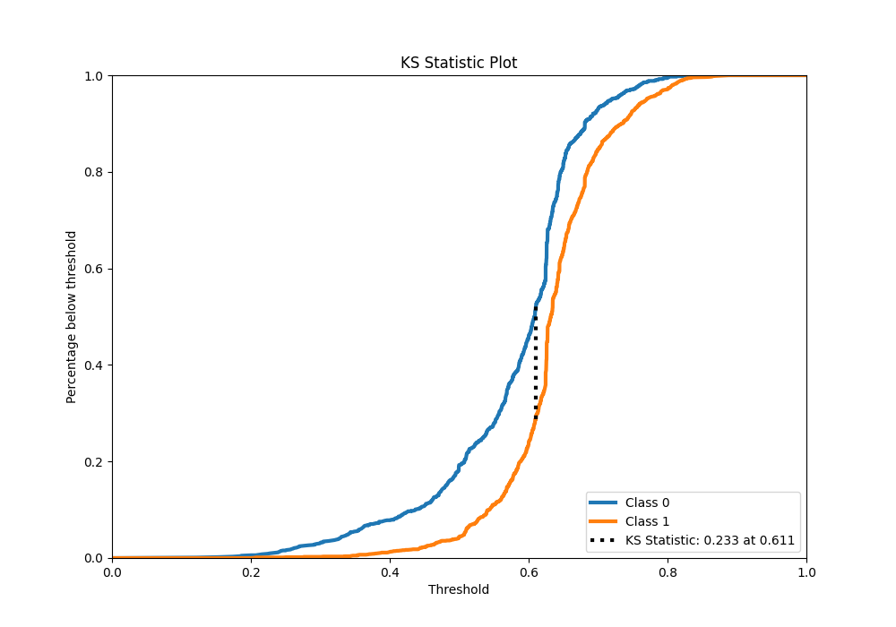
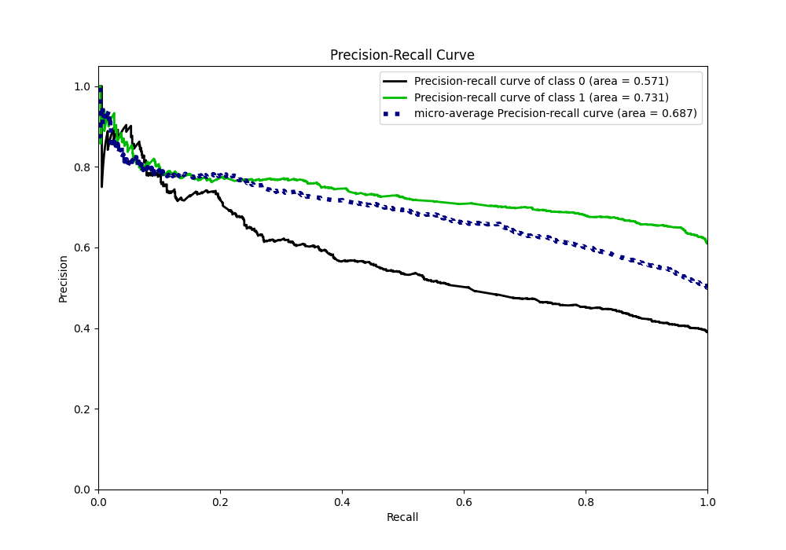
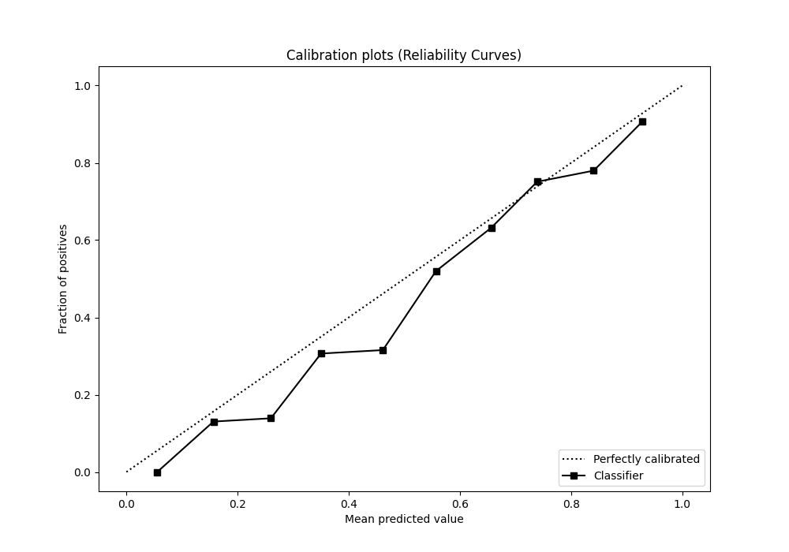
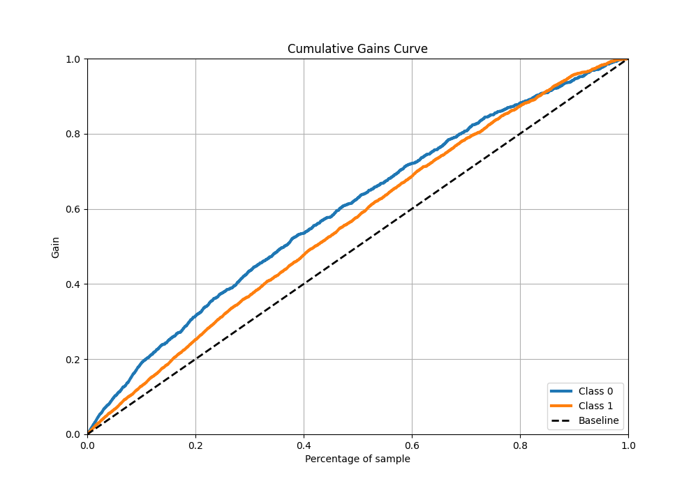
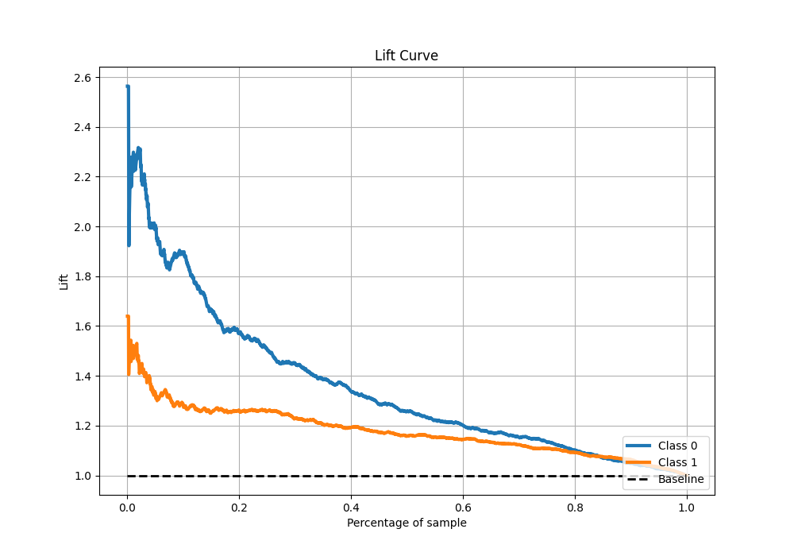

# Summary of 31_Xgboost

[<< Go back](../README.md)

## Extreme Gradient Boosting (Xgboost)
- **n_jobs**: -1
- **objective**: binary:logistic
- **eta**: 0.075
- **max_depth**: 7
- **min_child_weight**: 1
- **subsample**: 1.0
- **colsample_bytree**: 1.0
- **eval_metric**: f1
- **explain_level**: 1

## Validation
 - **validation_type**: kfold
 - **k_folds**: 5
 - **shuffle**: True
 - **stratify**: True
 - **random_seed**: 1234

## Optimized metric
f1

## Training time

11.4 seconds

## Metric details
|           |    score |   threshold |
|:----------|---------:|------------:|
| logloss   | 0.631443 |  nan        |
| auc       | 0.658419 |  nan        |
| f1        | 0.773313 |    0.49937  |
| accuracy  | 0.657634 |    0.49937  |
| precision | 0.933333 |    0.803117 |
| recall    | 1        |    0.109026 |
| mcc       | 0.239148 |    0.570835 |

## Metric details with threshold from accuracy metric
|           |    score |   threshold |
|:----------|---------:|------------:|
| logloss   | 0.631443 |   nan       |
| auc       | 0.658419 |   nan       |
| f1        | 0.773313 |     0.49937 |
| accuracy  | 0.657634 |     0.49937 |
| precision | 0.64858  |     0.49937 |
| recall    | 0.957447 |     0.49937 |
| mcc       | 0.23826  |     0.49937 |

## Confusion matrix (at threshold=0.49937)
|              |   Predicted as 0 |   Predicted as 1 |
|:-------------|-----------------:|-----------------:|
| Labeled as 0 |              193 |              829 |
| Labeled as 1 |               68 |             1530 |

## Learning curves

## Permutation-based Importance

## Confusion Matrix

## Normalized Confusion Matrix

## ROC Curve

## Kolmogorov-Smirnov Statistic

## Precision-Recall Curve

## Calibration Curve

## Cumulative Gains Curve

## Lift Curve

[<< Go back](../README.md)
