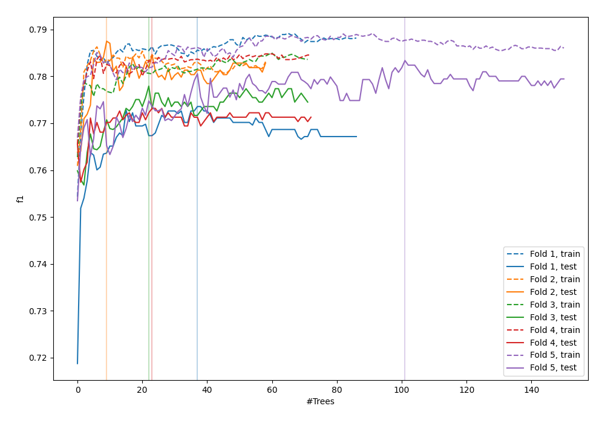
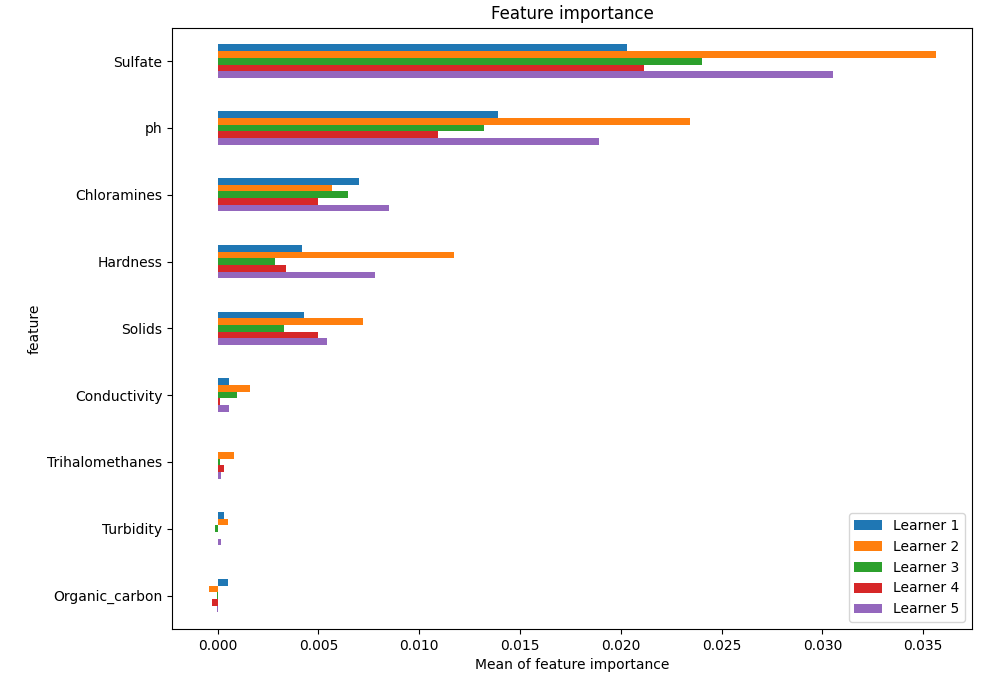
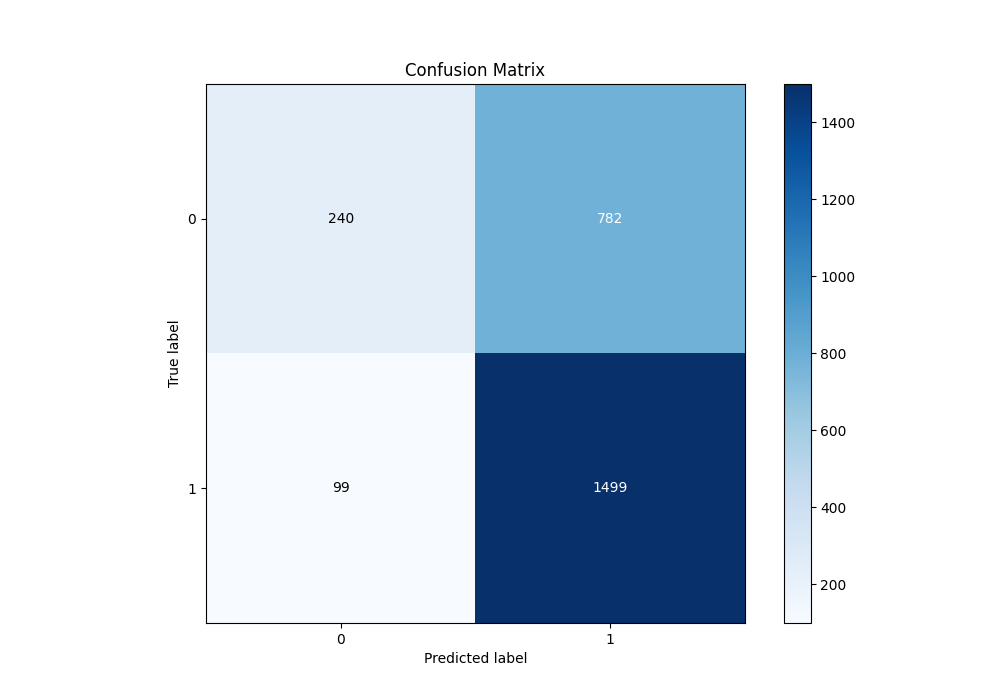
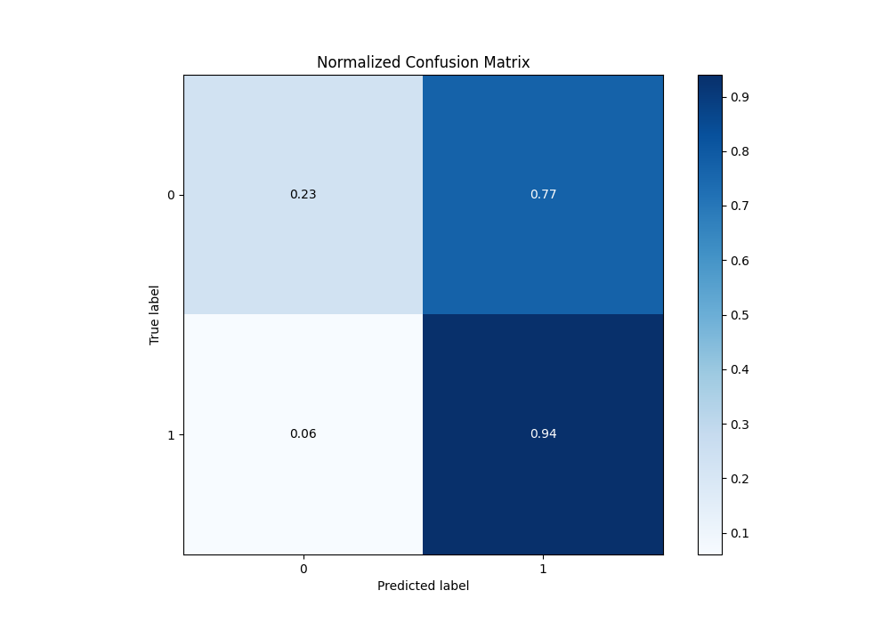
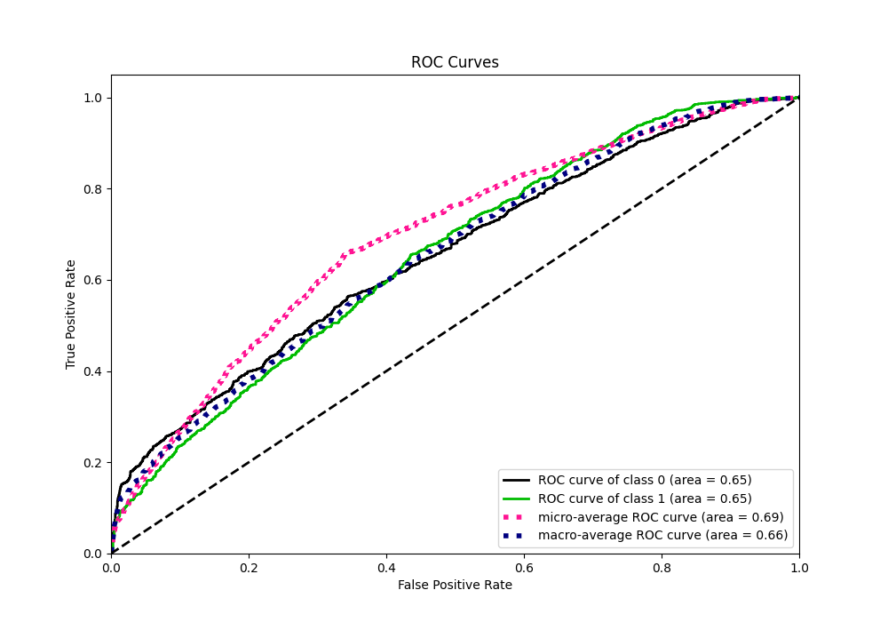
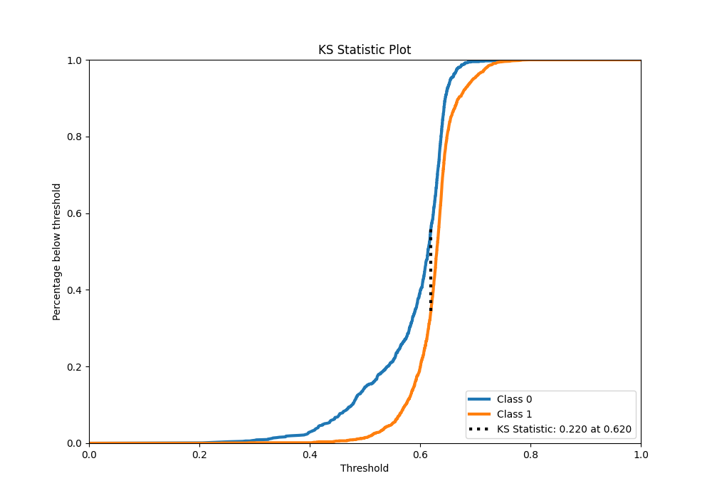
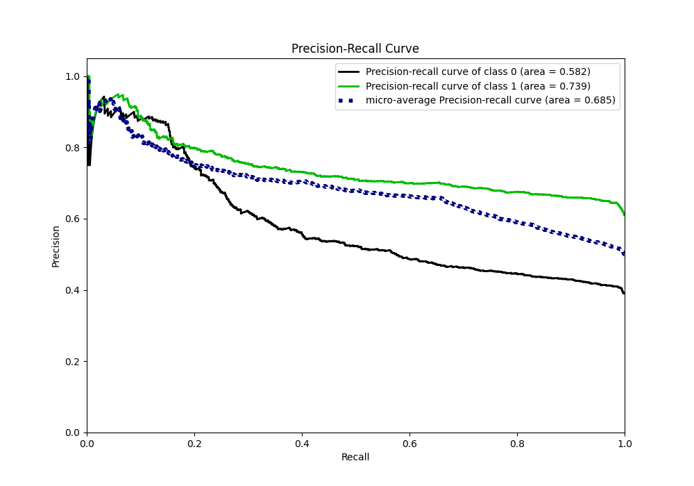
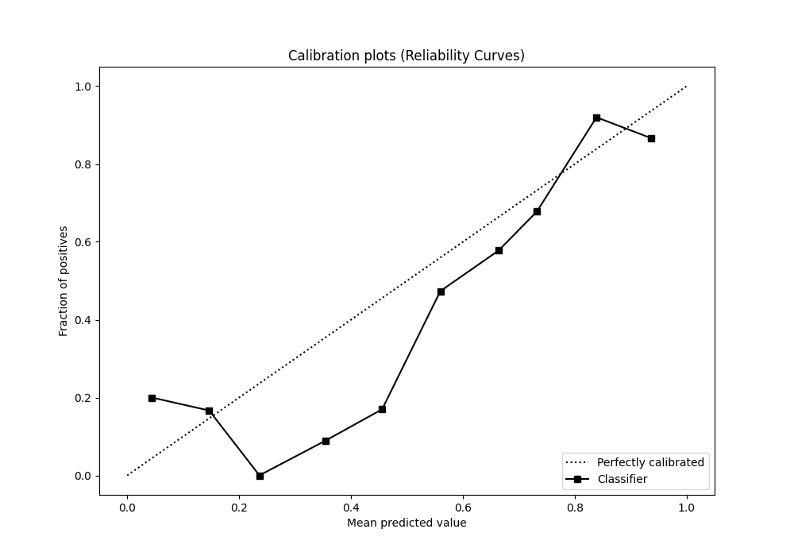
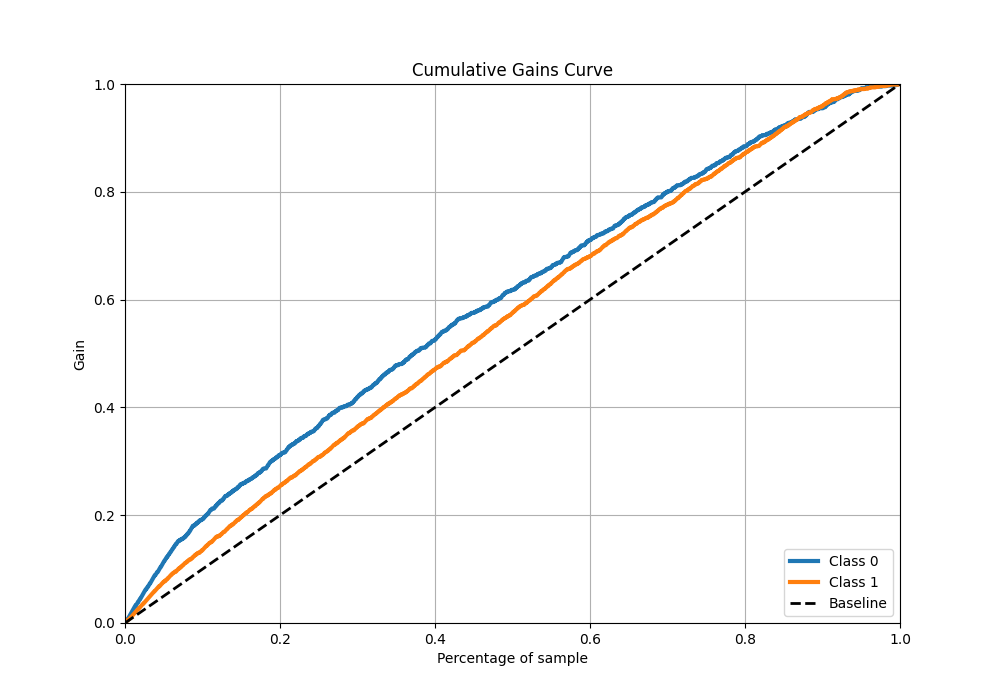
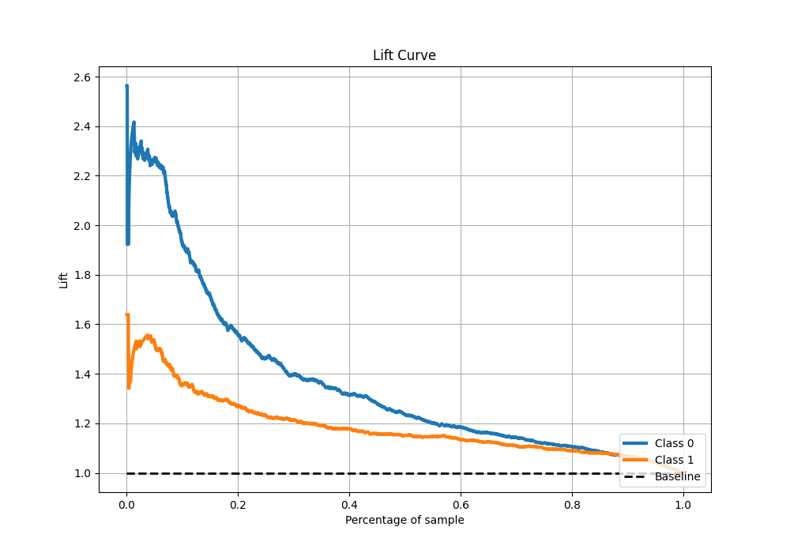

# Summary of 32_ExtraTrees

[<< Go back](../README.md)

## Extra Trees Classifier (Extra Trees)
- **n_jobs**: -1
- **criterion**: entropy
- **max_features**: 0.7
- **min_samples_split**: 30
- **max_depth**: 7
- **eval_metric_name**: f1
- **explain_level**: 1

## Validation
 - **validation_type**: kfold
 - **k_folds**: 5
 - **shuffle**: True
 - **stratify**: True
 - **random_seed**: 1234

## Optimized metric
f1

## Training time

15.0 seconds

## Metric details
|           |    score |   threshold |
|:----------|---------:|------------:|
| logloss   | 0.638351 |  nan        |
| auc       | 0.654716 |  nan        |
| f1        | 0.778686 |    0.506749 |
| accuracy  | 0.66374  |    0.55684  |
| precision | 0.948454 |    0.692271 |
| recall    | 1        |    0.184836 |
| mcc       | 0.259769 |    0.506749 |

## Metric details with threshold from accuracy metric
|           |    score |   threshold |
|:----------|---------:|------------:|
| logloss   | 0.638351 |   nan       |
| auc       | 0.654716 |   nan       |
| f1        | 0.77288  |     0.55684 |
| accuracy  | 0.66374  |     0.55684 |
| precision | 0.657168 |     0.55684 |
| recall    | 0.938048 |     0.55684 |
| mcc       | 0.251246 |     0.55684 |

## Confusion matrix (at threshold=0.55684)
|              |   Predicted as 0 |   Predicted as 1 |
|:-------------|-----------------:|-----------------:|
| Labeled as 0 |              240 |              782 |
| Labeled as 1 |               99 |             1499 |

## Learning curves

## Permutation-based Importance

## Confusion Matrix

## Normalized Confusion Matrix

## ROC Curve

## Kolmogorov-Smirnov Statistic

## Precision-Recall Curve

## Calibration Curve

## Cumulative Gains Curve

## Lift Curve

[<< Go back](../README.md)
