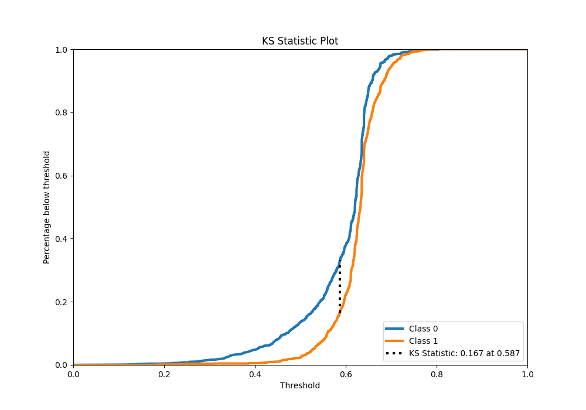

# Summary of 34_RandomForest

[<< Go back](../README.md)

## Random Forest
- **n_jobs**: -1
- **criterion**: entropy
- **max_features**: 0.5
- **min_samples_split**: 20
- **max_depth**: 4
- **eval_metric_name**: f1
- **explain_level**: 1

## Validation
 - **validation_type**: kfold
 - **k_folds**: 5
 - **shuffle**: True
 - **stratify**: True
 - **random_seed**: 1234

## Optimized metric
f1

## Training time

14.9 seconds

## Metric details
|           |    score |   threshold |
|:----------|---------:|------------:|
| logloss   | 0.644616 | nan         |
| auc       | 0.617941 | nan         |
| f1        | 0.771252 |   0.502296  |
| accuracy  | 0.648473 |   0.513643  |
| precision | 0.821138 |   0.695833  |
| recall    | 1        |   0.0997967 |
| mcc       | 0.213719 |   0.502296  |

## Metric details with threshold from accuracy metric
|           |    score |   threshold |
|:----------|---------:|------------:|
| logloss   | 0.644616 |  nan        |
| auc       | 0.617941 |  nan        |
| f1        | 0.770267 |    0.513643 |
| accuracy  | 0.648473 |    0.513643 |
| precision | 0.640398 |    0.513643 |
| recall    | 0.966208 |    0.513643 |
| mcc       | 0.212202 |    0.513643 |

## Confusion matrix (at threshold=0.513643)
|              |   Predicted as 0 |   Predicted as 1 |
|:-------------|-----------------:|-----------------:|
| Labeled as 0 |              155 |              867 |
| Labeled as 1 |               54 |             1544 |

## Learning curves

## Permutation-based Importance

## Confusion Matrix

## Normalized Confusion Matrix

## ROC Curve

## Kolmogorov-Smirnov Statistic

## Precision-Recall Curve

## Calibration Curve

## Cumulative Gains Curve

## Lift Curve

[<< Go back](../README.md)
