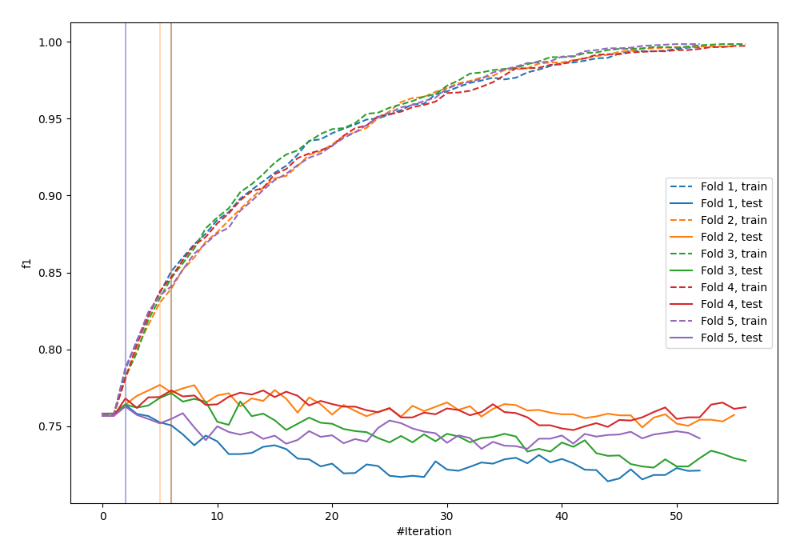
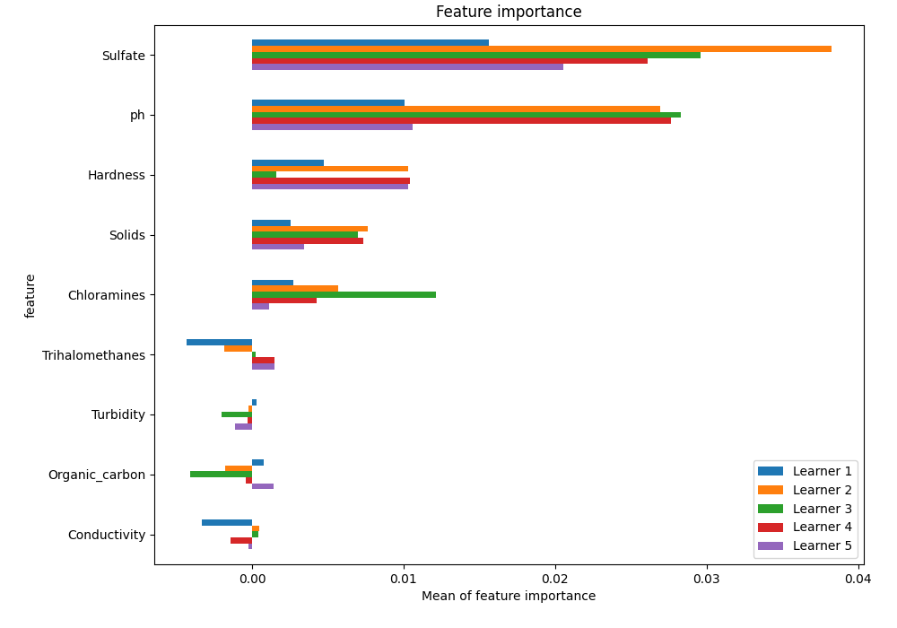
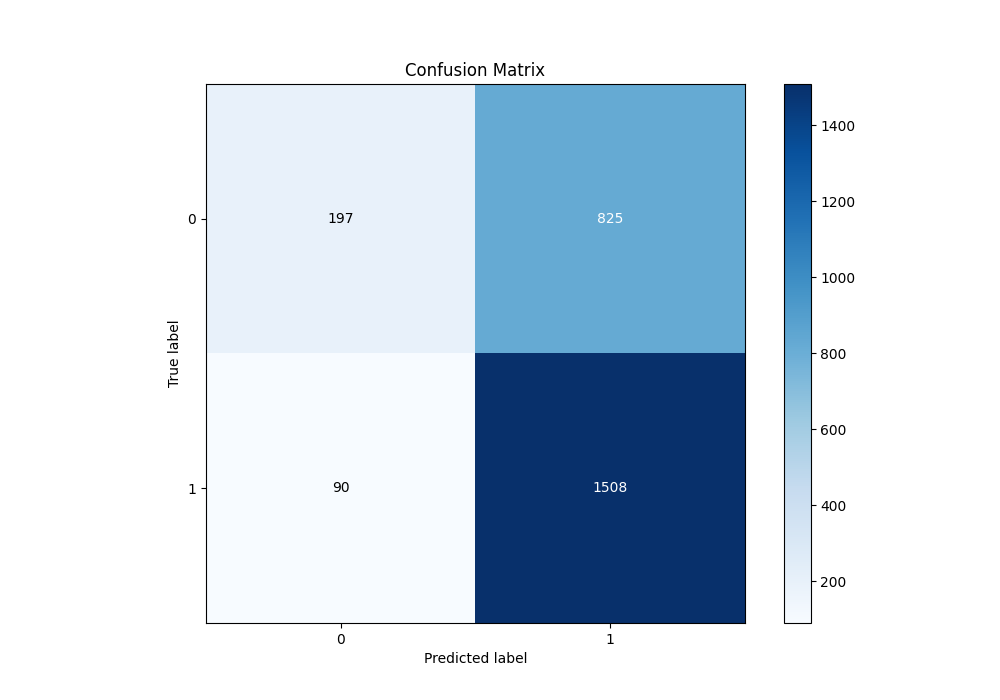
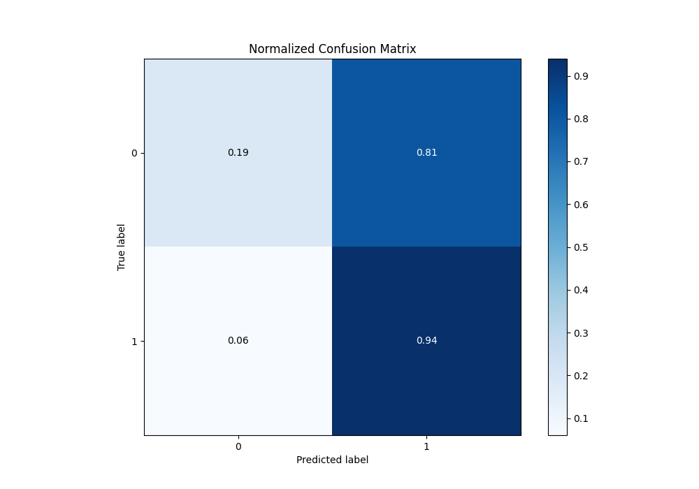
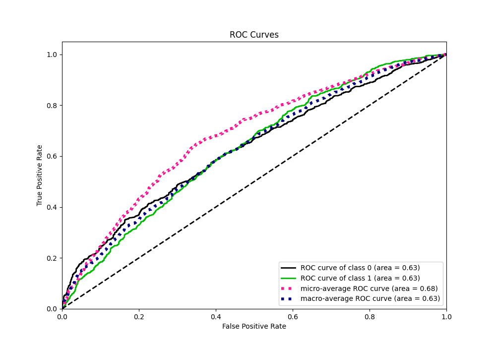
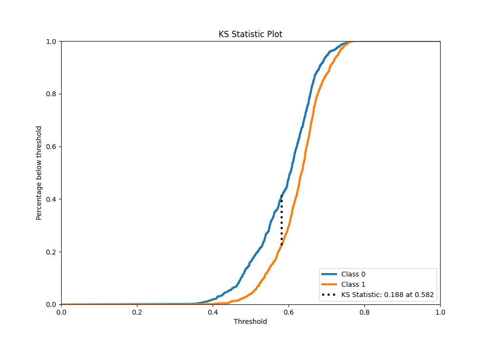
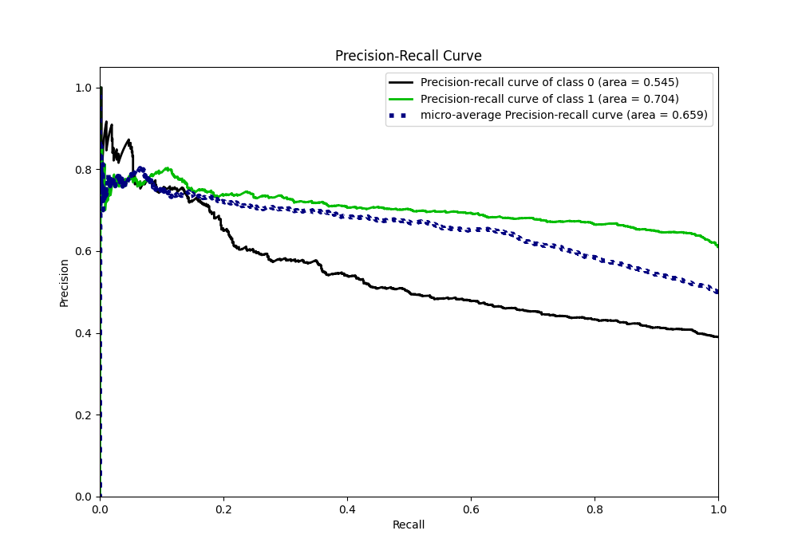
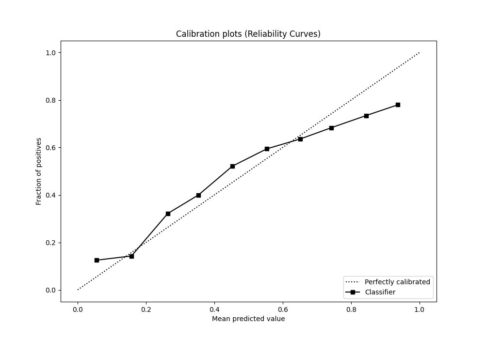
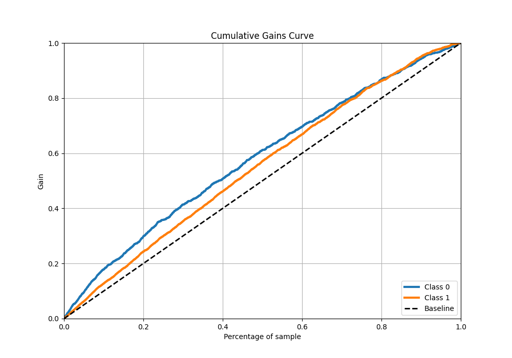
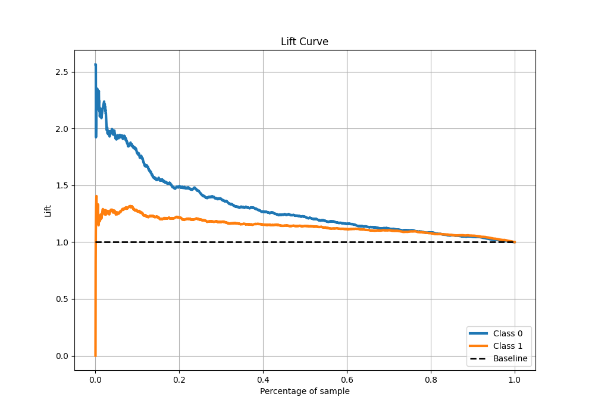

# Summary of 35_LightGBM

[<< Go back](../README.md)

## LightGBM
- **n_jobs**: -1
- **objective**: binary
- **num_leaves**: 63
- **learning_rate**: 0.1
- **feature_fraction**: 0.9
- **bagging_fraction**: 0.9
- **min_data_in_leaf**: 10
- **metric**: custom
- **custom_eval_metric_name**: f1
- **explain_level**: 1

## Validation
 - **validation_type**: kfold
 - **k_folds**: 5
 - **shuffle**: True
 - **stratify**: True
 - **random_seed**: 1234

## Optimized metric
f1

## Training time

12.0 seconds

## Metric details
|           |    score |   threshold |
|:----------|---------:|------------:|
| logloss   | 0.643486 |  nan        |
| auc       | 0.630665 |  nan        |
| f1        | 0.769765 |    0.487779 |
| accuracy  | 0.650763 |    0.513758 |
| precision | 0.799107 |    0.706874 |
| recall    | 1        |    0.312597 |
| mcc       | 0.213085 |    0.513758 |

## Metric details with threshold from accuracy metric
|           |    score |   threshold |
|:----------|---------:|------------:|
| logloss   | 0.643486 |  nan        |
| auc       | 0.630665 |  nan        |
| f1        | 0.767235 |    0.513758 |
| accuracy  | 0.650763 |    0.513758 |
| precision | 0.646378 |    0.513758 |
| recall    | 0.94368  |    0.513758 |
| mcc       | 0.213085 |    0.513758 |

## Confusion matrix (at threshold=0.513758)
|              |   Predicted as 0 |   Predicted as 1 |
|:-------------|-----------------:|-----------------:|
| Labeled as 0 |              197 |              825 |
| Labeled as 1 |               90 |             1508 |

## Learning curves

## Permutation-based Importance

## Confusion Matrix

## Normalized Confusion Matrix

## ROC Curve

## Kolmogorov-Smirnov Statistic

## Precision-Recall Curve

## Calibration Curve

## Cumulative Gains Curve

## Lift Curve

[<< Go back](../README.md)
