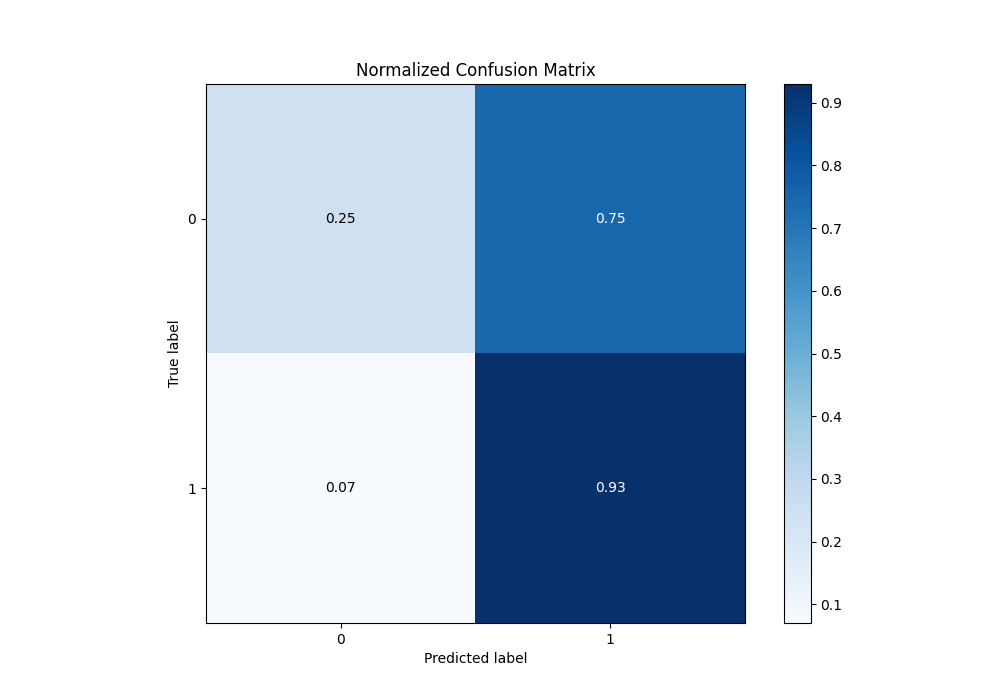

# Summary of 36_Xgboost

[<< Go back](../README.md)

## Extreme Gradient Boosting (Xgboost)
- **n_jobs**: -1
- **objective**: binary:logistic
- **eta**: 0.1
- **max_depth**: 7
- **min_child_weight**: 1
- **subsample**: 1.0
- **colsample_bytree**: 1.0
- **eval_metric**: f1
- **explain_level**: 1

## Validation
 - **validation_type**: kfold
 - **k_folds**: 5
 - **shuffle**: True
 - **stratify**: True
 - **random_seed**: 1234

## Optimized metric
f1

## Training time

12.0 seconds

## Metric details
|           |    score |   threshold |
|:----------|---------:|------------:|
| logloss   | 0.628027 | nan         |
| auc       | 0.658335 | nan         |
| f1        | 0.773079 |   0.499095  |
| accuracy  | 0.664504 |   0.506366  |
| precision | 0.835052 |   0.798135  |
| recall    | 1        |   0.0452763 |
| mcc       | 0.252351 |   0.499095  |

## Metric details with threshold from accuracy metric
|           |    score |   threshold |
|:----------|---------:|------------:|
| logloss   | 0.628027 |  nan        |
| auc       | 0.658335 |  nan        |
| f1        | 0.771866 |    0.506366 |
| accuracy  | 0.664504 |    0.506366 |
| precision | 0.659424 |    0.506366 |
| recall    | 0.930538 |    0.506366 |
| mcc       | 0.252242 |    0.506366 |

## Confusion matrix (at threshold=0.506366)
|              |   Predicted as 0 |   Predicted as 1 |
|:-------------|-----------------:|-----------------:|
| Labeled as 0 |              254 |              768 |
| Labeled as 1 |              111 |             1487 |

## Learning curves

## Permutation-based Importance

## Confusion Matrix

## Normalized Confusion Matrix

## ROC Curve

## Kolmogorov-Smirnov Statistic

## Precision-Recall Curve

## Calibration Curve

## Cumulative Gains Curve

## Lift Curve

[<< Go back](../README.md)
