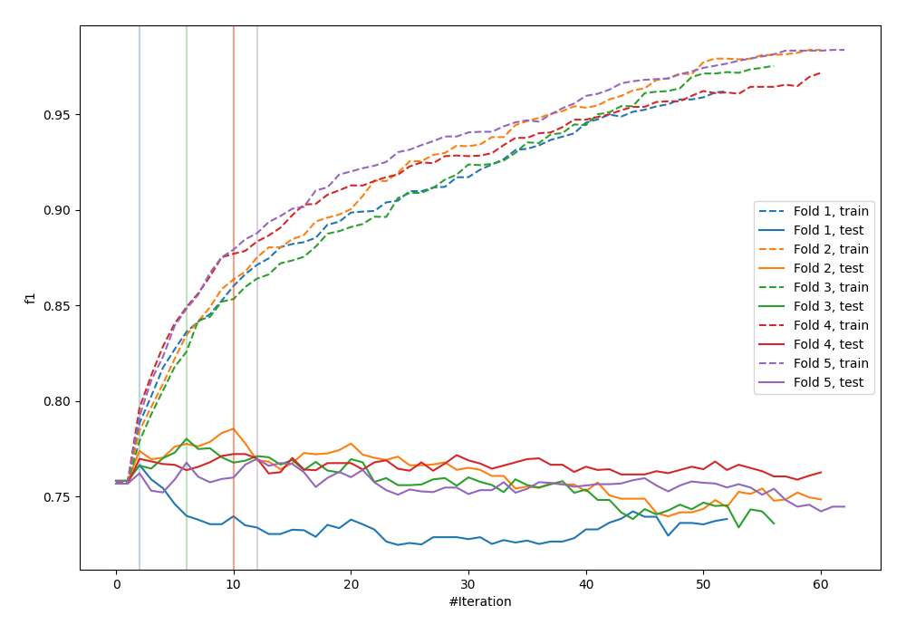
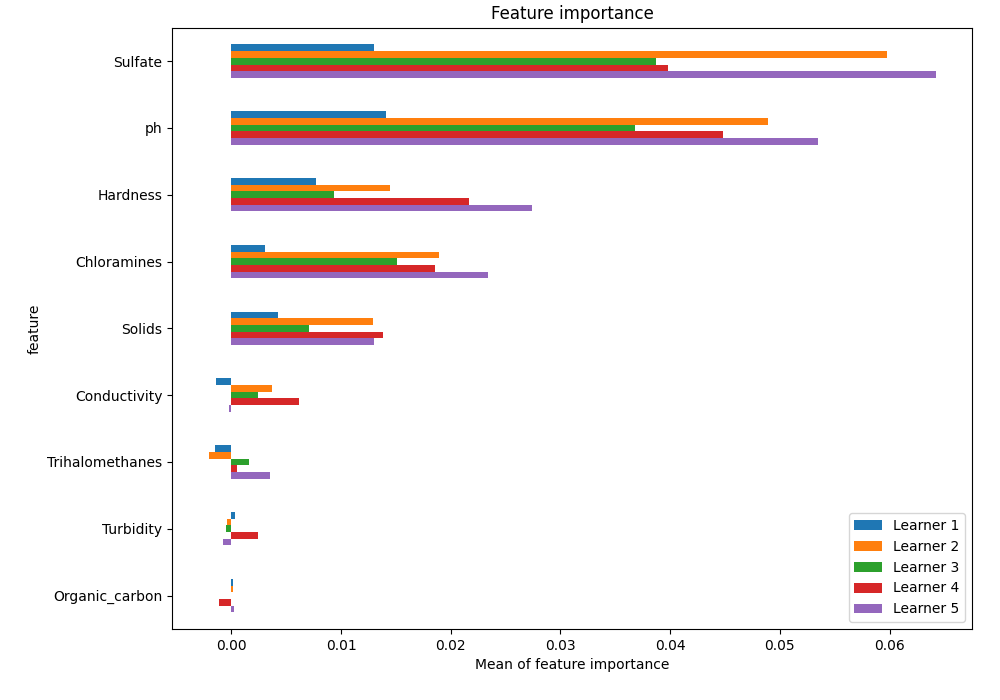
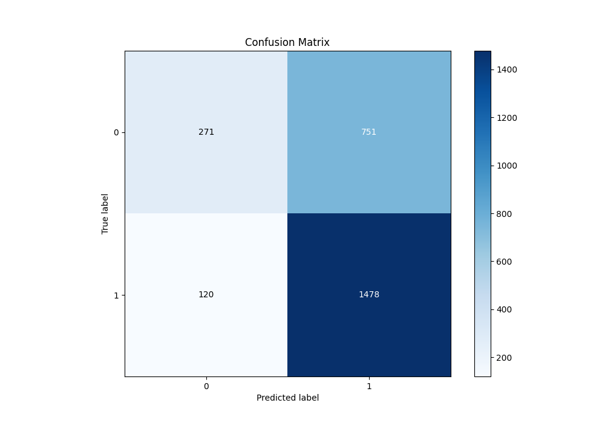
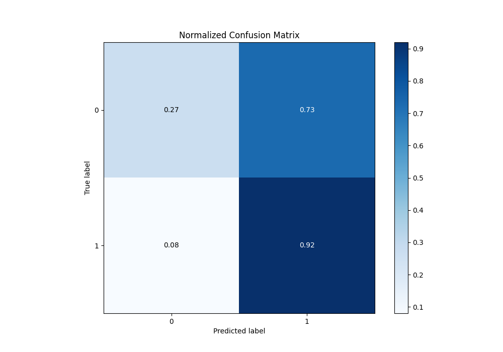
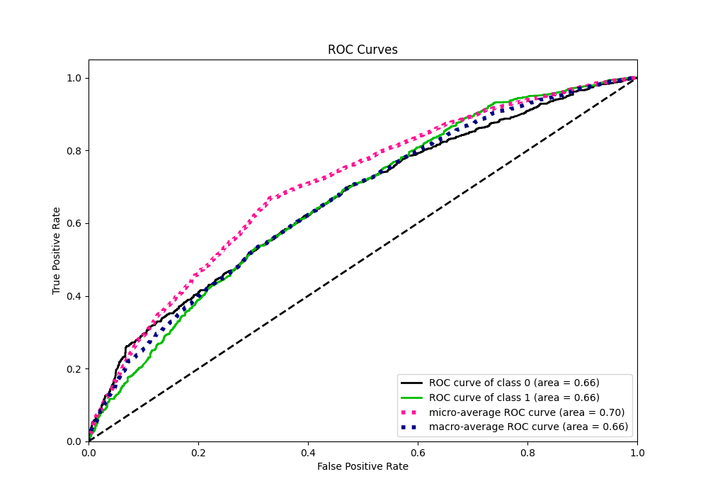
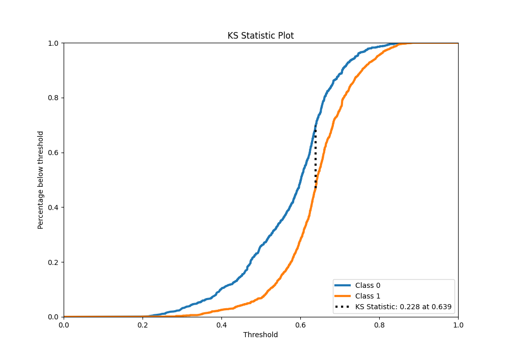
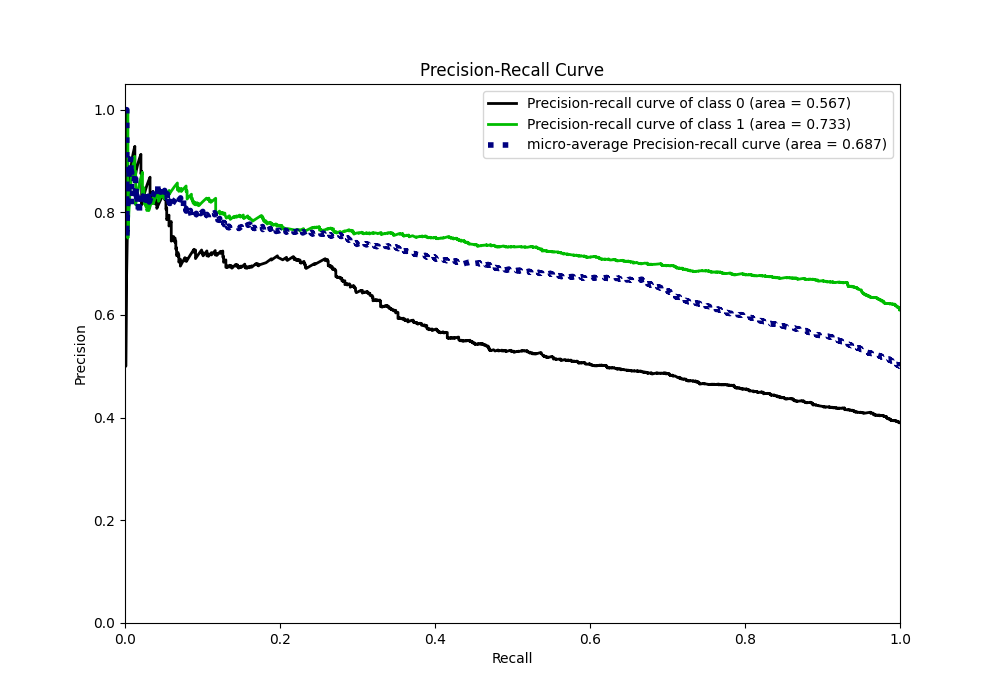
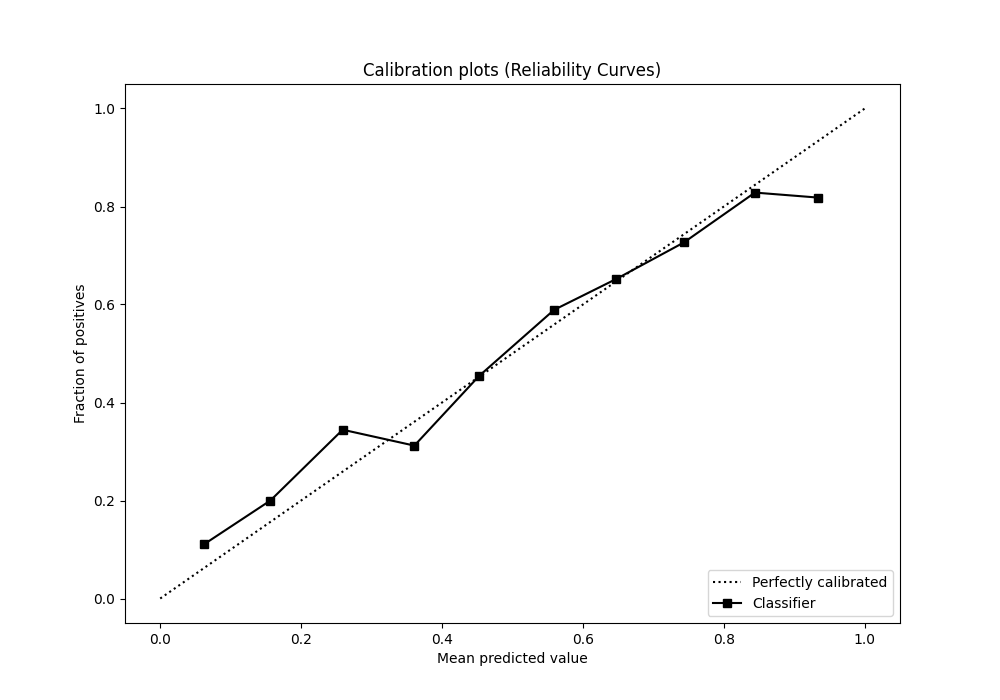
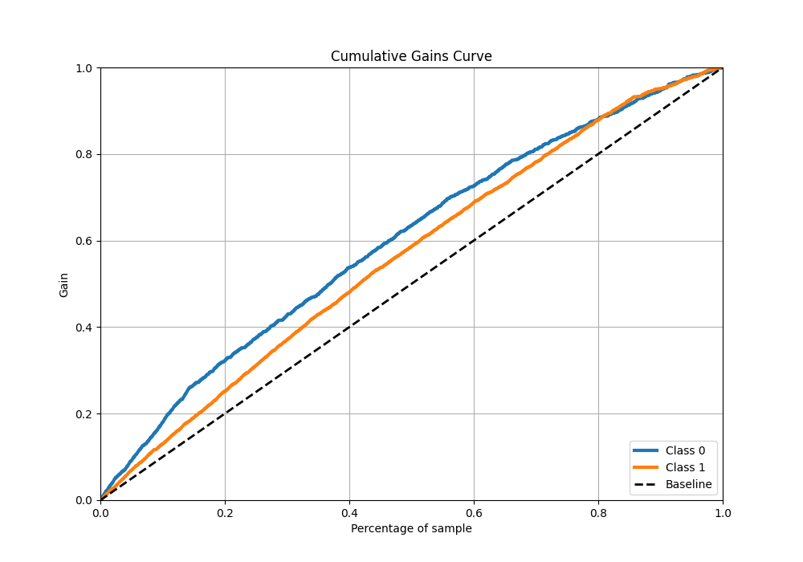
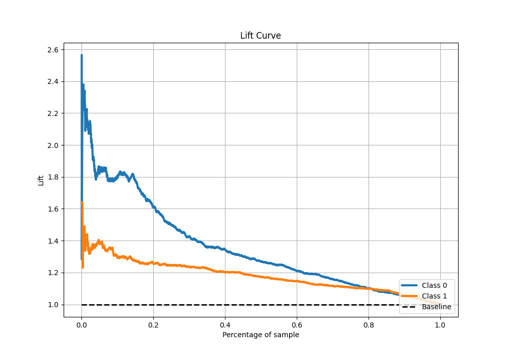

# Summary of 37_Xgboost

[<< Go back](../README.md)

## Extreme Gradient Boosting (Xgboost)
- **n_jobs**: -1
- **objective**: binary:logistic
- **eta**: 0.1
- **max_depth**: 9
- **min_child_weight**: 1
- **subsample**: 1.0
- **colsample_bytree**: 1.0
- **eval_metric**: f1
- **explain_level**: 1

## Validation
 - **validation_type**: kfold
 - **k_folds**: 5
 - **shuffle**: True
 - **stratify**: True
 - **random_seed**: 1234

## Optimized metric
f1

## Training time

11.8 seconds

## Metric details
|           |    score |   threshold |
|:----------|---------:|------------:|
| logloss   | 0.628642 |  nan        |
| auc       | 0.661491 |  nan        |
| f1        | 0.773423 |    0.497433 |
| accuracy  | 0.667557 |    0.507116 |
| precision | 0.853659 |    0.78384  |
| recall    | 1        |    0.174799 |
| mcc       | 0.260189 |    0.507116 |

## Metric details with threshold from accuracy metric
|           |    score |   threshold |
|:----------|---------:|------------:|
| logloss   | 0.628642 |  nan        |
| auc       | 0.661491 |  nan        |
| f1        | 0.772407 |    0.507116 |
| accuracy  | 0.667557 |    0.507116 |
| precision | 0.663078 |    0.507116 |
| recall    | 0.924906 |    0.507116 |
| mcc       | 0.260189 |    0.507116 |

## Confusion matrix (at threshold=0.507116)
|              |   Predicted as 0 |   Predicted as 1 |
|:-------------|-----------------:|-----------------:|
| Labeled as 0 |              271 |              751 |
| Labeled as 1 |              120 |             1478 |

## Learning curves

## Permutation-based Importance

## Confusion Matrix

## Normalized Confusion Matrix

## ROC Curve

## Kolmogorov-Smirnov Statistic

## Precision-Recall Curve

## Calibration Curve

## Cumulative Gains Curve

## Lift Curve

[<< Go back](../README.md)
