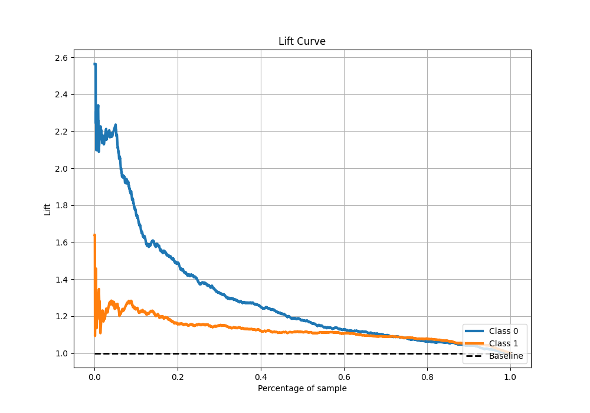

# Summary of 39_ExtraTrees

[<< Go back](../README.md)

## Extra Trees Classifier (Extra Trees)
- **n_jobs**: -1
- **criterion**: entropy
- **max_features**: 0.9
- **min_samples_split**: 30
- **max_depth**: 4
- **eval_metric_name**: f1
- **explain_level**: 1

## Validation
 - **validation_type**: kfold
 - **k_folds**: 5
 - **shuffle**: True
 - **stratify**: True
 - **random_seed**: 1234

## Optimized metric
f1

## Training time

13.7 seconds

## Metric details
|           |    score |   threshold |
|:----------|---------:|------------:|
| logloss   | 0.648747 |  nan        |
| auc       | 0.615829 |  nan        |
| f1        | 0.773673 |    0.498134 |
| accuracy  | 0.65     |    0.533318 |
| precision | 0.776786 |    0.650556 |
| recall    | 1        |    0.212757 |
| mcc       | 0.225834 |    0.498134 |

## Metric details with threshold from accuracy metric
|           |    score |   threshold |
|:----------|---------:|------------:|
| logloss   | 0.648747 |  nan        |
| auc       | 0.615829 |  nan        |
| f1        | 0.771265 |    0.533318 |
| accuracy  | 0.65     |    0.533318 |
| precision | 0.641228 |    0.533318 |
| recall    | 0.967459 |    0.533318 |
| mcc       | 0.217978 |    0.533318 |

## Confusion matrix (at threshold=0.533318)
|              |   Predicted as 0 |   Predicted as 1 |
|:-------------|-----------------:|-----------------:|
| Labeled as 0 |              157 |              865 |
| Labeled as 1 |               52 |             1546 |

## Learning curves

## Permutation-based Importance

## Confusion Matrix

## Normalized Confusion Matrix

## ROC Curve

## Kolmogorov-Smirnov Statistic

## Precision-Recall Curve

## Calibration Curve

## Cumulative Gains Curve

## Lift Curve

[<< Go back](../README.md)
