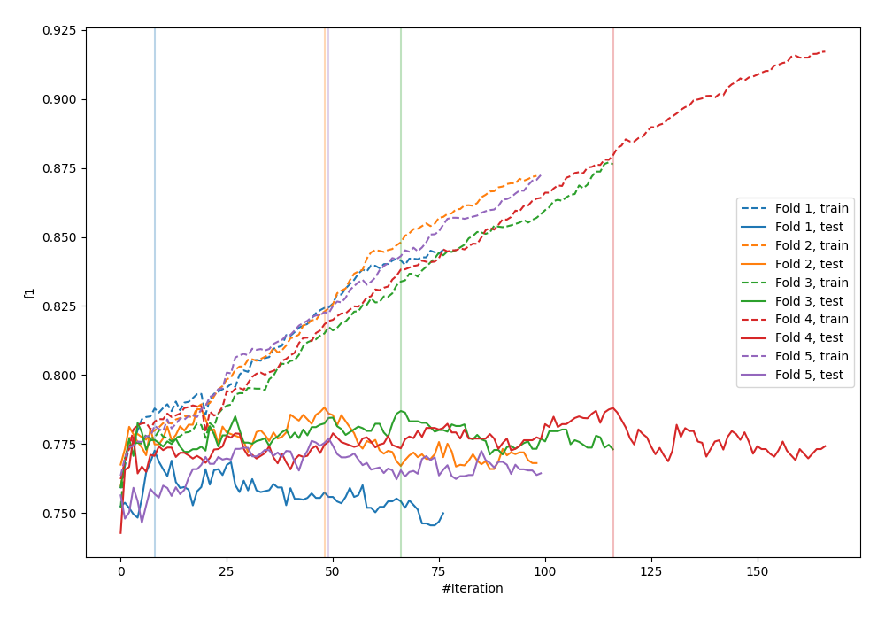
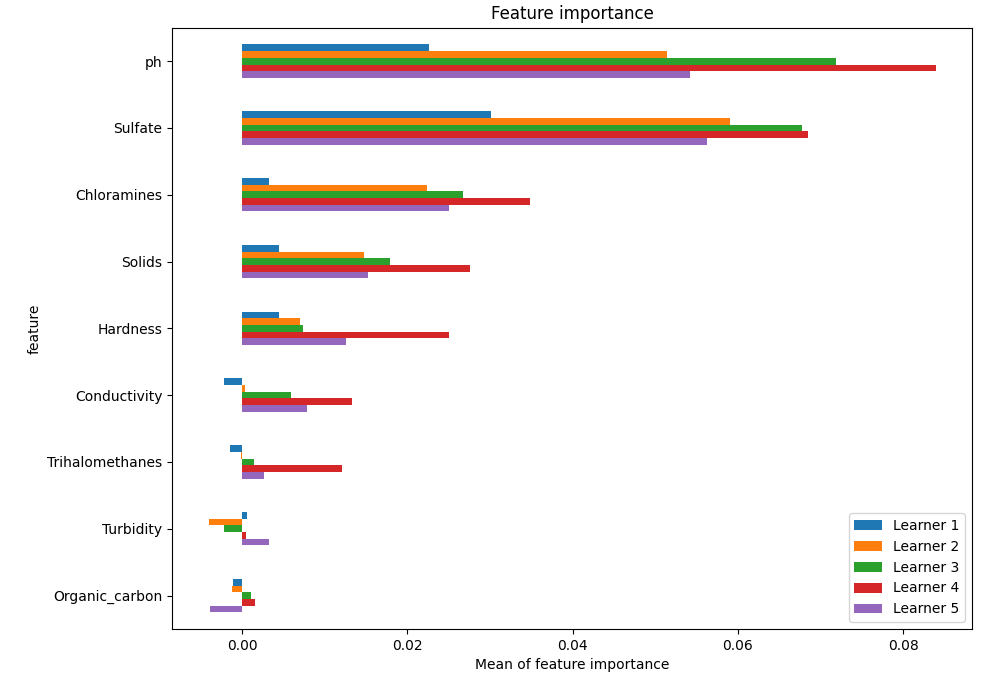
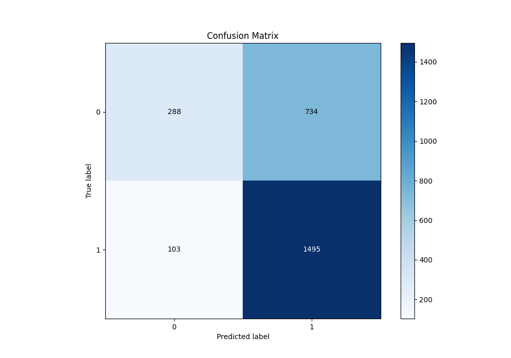
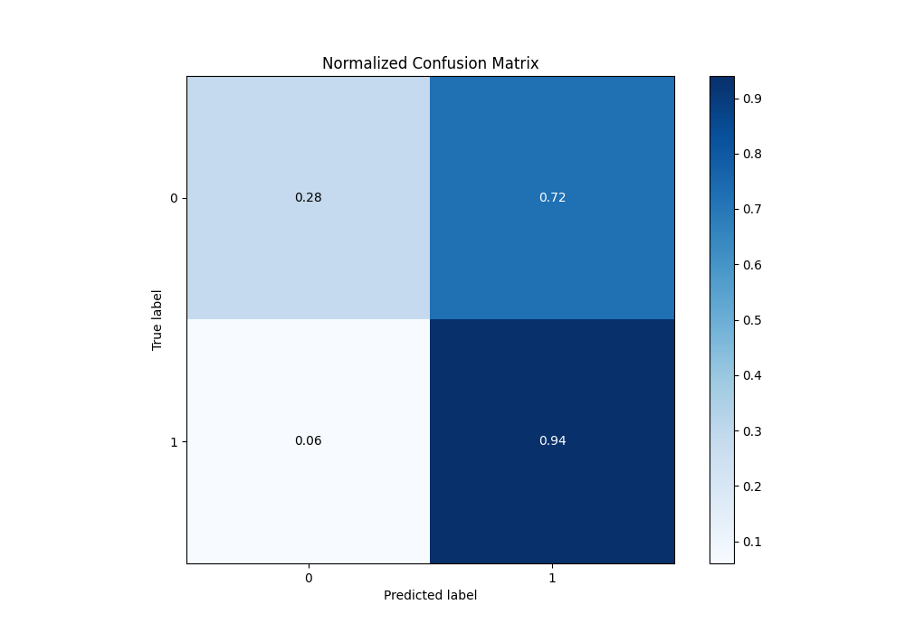
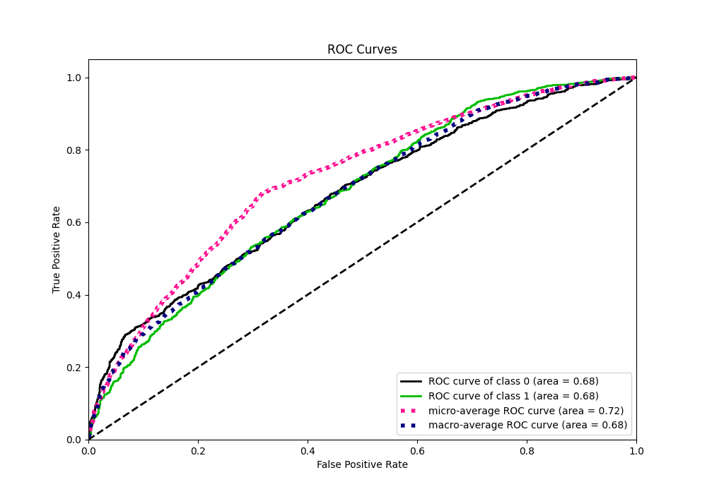
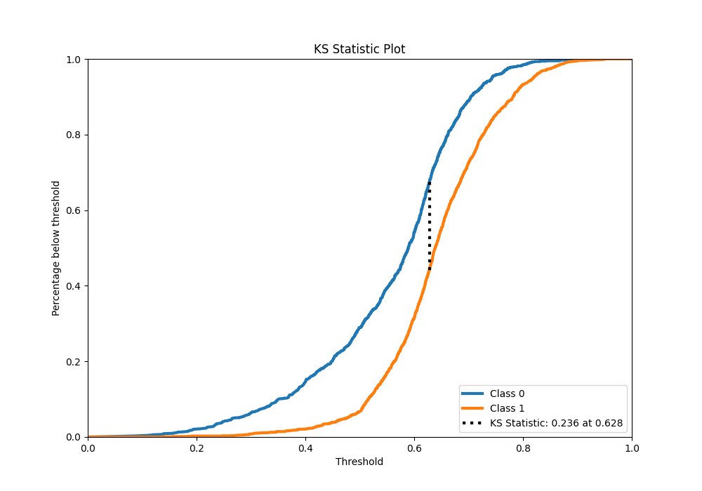
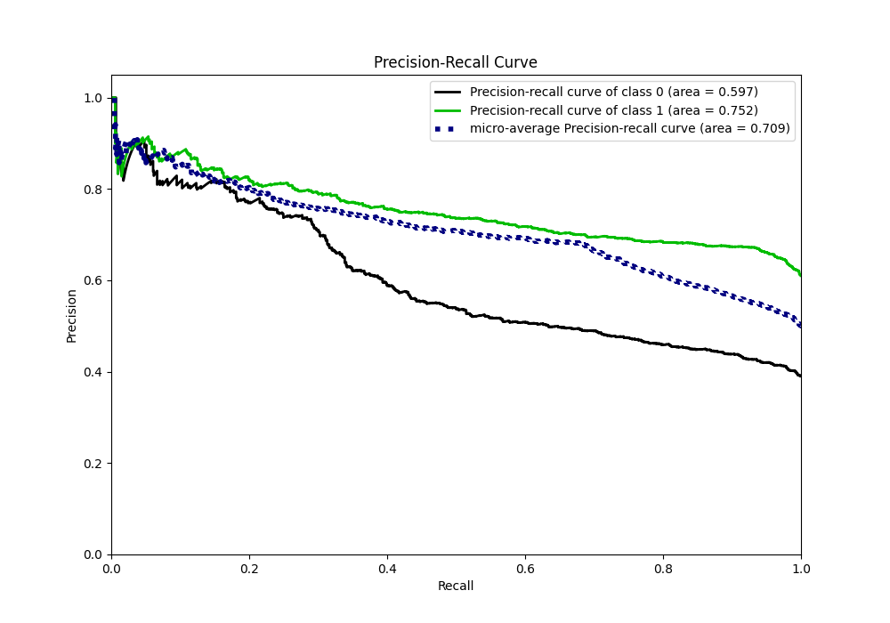
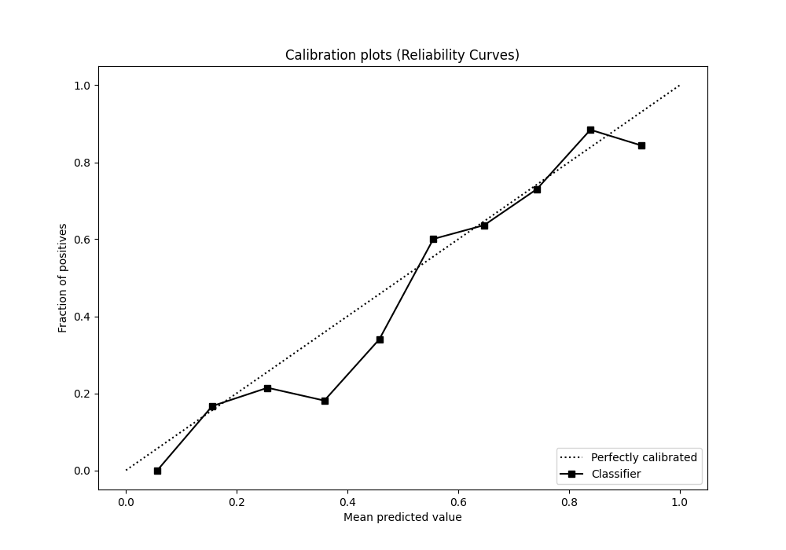
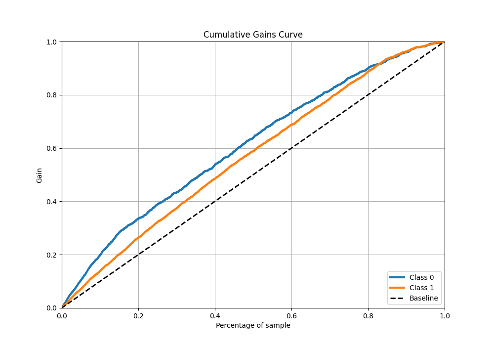
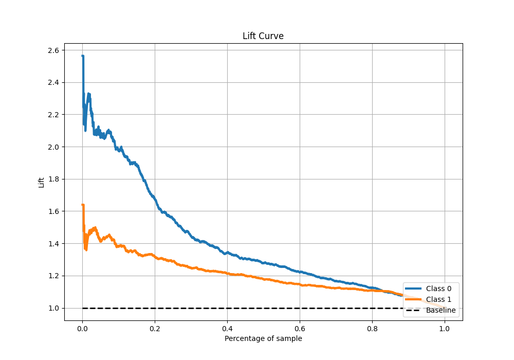

# Summary of 3_Default_CatBoost

[<< Go back](../README.md)

## CatBoost
- **n_jobs**: -1
- **learning_rate**: 0.1
- **depth**: 6
- **rsm**: 1
- **loss_function**: Logloss
- **eval_metric**: F1
- **explain_level**: 1

## Validation
 - **validation_type**: kfold
 - **k_folds**: 5
 - **shuffle**: True
 - **stratify**: True
 - **random_seed**: 1234

## Optimized metric
f1

## Training time

6.3 seconds

## Metric details
|           |    score |   threshold |
|:----------|---------:|------------:|
| logloss   | 0.615939 | nan         |
| auc       | 0.676393 | nan         |
| f1        | 0.781291 |   0.495988  |
| accuracy  | 0.680534 |   0.495988  |
| precision | 0.907216 |   0.815518  |
| recall    | 1        |   0.0318521 |
| mcc       | 0.297522 |   0.495988  |

## Metric details with threshold from accuracy metric
|           |    score |   threshold |
|:----------|---------:|------------:|
| logloss   | 0.615939 |  nan        |
| auc       | 0.676393 |  nan        |
| f1        | 0.781291 |    0.495988 |
| accuracy  | 0.680534 |    0.495988 |
| precision | 0.670704 |    0.495988 |
| recall    | 0.935544 |    0.495988 |
| mcc       | 0.297522 |    0.495988 |

## Confusion matrix (at threshold=0.495988)
|              |   Predicted as 0 |   Predicted as 1 |
|:-------------|-----------------:|-----------------:|
| Labeled as 0 |              288 |              734 |
| Labeled as 1 |              103 |             1495 |

## Learning curves

## Permutation-based Importance

## Confusion Matrix

## Normalized Confusion Matrix

## ROC Curve

## Kolmogorov-Smirnov Statistic

## Precision-Recall Curve

## Calibration Curve

## Cumulative Gains Curve

## Lift Curve

[<< Go back](../README.md)
