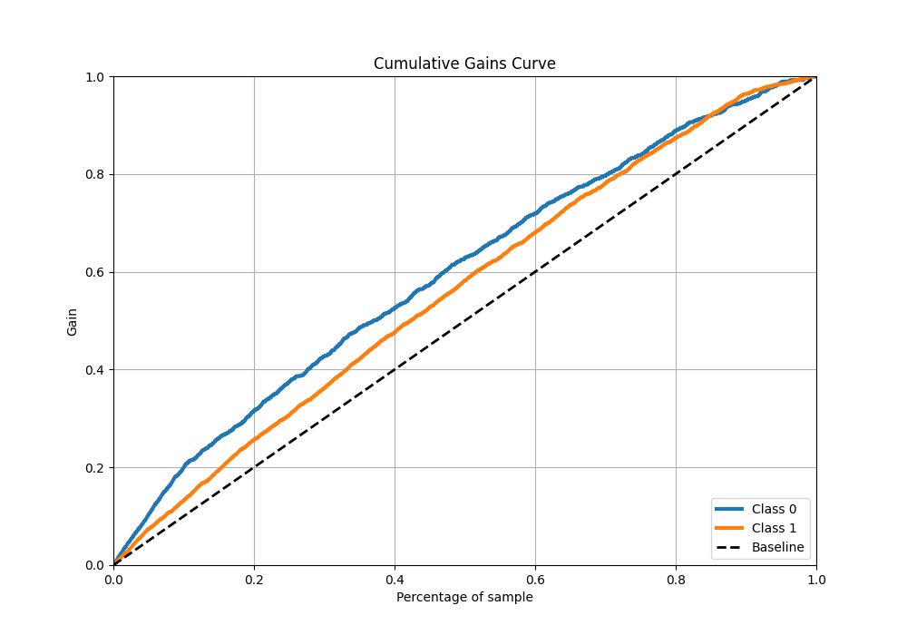

# Summary of 3_Default_CatBoost_GoldenFeatures

[<< Go back](../README.md)

## CatBoost
- **n_jobs**: -1
- **learning_rate**: 0.1
- **depth**: 6
- **rsm**: 1
- **loss_function**: Logloss
- **eval_metric**: F1
- **explain_level**: 1

## Validation
 - **validation_type**: kfold
 - **k_folds**: 5
 - **shuffle**: True
 - **stratify**: True
 - **random_seed**: 1234

## Optimized metric
f1

## Training time

8.0 seconds

## Metric details
|           |    score |   threshold |
|:----------|---------:|------------:|
| logloss   | 0.633482 |  nan        |
| auc       | 0.658368 |  nan        |
| f1        | 0.778428 |    0.50374  |
| accuracy  | 0.667557 |    0.50374  |
| precision | 0.910569 |    0.721943 |
| recall    | 1        |    0.16212  |
| mcc       | 0.268206 |    0.50374  |

## Metric details with threshold from accuracy metric
|           |    score |   threshold |
|:----------|---------:|------------:|
| logloss   | 0.633482 |   nan       |
| auc       | 0.658368 |   nan       |
| f1        | 0.778428 |     0.50374 |
| accuracy  | 0.667557 |     0.50374 |
| precision | 0.655808 |     0.50374 |
| recall    | 0.957447 |     0.50374 |
| mcc       | 0.268206 |     0.50374 |

## Confusion matrix (at threshold=0.50374)
|              |   Predicted as 0 |   Predicted as 1 |
|:-------------|-----------------:|-----------------:|
| Labeled as 0 |              219 |              803 |
| Labeled as 1 |               68 |             1530 |

## Learning curves

## Permutation-based Importance

## Confusion Matrix

## Normalized Confusion Matrix

## ROC Curve

## Kolmogorov-Smirnov Statistic

## Precision-Recall Curve

## Calibration Curve

## Cumulative Gains Curve

## Lift Curve

[<< Go back](../README.md)
