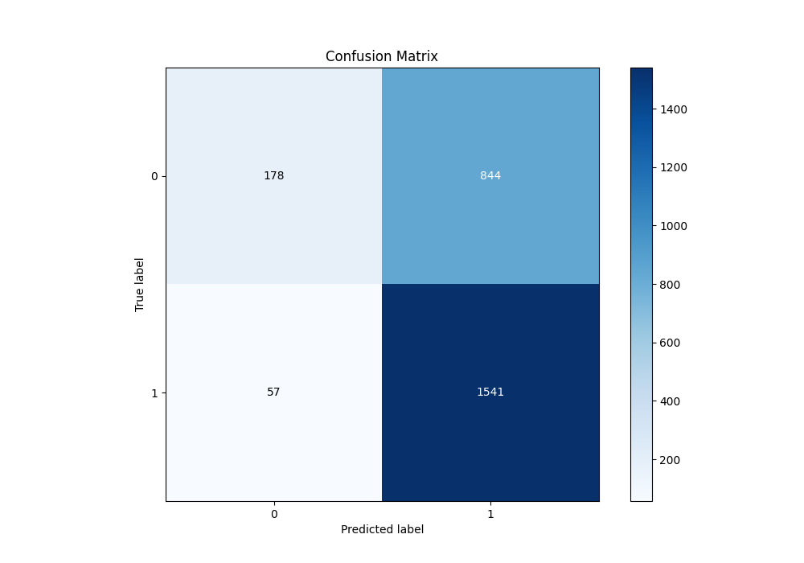

# Summary of 4_Default_RandomForest

[<< Go back](../README.md)

## Random Forest
- **n_jobs**: -1
- **criterion**: gini
- **max_features**: 0.9
- **min_samples_split**: 30
- **max_depth**: 4
- **eval_metric_name**: f1
- **explain_level**: 1

## Validation
 - **validation_type**: kfold
 - **k_folds**: 5
 - **shuffle**: True
 - **stratify**: True
 - **random_seed**: 1234

## Optimized metric
f1

## Training time

13.5 seconds

## Metric details
|           |    score |   threshold |
|:----------|---------:|------------:|
| logloss   | 0.638404 |  nan        |
| auc       | 0.634583 |  nan        |
| f1        | 0.773789 |    0.494345 |
| accuracy  | 0.656107 |    0.494345 |
| precision | 0.805369 |    0.703973 |
| recall    | 1        |    0.162046 |
| mcc       | 0.236418 |    0.494345 |

## Metric details with threshold from accuracy metric
|           |    score |   threshold |
|:----------|---------:|------------:|
| logloss   | 0.638404 |  nan        |
| auc       | 0.634583 |  nan        |
| f1        | 0.773789 |    0.494345 |
| accuracy  | 0.656107 |    0.494345 |
| precision | 0.646122 |    0.494345 |
| recall    | 0.96433  |    0.494345 |
| mcc       | 0.236418 |    0.494345 |

## Confusion matrix (at threshold=0.494345)
|              |   Predicted as 0 |   Predicted as 1 |
|:-------------|-----------------:|-----------------:|
| Labeled as 0 |              178 |              844 |
| Labeled as 1 |               57 |             1541 |

## Learning curves

## Permutation-based Importance

## Confusion Matrix

## Normalized Confusion Matrix

## ROC Curve

## Kolmogorov-Smirnov Statistic

## Precision-Recall Curve

## Calibration Curve

## Cumulative Gains Curve

## Lift Curve

[<< Go back](../README.md)
