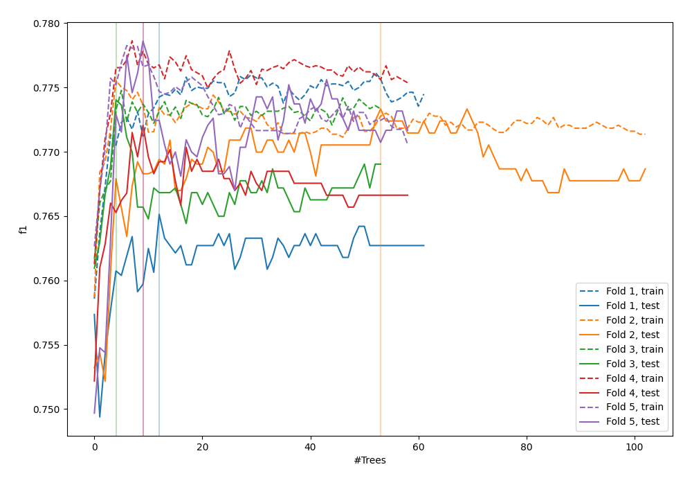
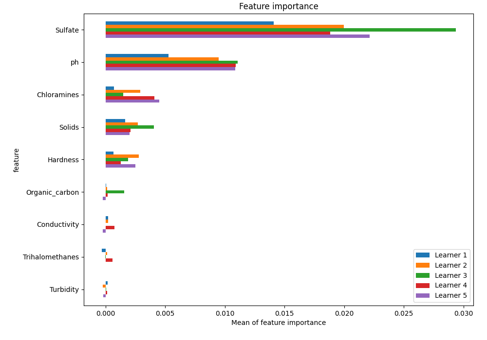
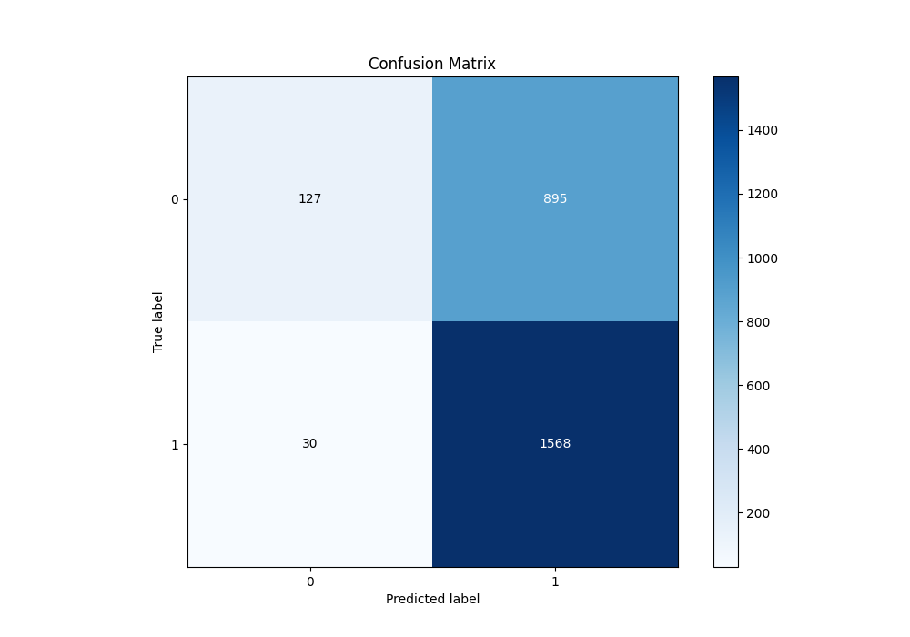
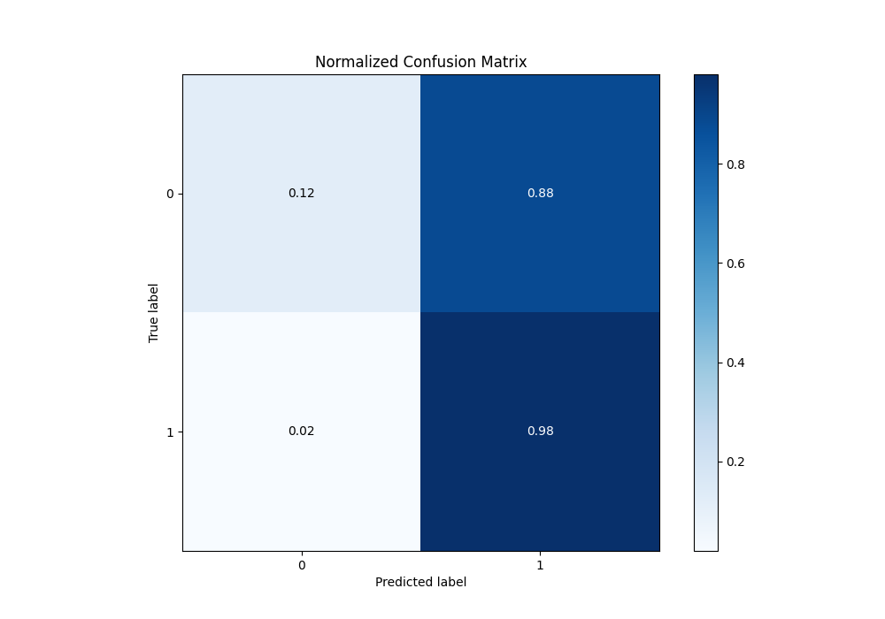
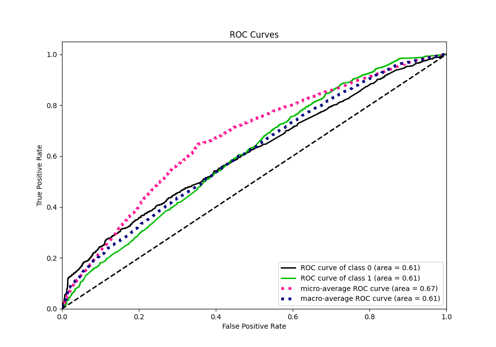
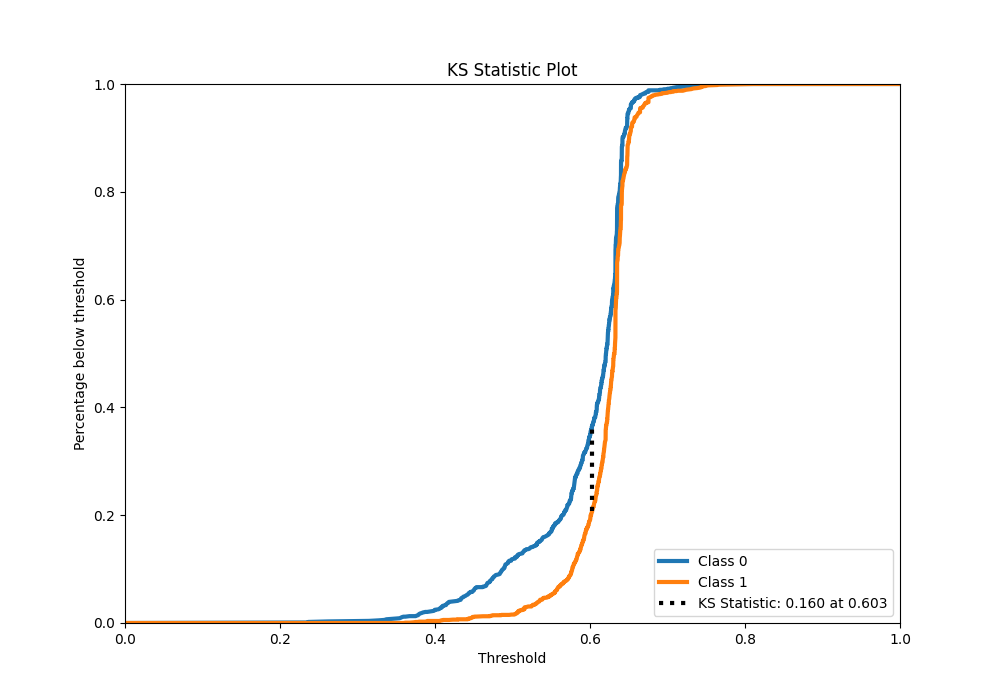
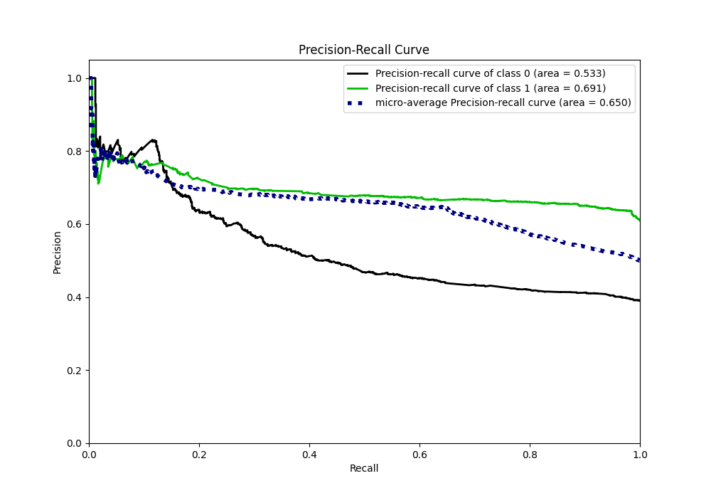
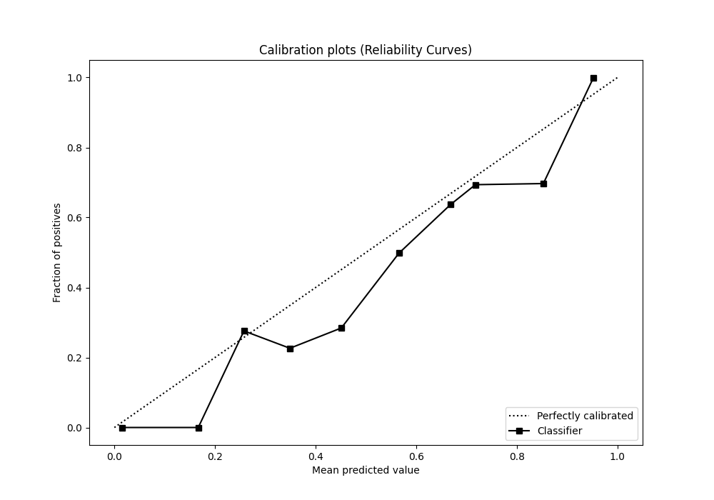
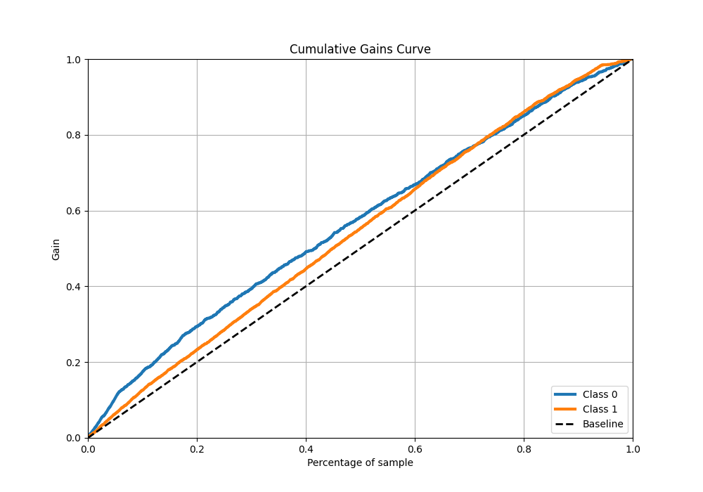
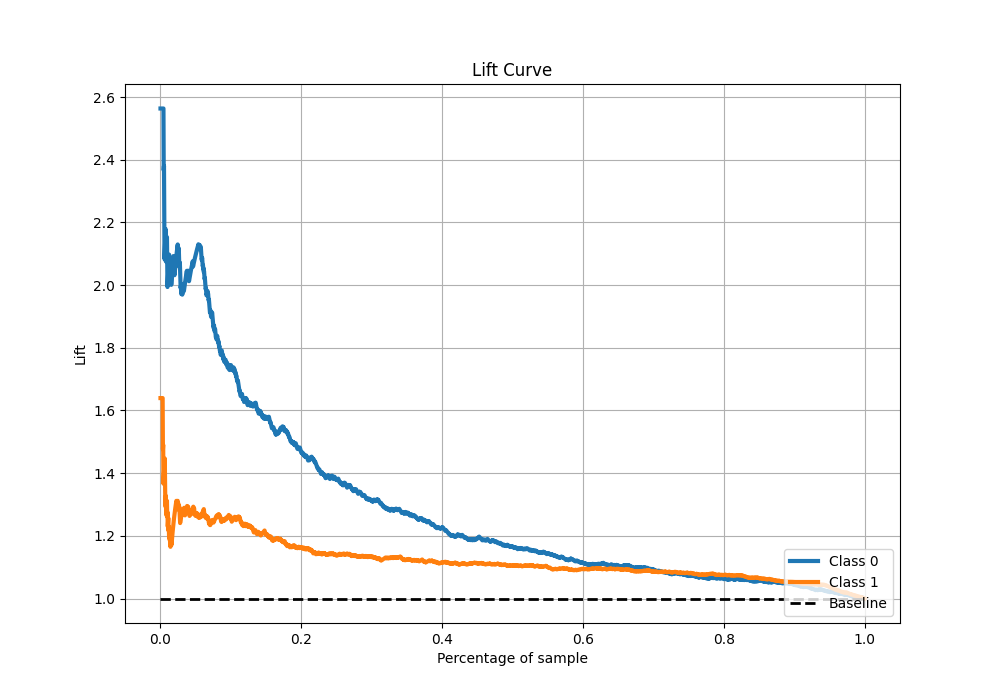

# Summary of 5_Default_ExtraTrees

[<< Go back](../README.md)

## Extra Trees Classifier (Extra Trees)
- **n_jobs**: -1
- **criterion**: gini
- **max_features**: 0.9
- **min_samples_split**: 30
- **max_depth**: 4
- **eval_metric_name**: f1
- **explain_level**: 1

## Validation
 - **validation_type**: kfold
 - **k_folds**: 5
 - **shuffle**: True
 - **stratify**: True
 - **random_seed**: 1234

## Optimized metric
f1

## Training time

10.9 seconds

## Metric details
|           |    score |   threshold |
|:----------|---------:|------------:|
| logloss   | 0.649072 |  nan        |
| auc       | 0.61009  |  nan        |
| f1        | 0.772224 |    0.506111 |
| accuracy  | 0.646947 |    0.506111 |
| precision | 0.788732 |    0.672803 |
| recall    | 1        |    0.212722 |
| mcc       | 0.216797 |    0.506111 |

## Metric details with threshold from accuracy metric
|           |    score |   threshold |
|:----------|---------:|------------:|
| logloss   | 0.649072 |  nan        |
| auc       | 0.61009  |  nan        |
| f1        | 0.772224 |    0.506111 |
| accuracy  | 0.646947 |    0.506111 |
| precision | 0.636622 |    0.506111 |
| recall    | 0.981227 |    0.506111 |
| mcc       | 0.216797 |    0.506111 |

## Confusion matrix (at threshold=0.506111)
|              |   Predicted as 0 |   Predicted as 1 |
|:-------------|-----------------:|-----------------:|
| Labeled as 0 |              127 |              895 |
| Labeled as 1 |               30 |             1568 |

## Learning curves

## Permutation-based Importance

## Confusion Matrix

## Normalized Confusion Matrix

## ROC Curve

## Kolmogorov-Smirnov Statistic

## Precision-Recall Curve

## Calibration Curve

## Cumulative Gains Curve

## Lift Curve

[<< Go back](../README.md)
