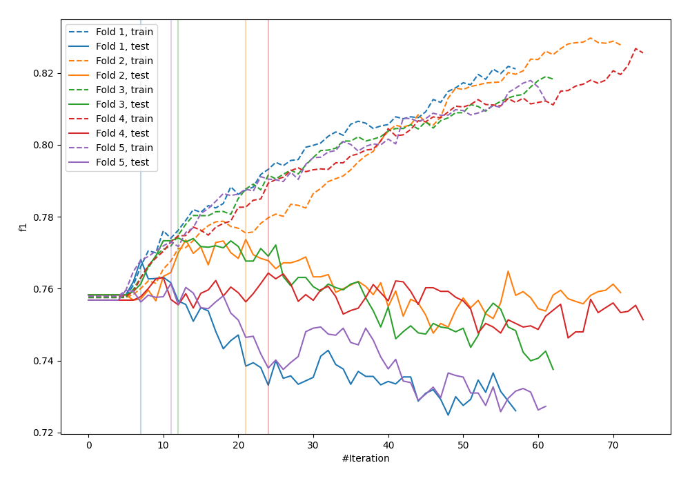
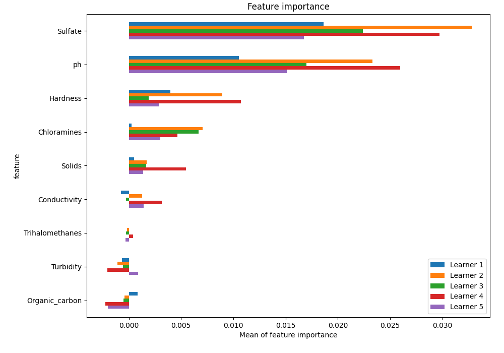
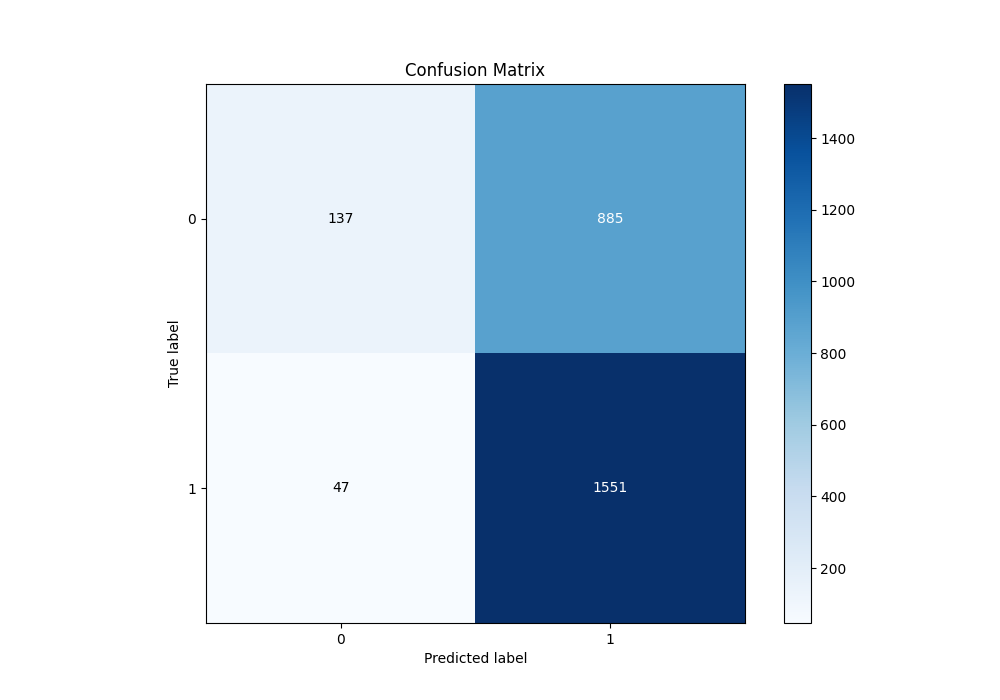
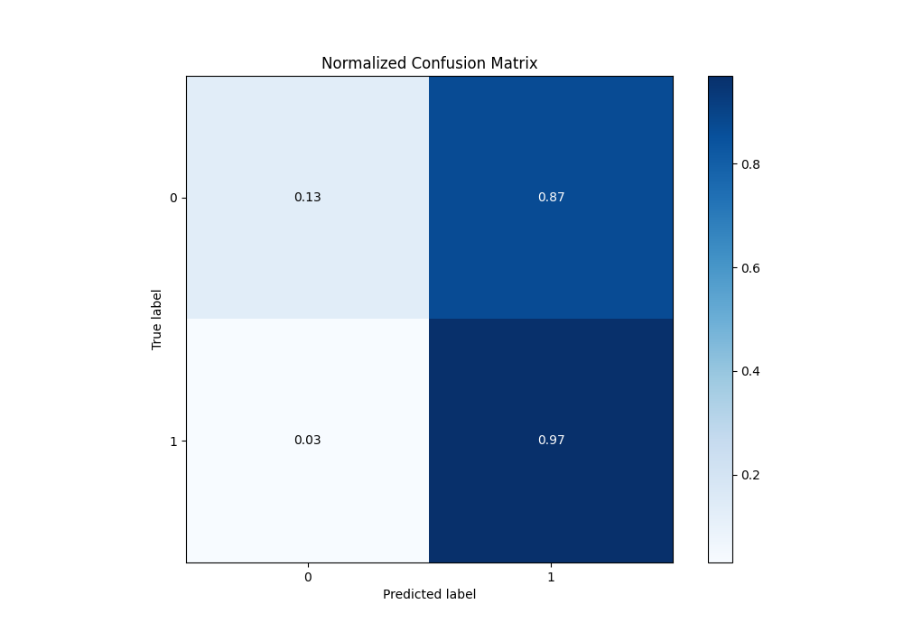
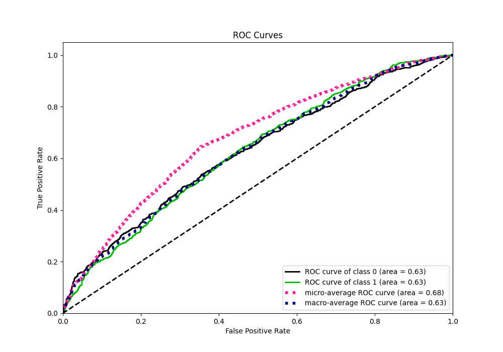
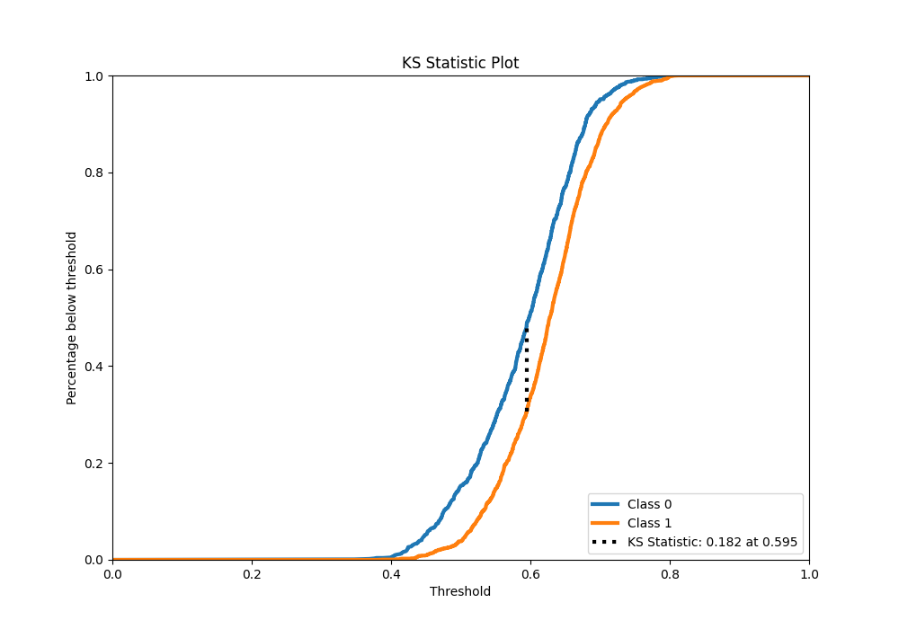
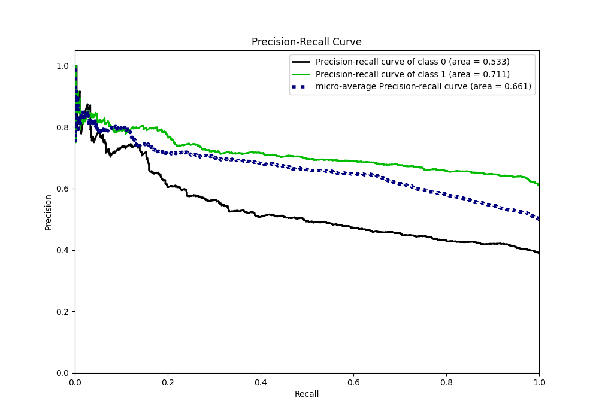
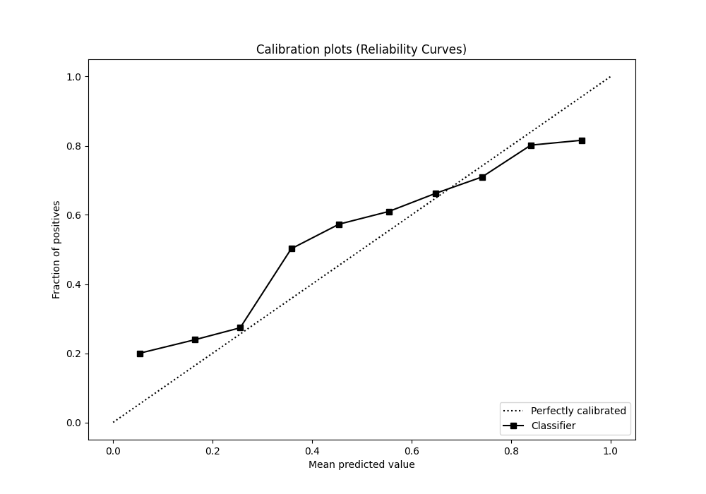
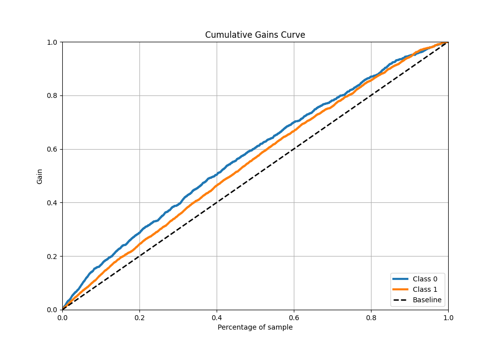
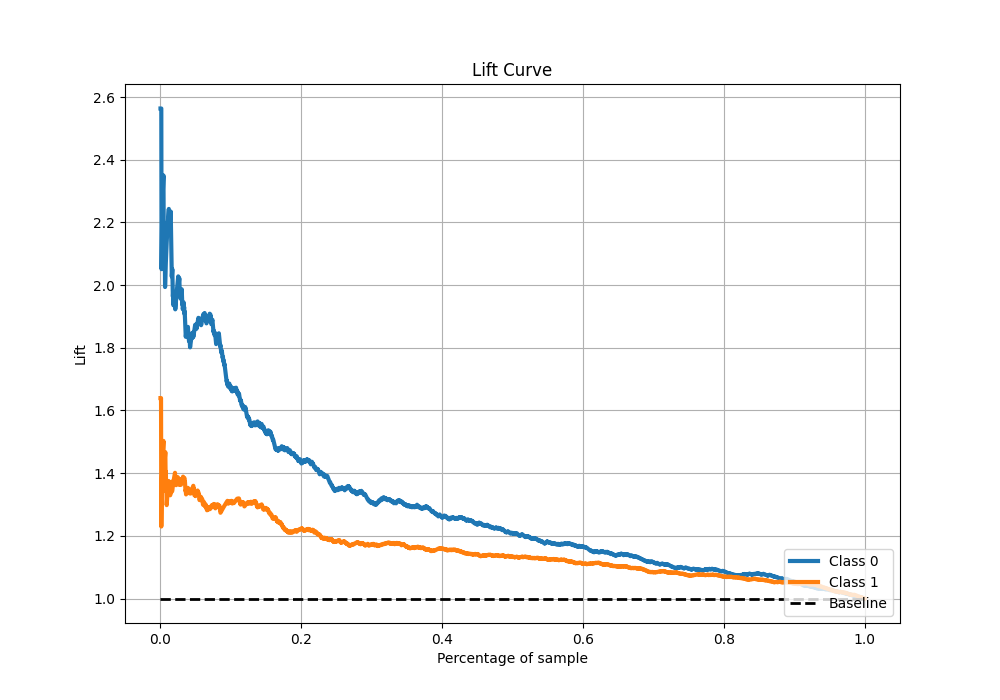

# Summary of 8_Xgboost

[<< Go back](../README.md)

## Extreme Gradient Boosting (Xgboost)
- **n_jobs**: -1
- **objective**: binary:logistic
- **eta**: 0.1
- **max_depth**: 7
- **min_child_weight**: 25
- **subsample**: 0.9
- **colsample_bytree**: 0.6
- **eval_metric**: f1
- **explain_level**: 1

## Validation
 - **validation_type**: kfold
 - **k_folds**: 5
 - **shuffle**: True
 - **stratify**: True
 - **random_seed**: 1234

## Optimized metric
f1

## Training time

9.7 seconds

## Metric details
|           |    score |   threshold |
|:----------|---------:|------------:|
| logloss   | 0.644794 |  nan        |
| auc       | 0.626932 |  nan        |
| f1        | 0.768964 |    0.491455 |
| accuracy  | 0.644275 |    0.491455 |
| precision | 0.830986 |    0.747415 |
| recall    | 1        |    0.312167 |
| mcc       | 0.199738 |    0.491455 |

## Metric details with threshold from accuracy metric
|           |    score |   threshold |
|:----------|---------:|------------:|
| logloss   | 0.644794 |  nan        |
| auc       | 0.626932 |  nan        |
| f1        | 0.768964 |    0.491455 |
| accuracy  | 0.644275 |    0.491455 |
| precision | 0.6367   |    0.491455 |
| recall    | 0.970588 |    0.491455 |
| mcc       | 0.199738 |    0.491455 |

## Confusion matrix (at threshold=0.491455)
|              |   Predicted as 0 |   Predicted as 1 |
|:-------------|-----------------:|-----------------:|
| Labeled as 0 |              137 |              885 |
| Labeled as 1 |               47 |             1551 |

## Learning curves

## Permutation-based Importance

## Confusion Matrix

## Normalized Confusion Matrix

## ROC Curve

## Kolmogorov-Smirnov Statistic

## Precision-Recall Curve

## Calibration Curve

## Cumulative Gains Curve

## Lift Curve

[<< Go back](../README.md)
