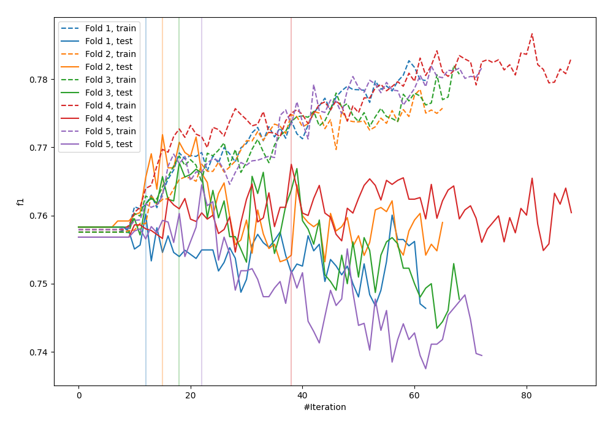
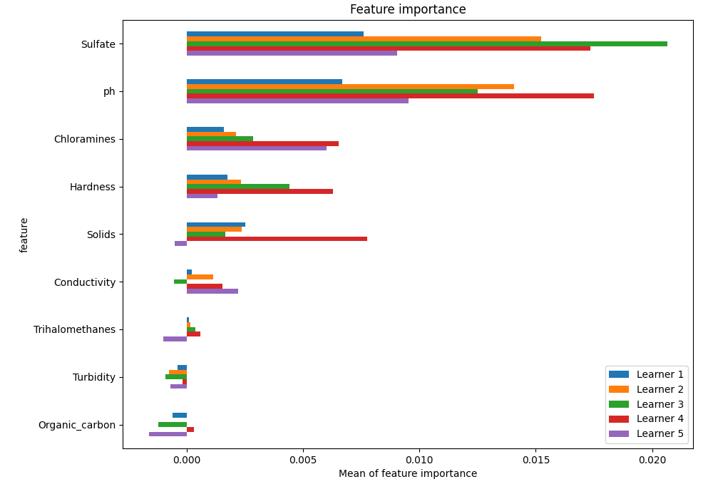
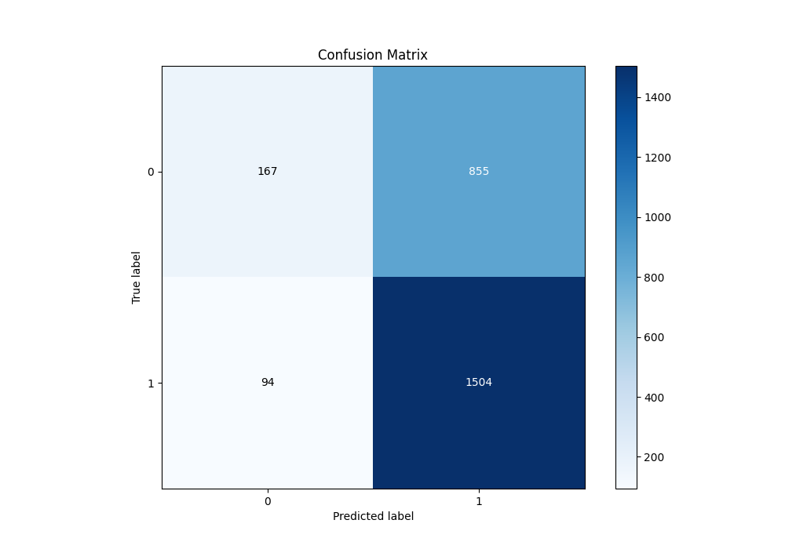
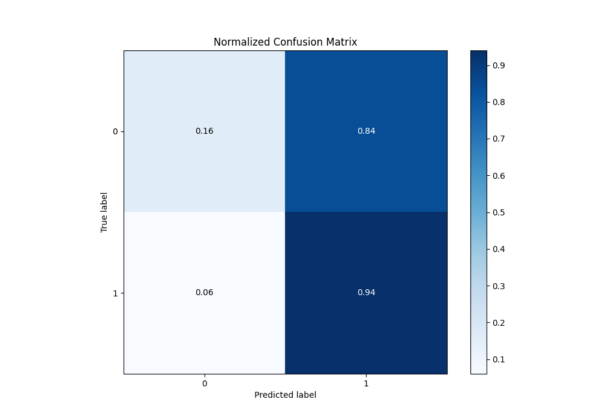
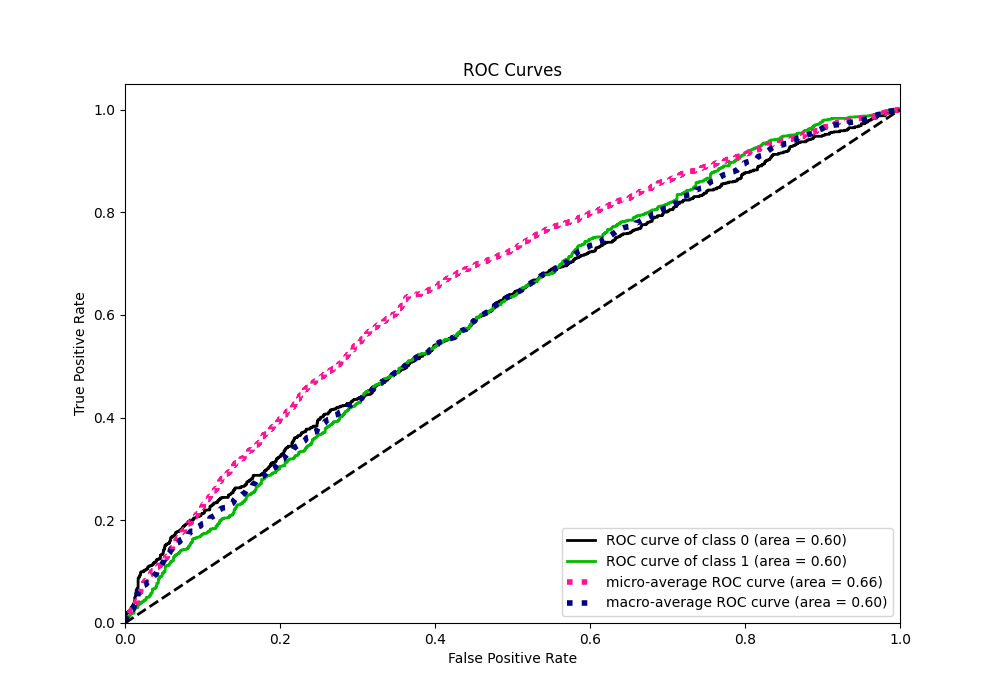
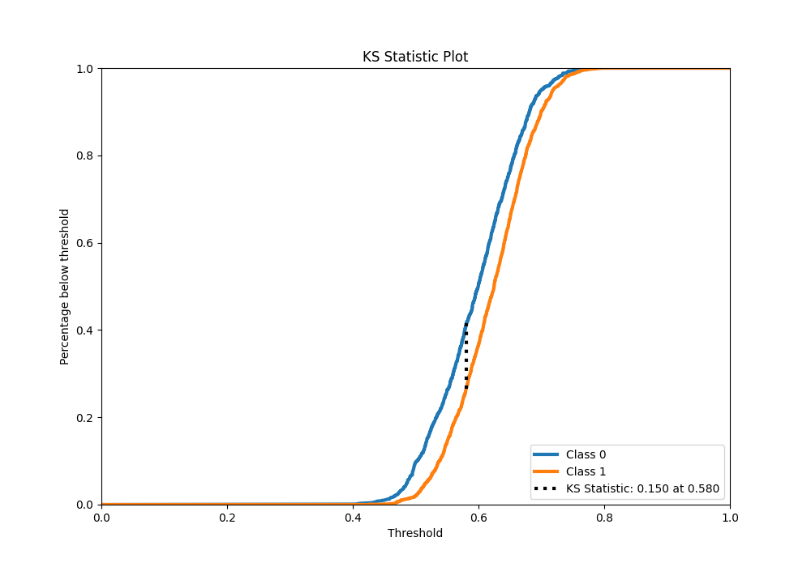
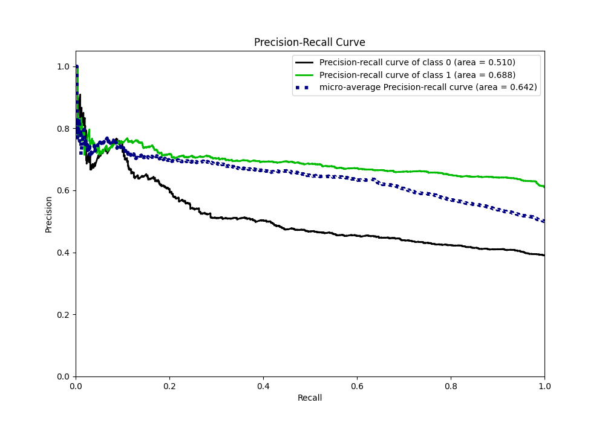
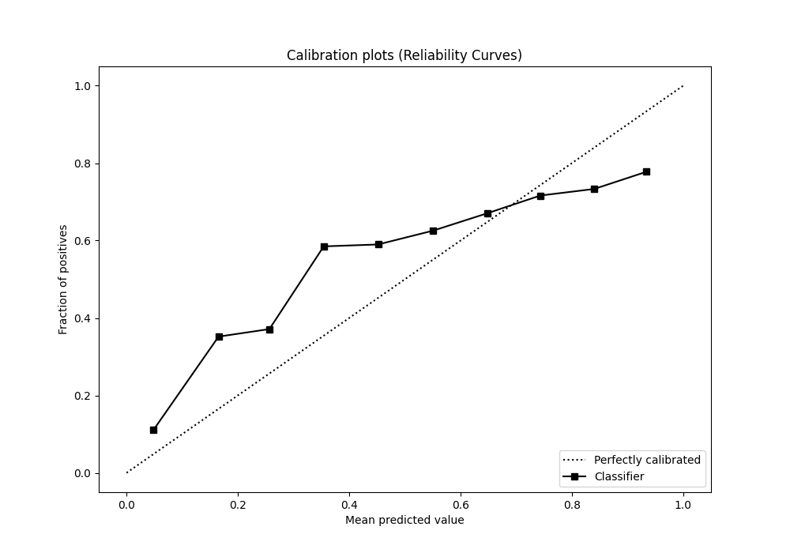
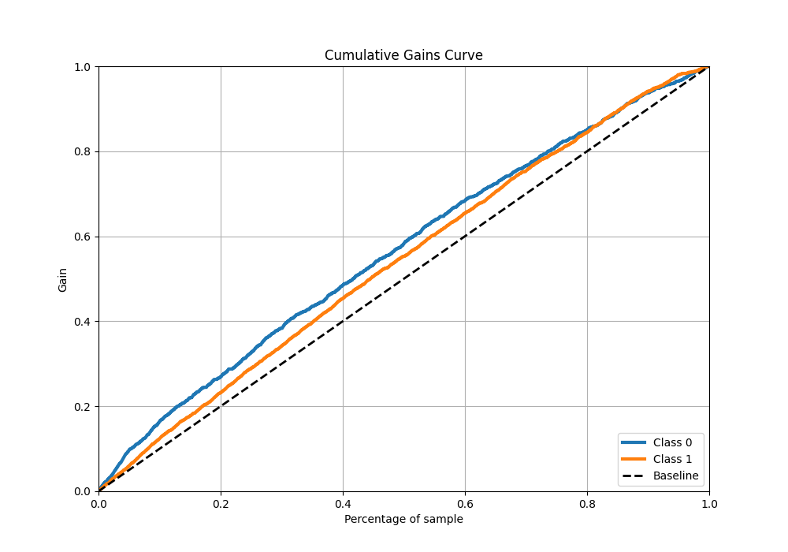
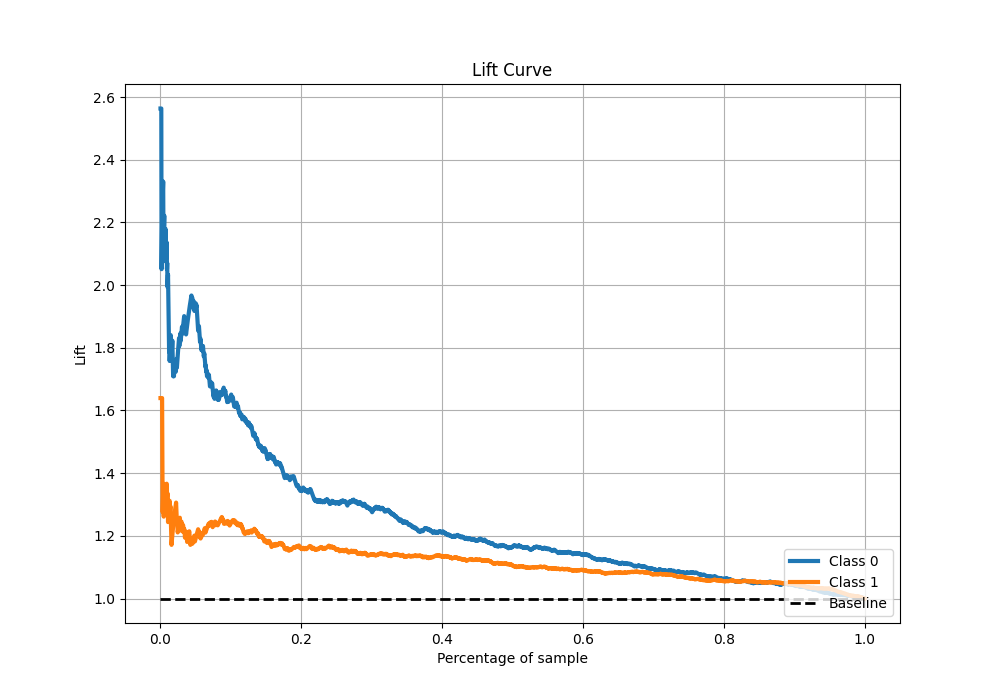

# Summary of 9_Xgboost

[<< Go back](../README.md)

## Extreme Gradient Boosting (Xgboost)
- **n_jobs**: -1
- **objective**: binary:logistic
- **eta**: 0.15
- **max_depth**: 8
- **min_child_weight**: 50
- **subsample**: 0.6
- **colsample_bytree**: 0.6
- **eval_metric**: f1
- **explain_level**: 1

## Validation
 - **validation_type**: kfold
 - **k_folds**: 5
 - **shuffle**: True
 - **stratify**: True
 - **random_seed**: 1234

## Optimized metric
f1

## Training time

10.1 seconds

## Metric details
|           |    score |   threshold |
|:----------|---------:|------------:|
| logloss   | 0.652695 |  nan        |
| auc       | 0.604045 |  nan        |
| f1        | 0.766332 |    0.500136 |
| accuracy  | 0.637786 |    0.52237  |
| precision | 0.76652  |    0.69857  |
| recall    | 1        |    0.364744 |
| mcc       | 0.171979 |    0.500136 |

## Metric details with threshold from accuracy metric
|           |    score |   threshold |
|:----------|---------:|------------:|
| logloss   | 0.652695 |   nan       |
| auc       | 0.604045 |   nan       |
| f1        | 0.760172 |     0.52237 |
| accuracy  | 0.637786 |     0.52237 |
| precision | 0.637558 |     0.52237 |
| recall    | 0.941176 |     0.52237 |
| mcc       | 0.170327 |     0.52237 |

## Confusion matrix (at threshold=0.52237)
|              |   Predicted as 0 |   Predicted as 1 |
|:-------------|-----------------:|-----------------:|
| Labeled as 0 |              167 |              855 |
| Labeled as 1 |               94 |             1504 |

## Learning curves

## Permutation-based Importance

## Confusion Matrix

## Normalized Confusion Matrix

## ROC Curve

## Kolmogorov-Smirnov Statistic

## Precision-Recall Curve

## Calibration Curve

## Cumulative Gains Curve

## Lift Curve

[<< Go back](../README.md)
