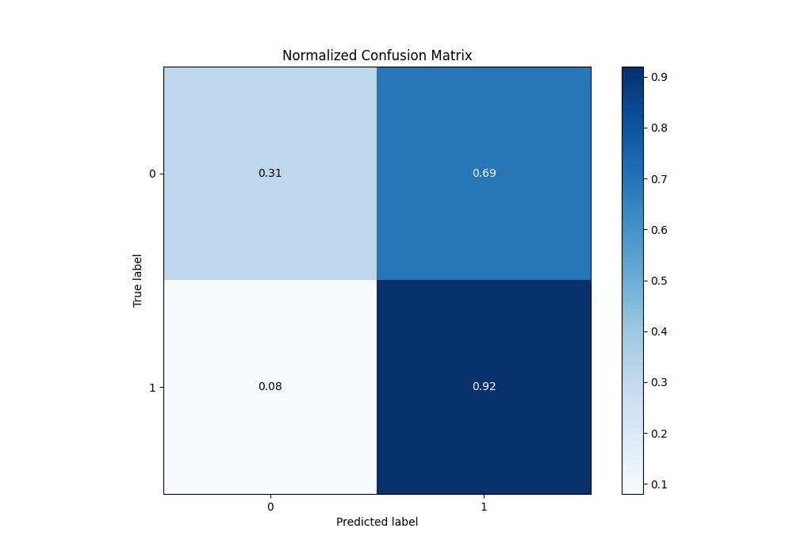

# Summary of Ensemble

[<< Go back](../README.md)

## Ensemble structure
| Model              |   Weight |
|:-------------------|---------:|
| 14_CatBoost        |       14 |
| 16_CatBoost        |        1 |
| 17_CatBoost        |        1 |
| 26_CatBoost        |        4 |
| 28_CatBoost        |        1 |
| 29_CatBoost        |        5 |
| 36_Xgboost         |        1 |
| 38_LightGBM        |        1 |
| 3_Default_CatBoost |        1 |
| 6_Xgboost          |        1 |
| 7_Xgboost          |        1 |

## Metric details
|           |    score |   threshold |
|:----------|---------:|------------:|
| logloss   | 0.621683 |  nan        |
| auc       | 0.689992 |  nan        |
| f1        | 0.787316 |    0.504947 |
| accuracy  | 0.685878 |    0.527582 |
| precision | 0.888889 |    0.784479 |
| recall    | 1        |    0.153349 |
| mcc       | 0.316526 |    0.504947 |

## Metric details with threshold from accuracy metric
|           |    score |   threshold |
|:----------|---------:|------------:|
| logloss   | 0.621683 |  nan        |
| auc       | 0.689992 |  nan        |
| f1        | 0.781987 |    0.527582 |
| accuracy  | 0.685878 |    0.527582 |
| precision | 0.677997 |    0.527582 |
| recall    | 0.923655 |    0.527582 |
| mcc       | 0.309381 |    0.527582 |

## Confusion matrix (at threshold=0.527582)
|              |   Predicted as 0 |   Predicted as 1 |
|:-------------|-----------------:|-----------------:|
| Labeled as 0 |              321 |              701 |
| Labeled as 1 |              122 |             1476 |

## Learning curves

## Confusion Matrix

## Normalized Confusion Matrix

## ROC Curve

## Kolmogorov-Smirnov Statistic

## Precision-Recall Curve

## Calibration Curve

## Cumulative Gains Curve

## Lift Curve

[<< Go back](../README.md)
