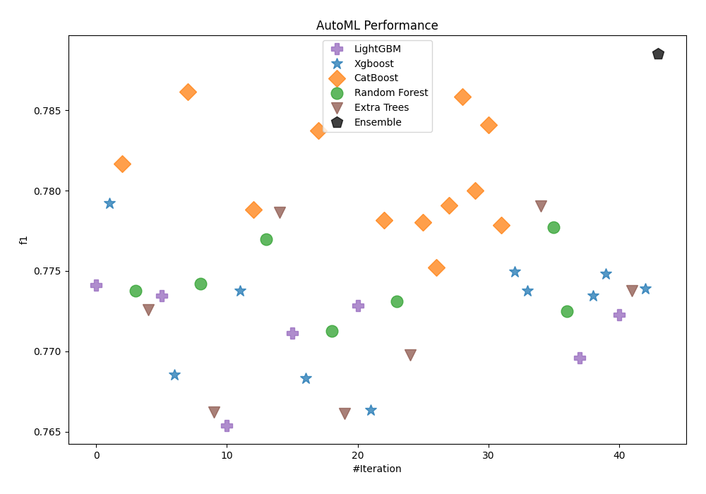
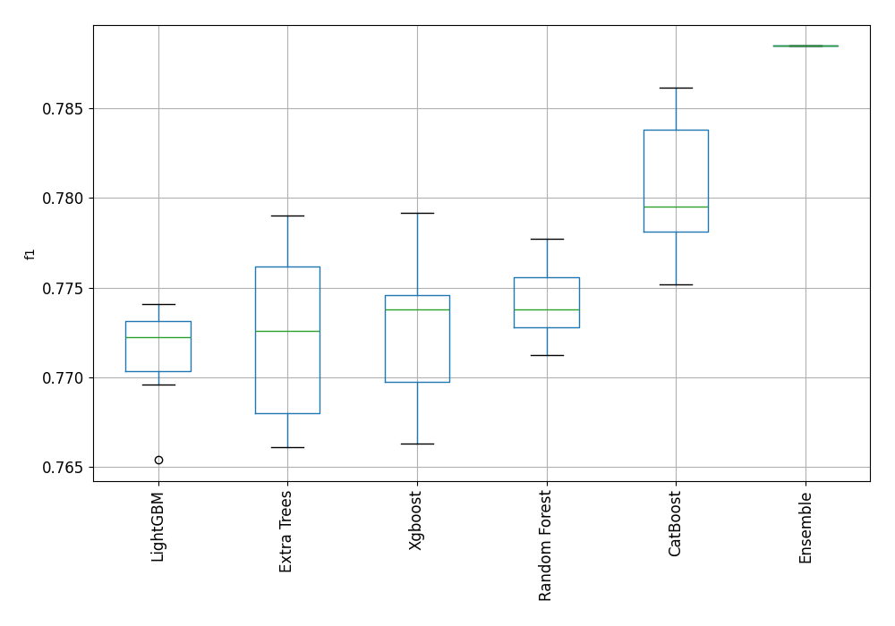
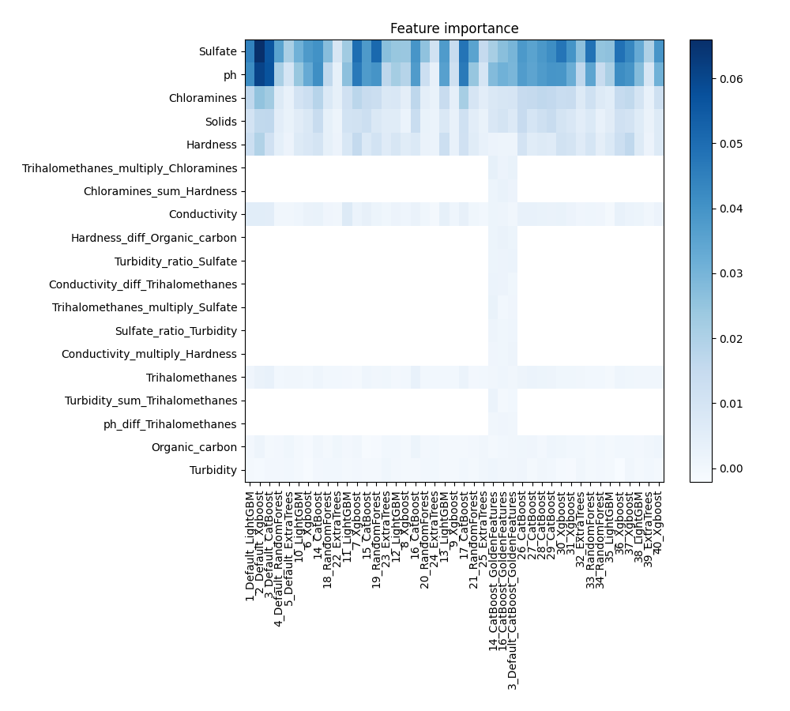
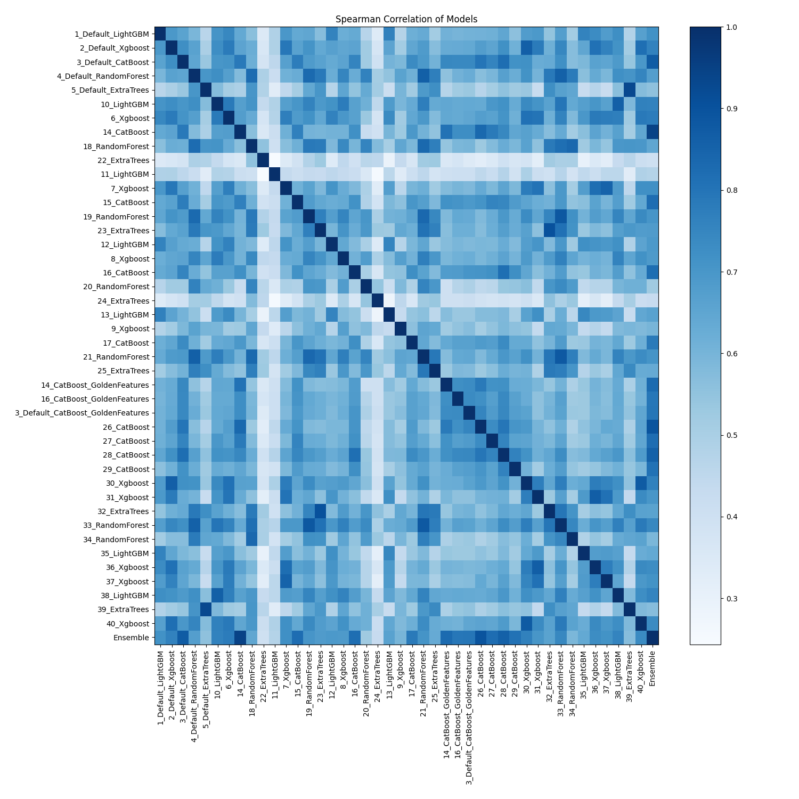

# AutoML Leaderboard

| Best model   | name                                                                             | model_type    | metric_type   |   metric_value |   train_time |   single_prediction_time |
|:-------------|:---------------------------------------------------------------------------------|:--------------|:--------------|---------------:|-------------:|-------------------------:|
|              | [1_Default_LightGBM](1_Default_LightGBM/README.md)                               | LightGBM      | f1            |       0.77411  |        21.99 |                   0.0399 |
|              | [2_Default_Xgboost](2_Default_Xgboost/README.md)                                 | Xgboost       | f1            |       0.779193 |        13.73 |                   0.0432 |
|              | [3_Default_CatBoost](3_Default_CatBoost/README.md)                               | CatBoost      | f1            |       0.781651 |         8.73 |                   0.0364 |
|              | [4_Default_RandomForest](4_Default_RandomForest/README.md)                       | Random Forest | f1            |       0.77377  |        15.86 |                   0.1394 |
|              | [5_Default_ExtraTrees](5_Default_ExtraTrees/README.md)                           | Extra Trees   | f1            |       0.772593 |        13.38 |                   0.133  |
|              | [10_LightGBM](10_LightGBM/README.md)                                             | LightGBM      | f1            |       0.773467 |        12.12 |                   0.0384 |
|              | [6_Xgboost](6_Xgboost/README.md)                                                 | Xgboost       | f1            |       0.768523 |        11.43 |                   0.0401 |
|              | [14_CatBoost](14_CatBoost/README.md)                                             | CatBoost      | f1            |       0.786157 |        11.07 |                   0.0353 |
|              | [18_RandomForest](18_RandomForest/README.md)                                     | Random Forest | f1            |       0.774226 |        15.4  |                   0.134  |
|              | [22_ExtraTrees](22_ExtraTrees/README.md)                                         | Extra Trees   | f1            |       0.766234 |        12.97 |                   0.1219 |
|              | [11_LightGBM](11_LightGBM/README.md)                                             | LightGBM      | f1            |       0.7654   |        11.07 |                   0.0379 |
|              | [7_Xgboost](7_Xgboost/README.md)                                                 | Xgboost       | f1            |       0.773791 |        12.24 |                   0.0396 |
|              | [15_CatBoost](15_CatBoost/README.md)                                             | CatBoost      | f1            |       0.778839 |        10.32 |                   0.038  |
|              | [19_RandomForest](19_RandomForest/README.md)                                     | Random Forest | f1            |       0.776971 |        16.01 |                   0.1216 |
|              | [23_ExtraTrees](23_ExtraTrees/README.md)                                         | Extra Trees   | f1            |       0.778626 |        15    |                   0.1229 |
|              | [12_LightGBM](12_LightGBM/README.md)                                             | LightGBM      | f1            |       0.771126 |        12.08 |                   0.0373 |
|              | [8_Xgboost](8_Xgboost/README.md)                                                 | Xgboost       | f1            |       0.768308 |        12.03 |                   0.0404 |
|              | [16_CatBoost](16_CatBoost/README.md)                                             | CatBoost      | f1            |       0.783749 |         9.71 |                   0.0376 |
|              | [20_RandomForest](20_RandomForest/README.md)                                     | Random Forest | f1            |       0.771265 |        15.51 |                   0.13   |
|              | [24_ExtraTrees](24_ExtraTrees/README.md)                                         | Extra Trees   | f1            |       0.766121 |        13.43 |                   0.1287 |
|              | [13_LightGBM](13_LightGBM/README.md)                                             | LightGBM      | f1            |       0.772867 |        12.83 |                   0.0365 |
|              | [9_Xgboost](9_Xgboost/README.md)                                                 | Xgboost       | f1            |       0.766332 |        12.55 |                   0.0407 |
|              | [17_CatBoost](17_CatBoost/README.md)                                             | CatBoost      | f1            |       0.778153 |        16.25 |                   0.0431 |
|              | [21_RandomForest](21_RandomForest/README.md)                                     | Random Forest | f1            |       0.773131 |        28.64 |                   0.1259 |
|              | [25_ExtraTrees](25_ExtraTrees/README.md)                                         | Extra Trees   | f1            |       0.769753 |        15.73 |                   0.1309 |
|              | [14_CatBoost_GoldenFeatures](14_CatBoost_GoldenFeatures/README.md)               | CatBoost      | f1            |       0.778031 |        15.22 |                   0.0914 |
|              | [16_CatBoost_GoldenFeatures](16_CatBoost_GoldenFeatures/README.md)               | CatBoost      | f1            |       0.77521  |        10.98 |                   0.087  |
|              | [3_Default_CatBoost_GoldenFeatures](3_Default_CatBoost_GoldenFeatures/README.md) | CatBoost      | f1            |       0.779102 |        10.52 |                   0.0871 |
|              | [26_CatBoost](26_CatBoost/README.md)                                             | CatBoost      | f1            |       0.785824 |        16.07 |                   0.0371 |
|              | [27_CatBoost](27_CatBoost/README.md)                                             | CatBoost      | f1            |       0.779985 |        11.77 |                   0.0365 |
|              | [28_CatBoost](28_CatBoost/README.md)                                             | CatBoost      | f1            |       0.784094 |        11.05 |                   0.0348 |
|              | [29_CatBoost](29_CatBoost/README.md)                                             | CatBoost      | f1            |       0.777836 |        10.51 |                   0.0362 |
|              | [30_Xgboost](30_Xgboost/README.md)                                               | Xgboost       | f1            |       0.774936 |        14.22 |                   0.0545 |
|              | [31_Xgboost](31_Xgboost/README.md)                                               | Xgboost       | f1            |       0.773785 |        13.89 |                   0.0412 |
|              | [32_ExtraTrees](32_ExtraTrees/README.md)                                         | Extra Trees   | f1            |       0.779041 |        17.41 |                   0.1334 |
|              | [33_RandomForest](33_RandomForest/README.md)                                     | Random Forest | f1            |       0.777721 |        23.14 |                   0.1583 |
|              | [34_RandomForest](34_RandomForest/README.md)                                     | Random Forest | f1            |       0.772502 |        17.32 |                   0.1383 |
|              | [35_LightGBM](35_LightGBM/README.md)                                             | LightGBM      | f1            |       0.769616 |        14.45 |                   0.0382 |
|              | [36_Xgboost](36_Xgboost/README.md)                                               | Xgboost       | f1            |       0.773478 |        14.4  |                   0.0488 |
|              | [37_Xgboost](37_Xgboost/README.md)                                               | Xgboost       | f1            |       0.774831 |        14.18 |                   0.0404 |
|              | [38_LightGBM](38_LightGBM/README.md)                                             | LightGBM      | f1            |       0.772257 |        13.89 |                   0.0371 |
|              | [39_ExtraTrees](39_ExtraTrees/README.md)                                         | Extra Trees   | f1            |       0.773751 |        16.02 |                   0.1342 |
|              | [40_Xgboost](40_Xgboost/README.md)                                               | Xgboost       | f1            |       0.7739   |        15.15 |                   0.0417 |
| **the best** | [Ensemble](Ensemble/README.md)                                                   | Ensemble      | f1            |       0.788501 |         9.6  |                   0.4477 |

### AutoML Performance

### AutoML Performance Boxplot

### Features Importance

### Spearman Correlation of Models

